Table of Contents
=================
   * [目录](#目录)
      * [基于Kubeadm部署Kubernetes1.13.3 HA 高可用集群](#基于kubeadm部署kubernetes1133-ha-高可用集群)
         * [01. 部署目的](#01-部署目的)
            * [1.1 Kubernetes的特性](#11-kubernetes的特性)
            * [1.2 贴微服务，开发环境快速部署](#12-贴微服务开发环境快速部署)
         * [02. 环境说明](#02-环境说明)
            * [2.1 集群说明](#21-集群说明)
         * [03. K8S集群名词说明](#03-k8s集群名词说明)
            * [3.1 Kubernetes](#31-kubernetes)
            * [3.2 Docker](#32-docker)
            * [3.3 Etcd](#33-etcd)
            * [3.4 Calico](#34-calico)
         * [04. 开始部署Kubernetes集群](#04-开始部署kubernetes集群)
            * [4.1 安装前准备](#41-安装前准备)
            * [4.2 优化系统和集群准备](#42-优化系统和集群准备)
            * [4.3 安装Docker-CE](#43-安装docker-ce)
            * [4.4 所有节点配置Docker镜像加速](#44-所有节点配置docker镜像加速)
         * [05. 生成TLS证书和秘钥](#05-生成tls证书和秘钥)
            * [5.1 Kubernetes 集群所需证书](#51-kubernetes-集群所需证书)
            * [5.2 安装CFSSL](#52-安装cfssl)
            * [5.3 创建CA文件,生成etcd证书](#53-创建ca文件生成etcd证书)
            * [5.4 分发证书到所有节点](#54-分发证书到所有节点)
         * [06. 安装配置etcd](#06-安装配置etcd)
            * [6.1 安装etcd](#61-安装etcd)
            * [6.2 配置etcd](#62-配置etcd)
            * [6.3  启动etcd](#63--启动etcd)
            * [6.4 集群状态检查(维护)](#64-集群状态检查维护)
         * [07 安装配置Kubeadm](#07-安装配置kubeadm)
            * [7.1 配置kubelet](#71-配置kubelet)
            * [7.2 加载配置文件](#72-加载配置文件)
         * [08 Master节点高可用](#08-master节点高可用)
            * [8.1 安装keepalived](#81-安装keepalived)
            * [8.2 配置Keepalived](#82-配置keepalived)
            * [8.3 启动Keepalived](#83-启动keepalived)
            * [8.4 测试Keepalived可用性](#84-测试keepalived可用性)
         * [09 初始化集群](#09-初始化集群)
            * [9.1 初始化集群](#91-初始化集群)
            * [9.2 初始化失败解决办法](#92-初始化失败解决办法)
         * [10. 部署网络组件](#10-部署网络组件)
            * [10.1 Calico组件部署（二选一）](#101-calico组件部署二选一)
            * [10.2 Flannel组件部署(二选一)](#102-flannel组件部署二选一)
            * [10.3 查看集群状态](#103-查看集群状态)
            * [10.4 测试Calico DNS网络问题](#104-测试calico-dns网络问题)
         * [11. 部署Dashboard](#11-部署dashboard)
            * [11.1 登陆访问](#111-登陆访问)
         * [12 部署Traefik Ingress](#12-部署traefik-ingress)
            * [12.1 配置Tracefik HTTPS](#121-配置tracefik-https)
            * [12.2 部署Traefik](#122-部署traefik)
            * [12.3 访问Traefik](#123-访问traefik)
         * [13. Prometheus-Operator](#13-prometheus-operator)
            * [13.1 快速开始](#131-快速开始)
            * [13.2使用Traefik 代理出来Prometheus Grafana](#132使用traefik-代理出来prometheus-grafana)
            * [13.3配置Promethe-Operator自定义报警](#133配置promethe-operator自定义报警)
            * [13.4使用Promethues监控外接ETCD集群](#134-使用promethues监控外接etcd集群)
         * [维护相关](#维护相关)
            * [01. 强制删除Pod](#01-强制删除pod)
            * [02. 重新获取集群Token](#02-重新获取集群token)
            * [03. Master节点也允许Pod容器](#03-master节点也允许pod容器)
            * [04. modprobe: FATAL: Module br_netfilter not found](#04-modprobe-fatal-module-br_netfilter-not-found)
            * [05. Node配置Keepalived，避免整个Node挂掉，Tarefik解析不可用问题](#05-node配置keepalived避免整个node挂掉tarefik解析不可用问题)
            * [06. POD容器不能访问外网问题](#06-pod容器不能访问外网问题)
         * [参考文档](#参考文档)


# 目录

## 基于Kubeadm部署Kubernetes1.13.3 HA 高可用集群 

> K8S 1.13版本中默认：
>
>  	DNS：CoreDNS
>
>   Kube-proxy： IPVS模板    #非iptables
>
>   Network： Calico
>
> 注意：
>
> 默认kubeadm一键部署`etcd`非集群高可用，
>
> 本示例使用`外接etcd`实现高可用集群，Master APIserver使用Keeplived；

### 01. 部署目的

#### 1.1 Kubernetes的特性

- 分布式部署
- 服务发现
- 服务实例保护
- 滚动升级
- 节点无痕维护
- 负载平衡
- 动态扩缩容

从而能够贴合未来微服部署维护的需求

#### 1.2 贴微服务，开发环境快速部署

> 01通过docker镜像，可以快速并且一致的为每个开发人员提供相同的linux开发环境，省去了每个员工自行部署开发环境带来的疑问和冗余，让开发人员能够能专注于code本身，节省大量时间


### 02. 环境说明

- 五台机器进行部署K8S v1.13+集群环境，一台内网Harbor。其中`etcd`为所有节点部署
- Kubernetes中所有数据都是存储在etcd中的，etcd必须高可用集群
- Master使用keepalived高可用，Master主要是分发用户操作指令等操作；
- Master官方给出是用keepalived进行集群，建议也可以使用自建LB/商业AWS的（ALB ELB ）
- Node节点为搭配Taaefik解析IP高可用，也使用Keepalived，Tarefik解析 VIP上

|            System             |   Roles   |   IP Address    |
| :---------------------------: | :-------: | :-------------: |
|     Master Keepalived VIP     |    VIP    |   172.16.1.49   |
|      Node Keepalived VIP      |    VIP    |   172.16.1.59   |
| CentOS Linux release 7.4.1708 | Master01  |   172.16.1.50   |
| CentOS Linux release 7.4.1708 | Master02  |   172.16.1.51   |
| CentOS Linux release 7.4.1708 |  Node01   |   172.16.1.52   |
| CentOS Linux release 7.4.1708 |  Node02   |   172.16.1.53   |
| CentOS Linux release 7.4.1708 |  Node01   |   172.16.1.54   |
| CentOS Linux release 7.4.1708 | VM Harbor | xxx.xxx.xxx.xxx |

#### 2.1 集群说明

|      Software       | Version |
| :-----------------: | :-----: |
|     Kubernetes      | 1.13.3  |
|      Docker-CE      | 18.06.1 |
|        Etcd         | 3.3.11  |
|       Calico        |  3.1.4  |
|      Dashboard      | v1.10.0 |
|   Traefik Ingress   |  1.7.9  |
| prometheus-operator | 0.29.0  |


### 03. K8S集群名词说明

#### 3.1 Kubernetes

>  Kubernetes 是 Google 团队发起并维护的基于Docker的开源容器集群管理系统，它不仅支持常见的云平台，而且支持内部数据中心。建于 Docker 之上的 Kubernetes 可以构建一个容器的调度服务，其目的是让用户透过Kubernetes集群来进行云端容器集群的管理，而无需用户进行复杂的设置工作。系统会自动选取合适的工作节点来执行具体的容器集群调度处理工作。其核心概念是Container Pod（容器仓）。一个Pod是有一组工作于同一物理工作节点的容器构成的。这些组容器拥有相同的网络命名空间/IP以及存储配额，可以根据实际情况对每一个Pod进行端口映射。此外，Kubernetes工作节点会由主系统进行管理，节点包含了能够运行Docker容器所用到的服务。

####  3.2 Docker

>  Docker是一个开源的引擎，可以轻松的为任何应用创建一个轻量级的、可移植的、自给自足的容器。开发者在笔记本上编译测试通过的容器可以批量地在生产环境中部署，包括VMs（虚拟机）、bare metal、OpenStack 集群和其他的基础应用平台。

####  3.3 Etcd

> ETCD是用于共享配置和服务发现的分布式，一致性的KV存储系统。

#### 3.4 Calico

> 同Flannel,用于解决 docker 容器直接跨主机的通信问题，Calico的实现是非侵入式的，不封包解包，直接通过iptables转发，基本没有消耗，flannel需要封包解包，有cpu消耗，效率不如calico，calico基本和原机差不多了 


### 04. 开始部署Kubernetes集群

#### 4.1 安装前准备

截至2019年2月，Kubernetes目前文档版本：v1.13+  官方版本迭代很快，我们选择目前文档版本搭建

**K8S所有节点配置主机名**

```shell
# 设置主机名
hostnamectl set-hostname K8S01-Master01
hostnamectl set-hostname K8S01-Master02
hostnamectl set-hostname K8S01-Node01
hostnamectl set-hostname K8S01-Node02
hostnamectl set-hostname K8S01-Node03

# 配置hosts
cat <<EOF > /etc/hosts
127.0.0.1   localhost localhost.localdomain localhost4 localhost4.localdomain4
::1         localhost localhost.localdomain localhost6 localhost6.localdomain6
172.16.1.50 master01 K8S01-Master01
172.16.1.51 master02 K8S01-Master02
172.16.1.52 node01 K8S01-Node01
172.16.1.53 node02 K8S01-Node02
172.16.1.54 node03 K8S01-Node03
EOF

#配置免密钥登陆
ssh-keygen   #一直回车
ssh-copy-id   master01
ssh-copy-id   master02
ssh-copy-id   node01
ssh-copy-id   node02
```


#### 4.2 优化系统和集群准备

```shell
#关闭防火墙
systemctl stop firewalld
systemctl disable firewalld

###关闭Swap
swapoff -a 
sed -i 's/.*swap.*/#&/' /etc/fstab

###禁用Selinux
setenforce  0 
sed -i "s/^SELINUX=enforcing/SELINUX=disabled/g" /etc/sysconfig/selinux 
sed -i "s/^SELINUX=enforcing/SELINUX=disabled/g" /etc/selinux/config 
sed -i "s/^SELINUX=permissive/SELINUX=disabled/g" /etc/sysconfig/selinux 
sed -i "s/^SELINUX=permissive/SELINUX=disabled/g" /etc/selinux/config  

###报错请参考下面报错处理
modprobe br_netfilter   
cat <<EOF >  /etc/sysctl.d/k8s.conf
net.bridge.bridge-nf-call-ip6tables = 1
net.bridge.bridge-nf-call-iptables = 1
net.ipv4.ip_forward = 1
vm.swappiness=0
EOF
sysctl -p /etc/sysctl.d/k8s.conf
ls /proc/sys/net/bridge

###K8S源
cat <<EOF > /etc/yum.repos.d/kubernetes.repo
[kubernetes]
name=Kubernetes
baseurl=https://mirrors.aliyun.com/kubernetes/yum/repos/kubernetes-el7-x86_64/
enabled=1
gpgcheck=1
repo_gpgcheck=1
gpgkey=https://mirrors.aliyun.com/kubernetes/yum/doc/yum-key.gpg https://mirrors.aliyun.com/kubernetes/yum/doc/rpm-package-key.gpg
EOF

###内核优化
echo "* soft nofile 204800" >> /etc/security/limits.conf
echo "* hard nofile 204800" >> /etc/security/limits.conf
echo "* soft nproc 204800"  >> /etc/security/limits.conf
echo "* hard nproc 204800"  >> /etc/security/limits.conf
echo "* soft  memlock  unlimited"  >> /etc/security/limits.conf
echo "* hard memlock  unlimited"  >> /etc/security/limits.conf

###kube-proxy开启ipvs的前置条件
# 原文：https://github.com/kubernetes/kubernetes/blob/master/pkg/proxy/ipvs/README.md
# 参考：https://www.qikqiak.com/post/how-to-use-ipvs-in-kubernetes/

# 加载模块 <module_name>
modprobe -- ip_vs
modprobe -- ip_vs_rr
modprobe -- ip_vs_wrr
modprobe -- ip_vs_sh
modprobe -- nf_conntrack_ipv4

# 检查加载的模块
lsmod | grep -e ipvs -e nf_conntrack_ipv4
# 或者
cut -f1 -d " "  /proc/modules | grep -e ip_vs -e nf_conntrack_ipv4

#所有node节点安装ipvsadm
yum install ipvsadm -y
ipvsadm -l -n
# Version INFO: IP Virtual Server version 1.2.1 (size=4096)
```


#### 4.3 安装Docker-CE

```shell
yum install -y yum-utils device-mapper-persistent-data lvm2
yum-config-manager \
    --add-repo \
    https://download.docker.com/linux/centos/docker-ce.repo

yum makecache fast
yum install -y --setopt=obsoletes=0 \
  docker-ce-18.06.1.ce-3.el7

systemctl start docker
systemctl enable docker
```


#### 4.4 所有节点配置Docker镜像加速 

阿里云容器镜像加速器配置地址<https://dev.aliyun.com/search.html>  登录管理中心获取个人专属加速器地址

```shell
sudo mkdir -p /etc/docker
sudo tee /etc/docker/daemon.json <<-'EOF'
{
  "registry-mirrors": ["https://3csy84rx.mirror.aliyuncs.com"]
}
EOF
sudo systemctl daemon-reload
sudo systemctl restart docker
```


### 05. 生成TLS证书和秘钥

#### 5.1 Kubernetes 集群所需证书

> `ca`证书为集群admin证书。
>
> `etcd`证书为etcd集群使用。
>
> `shinezone`证书为Harbor使用。

|      CA&Key       | etcd | api-server | proxy | kebectl | Calico | harbor |
| :---------------: | :--: | :--------: | :---: | :-----: | :----: | :----: |
|      ca.csr       |  √   |     √      |   √   |    √    |   √    |        |
|      ca.pem       |  √   |     √      |   √   |    √    |   √    |        |
|    ca-key.pem     |  √   |     √      |   √   |    √    |   √    |        |
|      ca.pem       |  √   |            |       |         |        |        |
|     etcd.csr      |  √   |            |       |         |        |        |
|   etcd-key.pem    |  √   |            |       |         |        |        |
| shinezone.com.crt |      |            |       |         |        |   √    |
| shinezone.com.key |      |            |       |         |        |   √    |


#### 5.2 安装CFSSL

- K8S01执行

```
yum install wget -y
wget https://pkg.cfssl.org/R1.2/cfssl_linux-amd64
wget https://pkg.cfssl.org/R1.2/cfssljson_linux-amd64
wget https://pkg.cfssl.org/R1.2/cfssl-certinfo_linux-amd64
chmod +x cfssl_linux-amd64
mv cfssl_linux-amd64 /usr/local/bin/cfssl
chmod +x cfssljson_linux-amd64
mv cfssljson_linux-amd64 /usr/local/bin/cfssljson
chmod +x cfssl-certinfo_linux-amd64
mv cfssl-certinfo_linux-amd64 /usr/local/bin/cfssl-certinfo
export PATH=/usr/local/bin:$PATH
```

#### 5.3 创建CA文件,生成etcd证书

```
mkdir /root/ssl
cd /root/ssl
cat >  ca-config.json <<EOF
{
"signing": {
"default": {
  "expiry": "8760h"
},
"profiles": {
  "kubernetes-Soulmate": {
    "usages": [
        "signing",
        "key encipherment",
        "server auth",
        "client auth"
    ],
    "expiry": "8760h"
  }
}
}
}
EOF

cat >  ca-csr.json <<EOF
{
"CN": "kubernetes-Soulmate",
"key": {
"algo": "rsa",
"size": 2048
},
"names": [
{
  "C": "CN",
  "ST": "shanghai",
  "L": "shanghai",
  "O": "k8s",
  "OU": "System"
}
]
}
EOF

cfssl gencert -initca ca-csr.json | cfssljson -bare ca

#hosts项需要加入所有etcd集群节点，建议将所有node也加入，便于扩容etcd集群。
cat > etcd-csr.json <<EOF
{
  "CN": "etcd",
  "hosts": [
    "127.0.0.1",
    "172.16.1.50",
    "172.16.1.51",
    "172.16.1.52",
    "172.16.1.53",
    "172.16.1.54"
  ],
  "key": {
    "algo": "rsa",
    "size": 2048
  },
  "names": [
    {
      "C": "CN",
      "ST": "shanghai",
      "L": "shanghai",
      "O": "k8s",
      "OU": "System"
    }
  ]
}
EOF

cfssl gencert -ca=ca.pem \
  -ca-key=ca-key.pem \
  -config=ca-config.json \
  -profile=kubernetes-Soulmate etcd-csr.json | cfssljson -bare etcd
```

字段说明

- 如果 hosts 字段不为空则需要指定授权使用该证书的?**IP 或域名列表**

- `ca-config.json`：可以定义多个 profiles，分别指定不同的过期时间、使用场景等参数；后续在签名证书时使用某个 profile；
- `signing`：表示该证书可用于签名其它证书；生成的 ca.pem 证书中?`CA=TRUE`；
- `server auth`：表示client可以用该 CA 对server提供的证书进行验证；
- `client auth`：表示server可以用该CA对client提供的证书进行验证；
- "CN"：`Common Name`，kube-apiserver 从证书中提取该字段作为请求的用户名 (User Name)；浏览器使用该字段验证网站是否合法；
- "O"：`Organization`，kube-apiserver 从证书中提取该字段作为请求用户所属的组 (Group)；


#### 5.4 分发证书到所有节点

- Master01执行

> 本集群所有所有节点安装etcd，因此需要证书分发所有节点。

```shell
mkdir -p /etc/etcd/ssl
cp etcd.pem etcd-key.pem ca.pem /etc/etcd/ssl/
scp -r /etc/etcd/ master02:/etc/
scp -r /etc/etcd/ node01:/etc/
scp -r /etc/etcd/ node02:/etc/
scp -r /etc/etcd/ node03:/etc/
```

### 06. 安装配置etcd

#### 6.1 安装etcd

- 所有节点执行

```shell
yum install etcd -y   
mkdir -p /var/lib/etcd
```

#### 6.2 配置etcd

master01的`etcd.service`

```shell
cat <<EOF >/usr/lib/systemd/system/etcd.service
[Unit]
Description=Etcd Server
After=network.target
After=network-online.target
Wants=network-online.target
Documentation=https://github.com/coreos

[Service]
Type=notify
WorkingDirectory=/var/lib/etcd/
ExecStart=/usr/bin/etcd \
  --name k8s01 \
  --cert-file=/etc/etcd/ssl/etcd.pem \
  --key-file=/etc/etcd/ssl/etcd-key.pem \
  --peer-cert-file=/etc/etcd/ssl/etcd.pem \
  --peer-key-file=/etc/etcd/ssl/etcd-key.pem \
  --trusted-ca-file=/etc/etcd/ssl/ca.pem \
  --peer-trusted-ca-file=/etc/etcd/ssl/ca.pem \
  --initial-advertise-peer-urls https://172.16.1.50:2380 \
  --listen-peer-urls https://172.16.1.50:2380 \
  --listen-client-urls https://172.16.1.50:2379,http://127.0.0.1:2379 \
  --advertise-client-urls https://172.16.1.50:2379 \
  --initial-cluster-token etcd-cluster-0 \
  --initial-cluster k8s01=https://172.16.1.50:2380,k8s02=https://172.16.1.51:2380,k8s03=https://172.16.1.52:2380,k8s04=https://172.16.1.53:2380,k8s05=https://172.16.1.54:2380 \
  --initial-cluster-state new \
  --data-dir=/var/lib/etcd
Restart=on-failure
RestartSec=5
LimitNOFILE=65536

[Install]
WantedBy=multi-user.target
EOF
```

master02的`etcd.service`

```shell
cat <<EOF >/usr/lib/systemd/system/etcd.service
[Unit]
Description=Etcd Server
After=network.target
After=network-online.target
Wants=network-online.target
Documentation=https://github.com/coreos

[Service]
Type=notify
WorkingDirectory=/var/lib/etcd/
ExecStart=/usr/bin/etcd \
  --name k8s02 \
  --cert-file=/etc/etcd/ssl/etcd.pem \
  --key-file=/etc/etcd/ssl/etcd-key.pem \
  --peer-cert-file=/etc/etcd/ssl/etcd.pem \
  --peer-key-file=/etc/etcd/ssl/etcd-key.pem \
  --trusted-ca-file=/etc/etcd/ssl/ca.pem \
  --peer-trusted-ca-file=/etc/etcd/ssl/ca.pem \
  --initial-advertise-peer-urls https://172.16.1.51:2380 \
  --listen-peer-urls https://172.16.1.51:2380 \
  --listen-client-urls https://172.16.1.51:2379,http://127.0.0.1:2379 \
  --advertise-client-urls https://172.16.1.51:2379 \
  --initial-cluster-token etcd-cluster-0 \
  --initial-cluster k8s01=https://172.16.1.50:2380,k8s02=https://172.16.1.51:2380,k8s03=https://172.16.1.52:2380,k8s04=https://172.16.1.53:2380,k8s05=https://172.16.1.54:2380 \
  --initial-cluster-state new \
  --data-dir=/var/lib/etcd
Restart=on-failure
RestartSec=5
LimitNOFILE=65536

[Install]
WantedBy=multi-user.target
EOF
```

node01的`etcd.service`

```shell
cat <<EOF >/usr/lib/systemd/system/etcd.service
[Unit]
Description=Etcd Server
After=network.target
After=network-online.target
Wants=network-online.target
Documentation=https://github.com/coreos

[Service]
Type=notify
WorkingDirectory=/var/lib/etcd/
ExecStart=/usr/bin/etcd \
  --name k8s03 \
  --cert-file=/etc/etcd/ssl/etcd.pem \
  --key-file=/etc/etcd/ssl/etcd-key.pem \
  --peer-cert-file=/etc/etcd/ssl/etcd.pem \
  --peer-key-file=/etc/etcd/ssl/etcd-key.pem \
  --trusted-ca-file=/etc/etcd/ssl/ca.pem \
  --peer-trusted-ca-file=/etc/etcd/ssl/ca.pem \
  --initial-advertise-peer-urls https://172.16.1.52:2380 \
  --listen-peer-urls https://172.16.1.52:2380 \
  --listen-client-urls https://172.16.1.52:2379,http://127.0.0.1:2379 \
  --advertise-client-urls https://172.16.1.52:2379 \
  --initial-cluster-token etcd-cluster-0 \
  --initial-cluster k8s01=https://172.16.1.50:2380,k8s02=https://172.16.1.51:2380,k8s03=https://172.16.1.52:2380,k8s04=https://172.16.1.53:2380,k8s05=https://172.16.1.54:2380 \
  --initial-cluster-state new \
  --data-dir=/var/lib/etcd
Restart=on-failure
RestartSec=5
LimitNOFILE=65536

[Install]
WantedBy=multi-user.target
EOF
```

node02的`etcd.service`

```shell
cat <<EOF >/usr/lib/systemd/system/etcd.service
[Unit]
Description=Etcd Server
After=network.target
After=network-online.target
Wants=network-online.target
Documentation=https://github.com/coreos

[Service]
Type=notify
WorkingDirectory=/var/lib/etcd/
ExecStart=/usr/bin/etcd \
  --name k8s04 \
  --cert-file=/etc/etcd/ssl/etcd.pem \
  --key-file=/etc/etcd/ssl/etcd-key.pem \
  --peer-cert-file=/etc/etcd/ssl/etcd.pem \
  --peer-key-file=/etc/etcd/ssl/etcd-key.pem \
  --trusted-ca-file=/etc/etcd/ssl/ca.pem \
  --peer-trusted-ca-file=/etc/etcd/ssl/ca.pem \
  --initial-advertise-peer-urls https://172.16.1.53:2380 \
  --listen-peer-urls https://172.16.1.53:2380 \
  --listen-client-urls https://172.16.1.53:2379,http://127.0.0.1:2379 \
  --advertise-client-urls https://172.16.1.53:2379 \
  --initial-cluster-token etcd-cluster-0 \
  --initial-cluster k8s01=https://172.16.1.50:2380,k8s02=https://172.16.1.51:2380,k8s03=https://172.16.1.52:2380,k8s04=https://172.16.1.53:2380,k8s05=https://172.16.1.54:2380 \
  --initial-cluster-state new \
  --data-dir=/var/lib/etcd
Restart=on-failure
RestartSec=5
LimitNOFILE=65536

[Install]
WantedBy=multi-user.target
EOF
```

node03的`etcd.service`

```shell
cat <<EOF >/usr/lib/systemd/system/etcd.service
[Unit]
Description=Etcd Server
After=network.target
After=network-online.target
Wants=network-online.target
Documentation=https://github.com/coreos

[Service]
Type=notify
WorkingDirectory=/var/lib/etcd/
ExecStart=/usr/bin/etcd \
  --name k8s05 \
  --cert-file=/etc/etcd/ssl/etcd.pem \
  --key-file=/etc/etcd/ssl/etcd-key.pem \
  --peer-cert-file=/etc/etcd/ssl/etcd.pem \
  --peer-key-file=/etc/etcd/ssl/etcd-key.pem \
  --trusted-ca-file=/etc/etcd/ssl/ca.pem \
  --peer-trusted-ca-file=/etc/etcd/ssl/ca.pem \
  --initial-advertise-peer-urls https://172.16.1.54:2380 \
  --listen-peer-urls https://172.16.1.54:2380 \
  --listen-client-urls https://172.16.1.54:2379,http://127.0.0.1:2379 \
  --advertise-client-urls https://172.16.1.54:2379 \
  --initial-cluster-token etcd-cluster-0 \
  --initial-cluster k8s01=https://172.16.1.50:2380,k8s02=https://172.16.1.51:2380,k8s03=https://172.16.1.52:2380,k8s04=https://172.16.1.53:2380,k8s05=https://172.16.1.54:2380 \
  --initial-cluster-state new \
  --data-dir=/var/lib/etcd
Restart=on-failure
RestartSec=5
LimitNOFILE=65536

[Install]
WantedBy=multi-user.target
EOF
```

#### 6.3  启动etcd

```shell
 systemctl daemon-reload
 systemctl enable etcd
 systemctl start etcd
 systemctl status etcd
```

#### 6.4 集群状态检查(维护)

> 使用v3版本API

```shell
$ echo "export ETCDCTL_API=3" >>/etc/profile  && source /etc/profile
$ etcdctl version
etcdctl version: 3.2.18
API version: 3.2
```

> 查看集群健康状态

```shell
$ etcdctl --endpoints=https://172.16.1.50:2379,https://172.16.1.51:2379,https://172.16.1.52:2379,https://172.16.1.53:2379,https://172.16.1.54:2379 --cacert=/etc/etcd/ssl/ca.pem   --cert=/etc/etcd/ssl/etcd.pem   --key=/etc/etcd/ssl/etcd-key.pem   endpoint health
//输出信息如下：
https://172.16.1.54:2379 is healthy: successfully committed proposal: took = 1.911784ms
https://172.16.1.50:2379 is healthy: successfully committed proposal: took = 2.648385ms
https://172.16.1.52:2379 is healthy: successfully committed proposal: took = 3.472479ms
https://172.16.1.51:2379 is healthy: successfully committed proposal: took = 2.850887ms
https://172.16.1.53:2379 is healthy: successfully committed proposal: took = 3.711259ms
```

> 查询所有key

```shell
$ etcdctl --endpoints=https://172.16.1.50:2379,https://172.16.1.51:2379,https://172.16.1.52:2379,https://172.16.1.53:2379,https://172.16.1.54:2379 --cacert=/etc/etcd/ssl/ca.pem   --cert=/etc/etcd/ssl/etcd.pem   --key=/etc/etcd/ssl/etcd-key.pem    get / --prefix --keys-only

// kubeadm初始化之前是没有任何信息的，初始化完成后查询得到的信息如：
/registry/apiregistration.k8s.io/apiservices/v1.
/registry/apiregistration.k8s.io/apiservices/v1.apps
/registry/apiregistration.k8s.io/apiservices/v1.authentication.k8s.io
/registry/apiregistration.k8s.io/apiservices/v1.authorization.k8s.io
/registry/apiregistration.k8s.io/apiservices/v1.autoscaling
/registry/apiregistration.k8s.io/apiservices/v1.batch
........................
```

> 清除`所有/指定`key(**生成环境慎用**)
>
> 线上环境如有k8s组件出现问题,需要针对特定问题key进行清除操作。

```shell
 etcdctl --endpoints=https://172.16.1.50:2379,https://172.16.1.51:2379,https://172.16.1.52:2379,https://172.16.1.53:2379,https://172.16.1.54:2379 --cacert=/etc/etcd/ssl/ca.pem   --cert=/etc/etcd/ssl/etcd.pem   --key=/etc/etcd/ssl/etcd-key.pem    del /registry/apiregistration.k8s.io/apiservices/v1.batch --prefix 
```


### 07 安装配置Kubeadm

> 集群所有节点安装`kebelet` `kubeadm` `kebectl`

```shell
yum install -y kubelet kubeadm kubectl
###暂不启动，未初始化前启动也会报错
systemctl enable kubelet   
```

#### 7.1 配置kubelet

> 所有节点修改，kubelet类似Agent，每台Node上必须要安装的组件

```shell
// 所有机器执行
sed -i s#systemd#cgroupfs#g /etc/systemd/system/kubelet.service.d/10-kubeadm.conf
echo 'Environment="KUBELET_EXTRA_ARGS=--v=2 --fail-swap-on=false --pod-infra-container-image=harbor.domain.com/shinezonetest/pause-amd64:3.1"' >>  /etc/systemd/system/kubelet.service.d/10-kubeadm.conf
```

#### 7.2 加载配置文件

```shell
systemctl daemon-reload
systemctl enable kubelet
```


### 08 Master节点高可用

> Master节点高可用使用keepalived，也可以使用商业ELB ALB SLB，或自建N'gin'x负载均衡。

#### 8.1 安装keepalived

- master节点执行

```shell
yum install -y keepalived
systemctl enable keepalived
```

#### 8.2 配置Keepalived

> 注意修改`interface`网卡名，`priority`权重值，`unicast_peer`

 Master01 配置文件

```shell
cat <<EOF >/etc/keepalived/keepalived.conf
global_defs {
   router_id LVS_k8s
}

vrrp_script CheckK8sMaster {
    script "curl -k https://172.16.1.49:6443"    #VIP Address
    interval 3
    timeout 9
    fall 2
    rise 2
}

vrrp_instance VI_1 {
    state MASTER
    interface ens32       #Your Network Interface Name
    virtual_router_id 61
    priority 120          #权重，数字大的为主，数字一样则选择第一台为Master
    advert_int 1
    mcast_src_ip 172.16.1.50  #local IP
    nopreempt
    authentication {
        auth_type PASS
        auth_pass sqP05dQgMSlzrxHj
    }
    unicast_peer {
        #172.16.1.50
        172.16.1.51    #另外一台masterIP
    }
    virtual_ipaddress {
        172.16.1.49/24    # VIP
    }
    track_script {
        CheckK8sMaster
    }

}
EOF
```

Master02配置文件

```shell
cat <<EOF >/etc/keepalived/keepalived.conf
global_defs {
   router_id LVS_k8s
}

vrrp_script CheckK8sMaster {
    script "curl -k https://172.16.1.49:6443"
    interval 3
    timeout 9
    fall 2
    rise 2
}

vrrp_instance VI_1 {
    state MASTER
    interface ens32
    virtual_router_id 61
    priority 110
    advert_int 1
    mcast_src_ip 172.16.1.51
    nopreempt
    authentication {
        auth_type PASS
        auth_pass sqP05dQgMSlzrxHj
    }
    unicast_peer {
        172.16.1.50
        #172.16.1.51
    }
    virtual_ipaddress {
        172.16.1.49/24
    }
    track_script {
        CheckK8sMaster
    }

}
EOF
```

#### 8.3 启动Keepalived

```shell
sed s#'KEEPALIVED_OPTIONS="-D"'#'KEEPALIVED_OPTIONS="-D -d -S 0"'#g /etc/sysconfig/keepalived -i   //配置日志文件
echo "local0.*    /var/log/keepalived.log" >> /etc/rsyslog.conf
service rsyslog restart
systemctl start keepalived
systemctl status keepalived
```

#### 8.4 测试Keepalived可用性

> 测试：关闭一台Master机器，看IP是否漂移，API是否可用。

```shell
//确认VIP在Master01上
$ ip a | grep inet |grep "172.16"
    inet 172.16.1.50/21 brd 172.16.7.255 scope global ens32
    inet 172.16.1.49/24 scope global ens32   //VIP
    
// 关闭Master01机器，确认VIP是否飘逸
$ ip a |grep inet |grep "172.16"
    inet 172.16.1.51/21 brd 172.16.7.255 scope global ens32
    inet 172.16.1.49/24 scope global ens32  //可以看到瞬间就偏移到了Master02机器上
    
// 确认APi服务可用性,也可在下步初始化集群后测试，直接访问dashboard看效果。
$ curl https://your_dashboard_address/ -I
HTTP/1.1 200 OK
Server: nginx/1.10.0
Date: Wed, 06 Jun 2018 05:58:22 GMT
Content-Type: text/html; charset=utf-8
Content-Length: 990
Connection: keep-alive
Accept-Ranges: bytes
Cache-Control: no-store
Last-Modified: Tue, 13 Feb 2018 11:17:03 GMT
```

### 09 初始化集群

> Master机器添加初始化配置文件, V1.13版本后version版本使用v1beta1 语法变化很大

```shell
#cat EOF方式格式会乱掉，直接vim 复制粘贴进去，保持格式不变
#vim config.yaml   :set paste  

apiVersion: kubeproxy.config.k8s.io/v1alpha1
kind: KubeProxyConfiguration
mode: "ipvs"  #使用IPVS模式，非iptables
---
apiVersion: kubeadm.k8s.io/v1beta1  #v1beta1版本,非v1alpha版本，语法会有变化
certificatesDir: /etc/kubernetes/pki   
clusterName: kubernetes
controlPlaneEndpoint: 172.16.1.49:6443  #Keeplived 虚拟IP地址
controllerManager: {}
dns:
  type: CoreDNS  #默认DNS：CoreDNS
imageRepository: k8s.gcr.io   #官方镜像
#imageRepository: harbor.domain.com/k8s   #可修改为自己的Har镜像库
kind: ClusterConfiguration
kubernetesVersion: v1.13.3   #K8S版本
networking:
  dnsDomain: cluster.local
  serviceSubnet: 10.96.0.0/12  #SVC网络段 
  podSubnet: 100.64.0.0/10     #POD网络段
apiServer:
        certSANs:  
        - 172.16.1.50
        - 172.16.1.51
        - 172.16.1.52
        - 172.16.1.53
        - 172.16.1.54
        extraArgs: 
           etcd-cafile: /etc/etcd/ssl/ca.pem
           etcd-certfile: /etc/etcd/ssl/etcd.pem
           etcd-keyfile: /etc/etcd/ssl/etcd-key.pem
etcd:  #使用外接etcd高可用
    external:
        caFile: /etc/etcd/ssl/ca.pem
        certFile: /etc/etcd/ssl/etcd.pem
        keyFile: /etc/etcd/ssl/etcd-key.pem
        endpoints:
        - https://172.16.1.50:2379
        - https://172.16.1.51:2379
        - https://172.16.1.52:2379
        - https://172.16.1.53:2379
        - https://172.16.1.54:2379
```


#### 9.1 初始化集群

- Master01操作

```shell
kubeadm init --config config.yaml  

# 初始化过程中可以journalctl -u kubelet -f查看log，可能会报错cni网络问题，因为我们指定了网络，calico还没安装，所以报错，等calico安装完成就好了
```

初始化成功后输出信息：

```shell
Your Kubernetes master has initialized successfully!

To start using your cluster, you need to run the following as a regular user:

  mkdir -p $HOME/.kube
  sudo cp -i /etc/kubernetes/admin.conf $HOME/.kube/config
  sudo chown $(id -u):$(id -g) $HOME/.kube/config

You should now deploy a pod network to the cluster.
Run "kubectl apply -f [podnetwork].yaml" with one of the options listed at:
  https://kubernetes.io/docs/concepts/cluster-administration/addons/

You can now join any number of machines by running the following on each node
as root:

  kubeadm join 172.16.1.49:6443 --token b99a00.a144ef80536d4344 --discovery-token-ca-cert-hash sha256:8c
```

初始化完成后执行相关命令

```shell
mkdir -p $HOME/.kube
sudo cp -i /etc/kubernetes/admin.conf $HOME/.kube/config
sudo chown $(id -u):$(id -g) $HOME/.kube/config
```

查看状态

```shell
$ kubectl get cs
NAME                 STATUS    MESSAGE             ERROR
controller-manager   Healthy   ok                  
scheduler            Healthy   ok                  
etcd-0               Healthy   {"health":"true"}   
etcd-2               Healthy   {"health":"true"}   
etcd-3               Healthy   {"health":"true"}   
etcd-4               Healthy   {"health":"true"}   
etcd-1               Healthy   {"health":"true"}
```

> 注意，多台Master的主机都要进行初始化，第二台master初始化也需要config.yaml文件，前提需要将

- Master02操作

```shell
#分发kebeadm生成的证书文件和密码文件
#每台Master机器的证书和密码文件都是相同的，有新的Master加入，直接分发初始化即可。

$ scp -r /etc/kubernetes/pki  master02:/etc/kubernetes/
//然后初始化，执行命令
$ kubeadm init --config config.yaml 
$ mkdir -p $HOME/.kube
$ sudo cp -i /etc/kubernetes/admin.conf $HOME/.kube/config
$ sudo chown $(id -u):$(id -g) $HOME/.kube/config
```

#### 9.2 初始化失败解决办法

```shell
$ kubeadm reset
// 或者删除相关文件和images
$ rm -rf /etc/kubernetes/*.conf
$ rm -rf /etc/kubernetes/manifests/*.yaml
$ docker ps -a |awk '{print $1}' |xargs docker rm -f
$ systemctl  stop kubelet
```

再次初始化前需要执行清除etcd所有数据的操作。

```shell
 $ etcdctl --endpoints=https://172.16.1.50:2379,https://172.16.1.51:2379,https://172.16.1.52:2379,https://172.16.1.53:2379,https://172.16.1.54:2379 --cacert=/etc/etcd/ssl/ca.pem   --cert=/etc/etcd/ssl/etcd.pem   --key=/etc/etcd/ssl/etcd-key.pem    del / --prefix
```


### 10. 部署网络组件

> Flanneld和Calico都是解决容器通信组件，任选一个即可，这里使用DaemonSet部署，只在Master01执行

#### 10.1 Calico组件部署（二选一）

```shell
wget https://docs.projectcalico.org/v3.1/getting-started/kubernetes/installation/hosted/rbac-kdd.yaml
wget  https://docs.projectcalico.org/v3.1/getting-started/kubernetes/installation/hosted/kubernetes-datastore/calico-networking/1.7/calico.yaml
#修改calico.yaml里image镜像路径部分,已推内网harbor,有梯子的可以默认直接apply yaml文件
$ grep image calico.yaml 

        - image: harbor.domain.com/shinezonetest/calico-typha:1.0
          image: harbor.domain.com/shinezonetest/calico-node:1.0
          image: harbor.domain.com/shinezonetest/calico-cni:1.0
          
$ kubectl apply -f rbac-kdd.yaml
$ kubectl apply -f calico.yaml
```

#### 10.2 Flannel组件部署(二选一)

- 目前都是使用Calico网络，二选一即可，Flannel不需要部署

```shell
$ mkdir -p /run/flannel/
$ cat >/run/flannel/subnet.env <<EOF
FLANNEL_NETWORK=10.244.0.0/16
FLANNEL_SUBNET=10.244.0.1/24
FLANNEL_MTU=1450
FLANNEL_IPMASQ=true
EOF
$ wget https://raw.githubusercontent.com/coreos/flannel/master/Documentation/kube-flannel.yml
  #版本信息：quay.io/coreos/flannel:v0.10.0-amd64
$ kubectl create -f  kube-flannel.yml
```

#### 10.3 查看集群状态

> 集群中组件通信都要基于Calico/Flanneld，需要等到网络组件启动后才可以确认。

```shell
$ kubectl get nodes
NAME             STATUS   ROLES    AGE     VERSION
k8s01-master01   Ready    master   22h     v1.13.3
k8s01-master02   Ready    master   6h47m   v1.13.3
k8s01-node01     Ready    <none>   22h     v1.13.3
k8s01-node02     Ready    <none>   22h     v1.13.3
k8s01-node03     Ready    <none>   22h     v1.13.3

$ kubectl get pods -n kube-system
NAME                                     READY   STATUS    RESTARTS   AGE
calico-node-bt2gq                        2/2     Running   0          22h
calico-node-gln4j                        2/2     Running   0          22h
calico-node-s4xj7                        2/2     Running   0          6h47m
calico-node-ttj6q                        2/2     Running   0          22h
calico-node-wsc7s                        2/2     Running   0          22h
coredns-86c58d9df4-n8tvw                 1/1     Running   0          22h
coredns-86c58d9df4-qlq2n                 1/1     Running   0          22h
kube-apiserver-k8s01-master01            1/1     Running   0          22h
kube-apiserver-k8s01-master02            1/1     Running   0          6h47m
kube-controller-manager-k8s01-master01   1/1     Running   0          22h
kube-controller-manager-k8s01-master02   1/1     Running   0          6h47m
kube-proxy-89f5j                         1/1     Running   0          6h47m
kube-proxy-fnc9t                         1/1     Running   0          22h
kube-proxy-gf4xt                         1/1     Running   0          22h
kube-proxy-j7ltr                         1/1     Running   0          22h
kube-proxy-z4tbz                         1/1     Running   0          22h
kube-scheduler-k8s01-master01            1/1     Running   0          22h
kube-scheduler-k8s01-master02            1/1     Running   0          6h47m
```

#### 10.4 测试Calico DNS网络问题

> DNS使用CoreDNS，是集群初始化默认启用的，Node之间通信是依赖Calico的

**坑一，Busybox镜像Bug**

```shell
$ kubectl run curl --image=radial/busyboxplus:curl   #启动busybox
$ nslookup kubernetes  #非全路径则无法解析
Server:    10.96.0.10
Address 1: 10.96.0.10 kube-dns.kube-system.svc.cluster.local  
nslookup: can‘t resolve kubernetes

$ nslookup kubernetes.default.svc.cluster.local     #nslookup解析全路径就可以解析
Server:    10.96.0.10 
Address 1: 10.96.0.10 kube-dns.kube-system.svc.cluster.local

Name:      kubernetes.default.svc.cluster.local
Address 1: 10.96.0.1 kubernetes.default.svc.cluster.local

# 使用DNSTOOLS工具
$ kubectl run -it --rm --image=infoblox/dnstools dns-client
dnstools# ping kubernetes   #确认可以解析内部
PING kubernetes (10.96.0.1): 56 data bytes
64 bytes from 10.96.0.1: seq=0 ttl=64 time=0.042 ms

dnstools# ping www.qq.com   #确认pod可以访问外网
```

**坑二，pod请求外网，DNS报错io/timeout**

> 简单记录下这里的排查思路。
>
> 当我整个集群都部署完成，监控就位的时候，发现Alertmanager无法发送邮件，然后确认Alert信息从Prometheus递交给了Alertmanager。
>
> 查看POD日志，POD日志显示无法链接到SMTP服务器，这时候意识到可能DNS解析有问题，然后就启动了busybox测试DNS，What Fuck!  我CoreDNS 解析集群内部的SVC都解析不到，那我Tarefik怎么转发工作的。
>
> 最后排查半天原来是busybox镜像有bug，nslookup 全路径就可以解析，如以上**坑一** ，使用dnstools即可解决，内网通了很开心，然后外网还是不通，其余POD没有报错日志，唯有DNS一直报错 timeout。
>
> 到了这个时候一直认为是CoreDNS问题，先去了解了下K8S集群中DNS工作原理，参考链接：https://www.simpleapples.com/2018/07/15/solving-kubernetes-dns-problem/
>
> DNS解析外部地址需要借助上层DNS，CoreDNS里面也有配置依赖Node DNS，默认/etc/resolv.conf 里面的nameserver，接着使用`kuberctl exec <dns_pod_name> cat /etc/resolv.conf -n kube-system ` 查看我DNS确实依赖了我Node的DNS呀 参考文档：https://kubernetes.io/docs/tasks/administer-cluster/dns-custom-nameservers/，什么情况，为什么还不能解析外网。
>
> 然后将CoreDNS换成了Kube-DNS，还是不行，各种尝试，reset集群，重启机器，耗时了将近一天时间，集群也重新建立了多次，最后开始怀疑自己排查点好像出错了。
>
> 开始意识到应该不是DNS问题，可能是我的Calico网络有问题，但是我POD之间又是可以通信，很奇怪，终于皇天不负有心人，我开始将重心搜素放到了`pod无法上外网`让我找到了以下https://blog.csdn.net/kozazyh/article/details/80595782，这里我一直认为我kube-proxy使用的IPVS模块，不会和Iptable有关系，直到我加了2条POD和SVC的iptable NAT规则，发现网络居然通了。。。。 我擦，这可能不是官方的正确解法，可能是我Calico网络没配置好，或者我IPVS这块理解有问题，还是要多看官方文档。

```shell
#解决办法：

cat config.yaml   #你的SVC和POD地址段，添加2条规则
$ ps uax |grep kube-proxy  //确保加载了--cluster-cidr
$ iptables -nvL |grep FORWARD  //查看FORWARD 是否为ACCEPT 
$ iptables -P FORWARD ACCEPT  //开启IPtableS转发ACCEPT
$ sysctl -a | grep ip_forward //确认系统ip_forward开启

$ /sbin/iptables -t nat -I POSTROUTING -s  100.64.0.0/10 -j MASQUERADE
$ /sbin/iptables -t nat -I POSTROUTING -s  10.96.0.0/12 -j MASQUERADE

$ kubectl run -it --rm --image=infoblox/dnstools dns-client #测试
dnstools# ping qq.com  #可以ping通
```


### 11. 部署Dashboard

- 暴露端口：Node Port：30000

```yaml
$ cat <<EOF > kubernetes-dashboard.yaml
# Copyright 2017 The Kubernetes Authors.
#
# Licensed under the Apache License, Version 2.0 (the "License");
# you may not use this file except in compliance with the License.
# You may obtain a copy of the License at
#
#     http://www.apache.org/licenses/LICENSE-2.0
#
# Unless required by applicable law or agreed to in writing, software
# distributed under the License is distributed on an "AS IS" BASIS,
# WITHOUT WARRANTIES OR CONDITIONS OF ANY KIND, either express or implied.
# See the License for the specific language governing permissions and
# limitations under the License.

# Configuration to deploy release version of the Dashboard UI compatible with
# Kubernetes 1.8.
#
# Example usage: kubectl create -f <this_file>

# ------------------- Dashboard Secret ------------------- #

apiVersion: v1
kind: Secret
metadata:
  labels:
    k8s-app: kubernetes-dashboard
  name: kubernetes-dashboard-certs
  namespace: kube-system
type: Opaque

---
# ------------------- Dashboard Service Account ------------------- #

apiVersion: v1
kind: ServiceAccount
metadata:
  labels:
    k8s-app: kubernetes-dashboard
  name: kubernetes-dashboard
  namespace: kube-system

---
# ------------------- Dashboard Role & Role Binding ------------------- #

kind: Role
apiVersion: rbac.authorization.k8s.io/v1
metadata:
  name: kubernetes-dashboard-minimal
  namespace: kube-system
rules:
  # Allow Dashboard to create 'kubernetes-dashboard-key-holder' secret.
- apiGroups: [""]
  resources: ["secrets"]
  verbs: ["create"]
  # Allow Dashboard to create 'kubernetes-dashboard-settings' config map.
- apiGroups: [""]
  resources: ["configmaps"]
  verbs: ["create"]
  # Allow Dashboard to get, update and delete Dashboard exclusive secrets.
- apiGroups: [""]
  resources: ["secrets"]
  resourceNames: ["kubernetes-dashboard-key-holder", "kubernetes-dashboard-certs"]
  verbs: ["get", "update", "delete"]
  # Allow Dashboard to get and update 'kubernetes-dashboard-settings' config map.
- apiGroups: [""]
  resources: ["configmaps"]
  resourceNames: ["kubernetes-dashboard-settings"]
  verbs: ["get", "update"]
  # Allow Dashboard to get metrics from heapster.
- apiGroups: [""]
  resources: ["services"]
  resourceNames: ["heapster"]
  verbs: ["proxy"]
- apiGroups: [""]
  resources: ["services/proxy"]
  resourceNames: ["heapster", "http:heapster:", "https:heapster:"]
  verbs: ["get"]

---
apiVersion: rbac.authorization.k8s.io/v1
kind: RoleBinding
metadata:
  name: kubernetes-dashboard-minimal
  namespace: kube-system
roleRef:
  apiGroup: rbac.authorization.k8s.io
  kind: Role
  name: kubernetes-dashboard-minimal
subjects:
- kind: ServiceAccount
  name: kubernetes-dashboard
  namespace: kube-system

---
# ------------------- Dashboard Deployment ------------------- #

kind: Deployment
apiVersion: apps/v1beta2
metadata:
  labels:
    k8s-app: kubernetes-dashboard
  name: kubernetes-dashboard
  namespace: kube-system
spec:
  replicas: 1
  revisionHistoryLimit: 10
  selector:
    matchLabels:
      k8s-app: kubernetes-dashboard
  template:
    metadata:
      labels:
        k8s-app: kubernetes-dashboard
    spec:
      containers:
      - name: kubernetes-dashboard
        #image: harbor.shinezone.com/shinezonetest/kubernetes-dashboard-amd64:v1.8.3
        image: k8s.gcr.io/kubernetes-dashboard-amd64:v1.10.0
        ports:
        - containerPort: 8443
          protocol: TCP
        args:
          - --auto-generate-certificates
          # Uncomment the following line to manually specify Kubernetes API server Host
          # If not specified, Dashboard will attempt to auto discover the API server and connect
          # to it. Uncomment only if the default does not work.
          # - --apiserver-host=http://my-address:port
          #- --authentication-mode=basic
        volumeMounts:
        - name: kubernetes-dashboard-certs
          mountPath: /certs
          # Create on-disk volume to store exec logs
        - mountPath: /tmp
          name: tmp-volume
        livenessProbe:
          httpGet:
            scheme: HTTPS
            path: /
            port: 8443
          initialDelaySeconds: 30
          timeoutSeconds: 30
      volumes:
      - name: kubernetes-dashboard-certs
        secret:
          secretName: kubernetes-dashboard-certs
      - name: tmp-volume
        emptyDir: {}
      serviceAccountName: kubernetes-dashboard
      # Comment the following tolerations if Dashboard must not be deployed on master
      tolerations:
      - key: node-role.kubernetes.io/master
        effect: NoSchedule

---
# ------------------- Dashboard Service ------------------- #

kind: Service
apiVersion: v1
metadata:
  labels:
    k8s-app: kubernetes-dashboard
#    kubernetes.io/cluster-service: "true"
#    addonmanager.kubernetes.io/mode: Reconcile
  name: kubernetes-dashboard
  namespace: kube-system
spec:
  type: NodePort
  ports:
    - port: 443
      targetPort: 8443
      nodePort: 30000
  selector:
    k8s-app: kubernetes-dashboard

---
apiVersion: v1
kind: ServiceAccount
metadata:
  name: admin-user
  namespace: kube-system

---
apiVersion: rbac.authorization.k8s.io/v1beta1
kind: ClusterRoleBinding
metadata:
  name: admin-user
roleRef:
  apiGroup: rbac.authorization.k8s.io
  kind: ClusterRole
  name: cluster-admin
subjects:
- kind: ServiceAccount
  name: admin-user
  namespace: kube-system
EOF
```

```shell
$ kubectl create -f kubernetes-dashboard.yaml
$ kubectl create clusterrolebinding  login-on-dashboard-with-cluster-admin --clusterrole=cluster-admin --user=admin
```

 #### 11.1 登陆访问

`https://172.16.1.49:30000/ `

获取token,通过令牌登陆

```shell
$ kubectl -n kube-system describe secret $(kubectl -n kube-system get secret | grep admin-user | awk '{print $1}')
```


### 12 部署Traefik Ingress

> Traefik 使用DS方式进行部署

```yaml
$ cat <<EOF > traefik-rbac.yaml
---
kind: ClusterRole
apiVersion: rbac.authorization.k8s.io/v1beta1
metadata:
  name: traefik-ingress-controller
rules:
  - apiGroups:
      - ""
    resources:
      - services
      - endpoints
      - secrets
    verbs:
      - get
      - list
      - watch
  - apiGroups:
      - extensions
    resources:
      - ingresses
    verbs:
      - get
      - list
      - watch
---
kind: ClusterRoleBinding
apiVersion: rbac.authorization.k8s.io/v1beta1
metadata:
  name: traefik-ingress-controller
roleRef:
  apiGroup: rbac.authorization.k8s.io
  kind: ClusterRole
  name: traefik-ingress-controller
subjects:
- kind: ServiceAccount
  name: traefik-ingress-controller
  namespace: default
EOF
```

```yaml
$ cat <<EOF > traefik-ui.yaml
apiVersion: v1
kind: Service
metadata:
  name: traefik-web-ui
  namespace: default
spec:
  selector:
    k8s-app: traefik-ingress-lb
  ports:
  - port: 80
    targetPort: 8080
---
apiVersion: extensions/v1beta1
kind: Ingress
metadata:
  name: traefik-web-ui
  namespace: default
  annotations:
    kubernetes.io/ingress.class: traefik
spec:
  rules:
  - host: k8s-traefik.shinezone.com
    http:
      paths:
      - backend:
          serviceName: traefik-web-ui
          servicePort: 80
EOF
```

```yaml
$ cat <<EOF > traefik-ds.yaml
---
apiVersion: v1
kind: ServiceAccount
metadata:
  name: traefik-ingress-controller
  namespace: default
---
kind: DaemonSet
apiVersion: extensions/v1beta1
metadata:
  name: traefik-ingress-controller
  namespace: default
  labels:
    k8s-app: traefik-ingress-lb
spec:
  template:
    metadata:
      labels:
        k8s-app: traefik-ingress-lb
        name: traefik-ingress-lb
    spec:
      serviceAccountName: traefik-ingress-controller
      terminationGracePeriodSeconds: 60
      hostNetwork: true
      restartPolicy: Always
      volumes:
      - name: ssl
        secret:
          secretName: traefik-cert
      - name: config
        configMap:
          name: traefik-conf
      containers:
      - image: traefik
        name: traefik-ingress-lb
        volumeMounts:
        - mountPath: "/etc/kubernetes/ssl"  #证书所在目录
          name: "ssl"
        - mountPath: "/root/k8s-online/traefik"        #traefik.toml文件所在目录
          name: "config"
        resources:
          limits:
            cpu: 200m
            memory: 30Mi
          requests:
            cpu: 100m
            memory: 20Mi
        ports:
        - name: http
          containerPort: 80
          hostPort: 80
        - name: admin
          containerPort: 8080
        - name: https
          containerPort: 443
          hostPort: 443
        securityContext:
          privileged: true
        args:
        - --api
        - --kubernetes
        - --logLevel=INFO
        - --configfile=/root/k8s-online/traefik/traefik.toml
---
kind: Service
apiVersion: v1
metadata:
  name: traefik-ingress-service
  namespace: default
spec:
  selector:
    k8s-app: traefik-ingress-lb
  ports:
    - protocol: TCP
      port: 80
      name: http
    - protocol: TCP
      port: 443
      name: https
    - protocol: TCP
      port: 8080
      name: admin
  type: NodePort
EOF
```

#### 12.1 配置Tracefik HTTPS

```yaml
$ cat <<EOF > traefik.toml
defaultEntryPoints = ["http", "https"]

[entryPoints]
  [entryPoints.http]
  address = ":80"
    [entryPoints.http.redirect]
    entryPoint = "https"
  [entryPoints.https]
  address = ":443"
    [entryPoints.https.tls]
      [[entryPoints.https.tls.certificates]]
      certFile = "/etc/kubernetes/ssl/shinezone.com.crt"
      keyFile = "/etc/kubernetes/ssl/shinezone.com.key"
EOF
```

```shell
$ kubectl create configmap traefik-conf --from-file=traefik.toml    //生成配置字典
$ kubectl create secret generic traefik-cert --from-file=/etc/kubernetes/ssl/shinezone.com.key --from-file=/etc/kubernetes/ssl/shinezone.com.crt                    //生成保密字典
```

#### 12.2 部署Traefik

```shell
$ kubectl create -f traefik-rbac.yaml 
$ kubectl create -f traefik-ds.yaml
$ kubectl create -f traefik-ui.yaml
$ kubectl get pods --all-namespaces |grep traefik
default       traefik-ingress-controller-gwcjk         1/1     Running   0         
default       traefik-ingress-controller-rphgz         1/1     Running   0         
default       traefik-ingress-controller-sd5l7         1/1     Running   0
$ kubectl get svc --all-namespaces |grep traefik
default       traefik-ingress-service   NodePort    10.105.248.48    <none>        80:30899/TCP,443:30942/TCP,8080:30686/TCP  
default       traefik-web-ui            ClusterIP   10.109.104.153   <none>        80/TCP                                    
```

#### 12.3 访问Traefik

> 默认端口Node IP+ NodePort,也可以使用Traefik代理出来 使用域名访问

- NodePort：http://ip:node_port/dashboard/
- Traefik：https://k8s-traefik.shinezone.com  #推荐使用traefik配置的域名方式


### 13. Prometheus-Operator

- [Prometheus Operator介绍](https://github.com/yanghongfei/Kubernetes#153-%E5%AE%89%E8%A3%85promethues-operator)
- 官网：https://github.com/coreos/prometheus-operator

- 参考文档：http://www.servicemesher.com/blog/prometheus-operator-manual/

#### 13.1 快速开始

> 官方把所有文件都放在一起，这里我分类下

```
cd contrib/kube-prometheus/manifests/
mkdir -p operator node-exporter alertmanager grafana kube-state-metrics prometheus serviceMonitor adapter
mv *-serviceMonitor* serviceMonitor/
mv 0prometheus-operator* operator/
mv grafana-* grafana/
mv kube-state-metrics-* kube-state-metrics/
mv alertmanager-* alertmanager/
mv node-exporter-* node-exporter/
mv prometheus-adapter* adapter/
mv prometheus-* prometheus/
$ ll
total 40
drwxr-xr-x 9 root root 4096 Jan  6 14:19 ./
drwxr-xr-x 9 root root 4096 Jan  6 14:15 ../
-rw-r--r-- 1 root root   60 Jan  6 14:15 00namespace-namespace.yaml
drwxr-xr-x 3 root root 4096 Jan  6 14:19 adapter/
drwxr-xr-x 3 root root 4096 Jan  6 14:19 alertmanager/
drwxr-xr-x 2 root root 4096 Jan  6 14:17 grafana/
drwxr-xr-x 2 root root 4096 Jan  6 14:17 kube-state-metrics/
drwxr-xr-x 2 root root 4096 Jan  6 14:18 node-exporter/
drwxr-xr-x 2 root root 4096 Jan  6 14:17 operator/
drwxr-xr-x 2 root root 4096 Jan  6 14:19 prometheus/
drwxr-xr-x 2 root root 4096 Jan  6 14:17 serviceMonitor/
```

- 部署opertor

> 先创建ns和operator，quay.io仓库拉取慢，可以使用脚本拉取，其他镜像也可以这样去拉，不过在apply之前才能拉，一旦被docker接手拉取就只能漫长等

```shell
kubectl apply -f .
curl -s https://zhangguanzhang.github.io/bash/pull.sh | bash -s -- quay.io/coreos/prometheus-operator:v0.26.0
kubectl apply -f operator/
# 确认状态运行正常再往后执行，这里镜像是quay.io仓库的可能会很慢耐心等待或者自行修改成能拉取到的。
$ kubectl -n monitoring get pod
NAME                                   READY     STATUS    RESTARTS   AGE
prometheus-operator-56954c76b5-qm9ww   1/1       Running   0          24s
```

- 若脚本访问不到，以下是脚本内容

```shell
#!/bin/bash
[ -z "$set_e" ] && set -e

[ -z "$1" ] && { echo '$1 is not set';exit 2; }

if [ "$1" == search ];then
    shift
    which jq &> /dev/null || { echo 'search needs jq, please install the jq';exit 2; }
    img=${1%/}
    [[ $img == *:* ]] && img_name=${img/://} || img_name=$img
    if [[ "$img" =~ ^gcr.io|^k8s.gcr.io ]];then
        if [[ "$img" =~ ^k8s.gcr.io ]];then
            img_name=${img_name/k8s.gcr.io\//gcr.io/google_containers/}
        elif [[ "$img" == *google-containers* ]]; then
            img_name=${img_name/google-containers/google_containers}
        fi
        repository=gcr.io
    elif [[ "$img" =~ ^quay.io ]];then
            repository=quay.io 
    else 
        echo 'not sync the namespaces!';exit 0;
    fi
    #echo '查询用的github,GFW原因可能会比较久,请确保能访问到github'
    curl -sX GET https://api.github.com/repos/zhangguanzhang/${repository}/contents/$img_name?ref=develop |
        jq -r 'length as $len | if $len ==2 then .message elif $len ==12 then .name else .[].name  end'
else
    img=$1
    name=${img%:*}
    [[ $img == *:* ]] && tag=${img##*:} || tag=latest

    if [[ "$img" =~ ^gcr.io|^quay.io ]];then
        repo=zhangguanzhang/${name//\//.}
        [[ "$img" == *google-containers* ]] && repo=${repo/google-containers/google_containers}
        docker pull $repo:$tag
        docker tag $repo:$tag $img
        docker rmi $repo:$tag

    elif [[ "$img" =~ ^k8s.gcr.io ]];then
        repo=zhangguanzhang/${name/k8s.gcr.io\//gcr.io.google_containers.}
        docker pull $repo:$tag
        docker tag $repo:$tag $img
        docker rmi $repo:$tag
    else
        echo 'not sync the namespaces!';exit 0;
    fi
fi

```


- 接着部署整套CRD

```shell
# 由于网络原因，可能需要很长时间
kubectl apply -f adapter/
kubectl apply -f alertmanager/
kubectl apply -f node-exporter/
kubectl apply -f kube-state-metrics/
kubectl apply -f grafana/
kubectl apply -f prometheus/
kubectl apply -f serviceMonitor/

#查看进度
kubectl -n monitoring get all
```

#### 13.2使用Traefik 代理出来Prometheus Grafana 

> 将以下文件进行apply即可
>
> kubectl apply -f  traefik-grafana.yaml 
>
> kubectl apply -f  traefik-prometheus.yaml 

- `traefik-grafana.yaml `

```yaml

apiVersion: extensions/v1beta1
kind: Ingress
metadata:
  name: grafana
  namespace: monitoring
spec:
  rules:
  - host: k8s-grafana.shinezone.com
    http:
      paths:
      - path: /
        backend:
          serviceName: grafana
          servicePort: 3000
```

- ` traefik-prometheus.yaml `

```yaml
apiVersion: extensions/v1beta1
kind: Ingress
metadata:
  name: prometheus-k8s
  namespace: monitoring
spec:
  rules:
  - host: k8s-prometheus.shinezone.com
    http:
      paths:
      - path: /
        backend:
          serviceName: prometheus-k8s
          servicePort: 9090     
```

- `alertmanager-ingress.yaml`

```yaml
apiVersion: extensions/v1beta1
kind: Ingress
metadata:
  name: alertmanager-k8s
  namespace: monitoring
spec:
  rules:
  - host: k8s-alertmanager.shinezone.com
    http:
      paths:
      - path: /
        backend:
          serviceName: alertmanager-main
          servicePort: 9093
```


- 效果图

  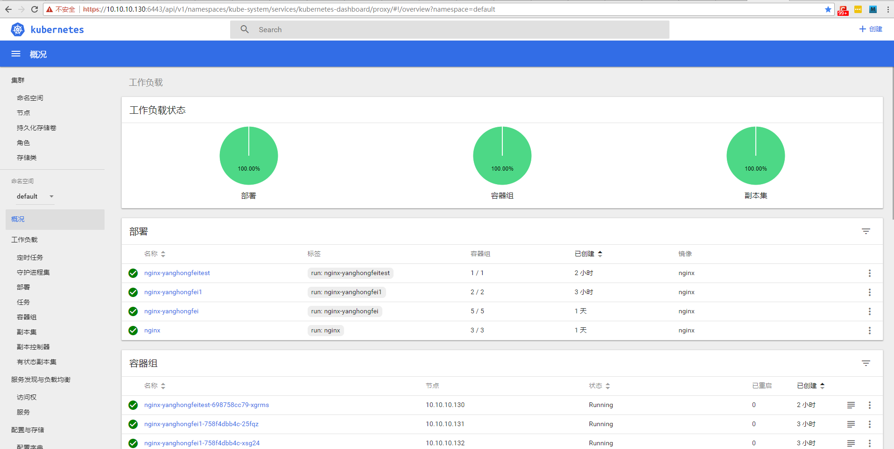


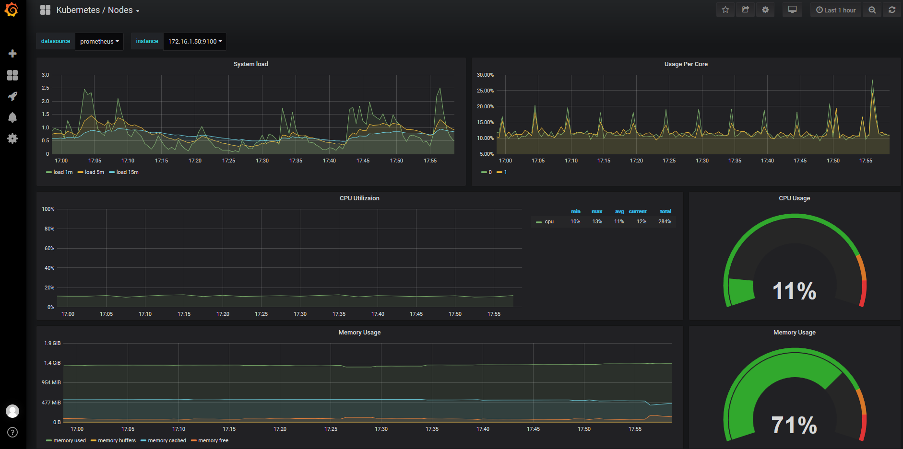


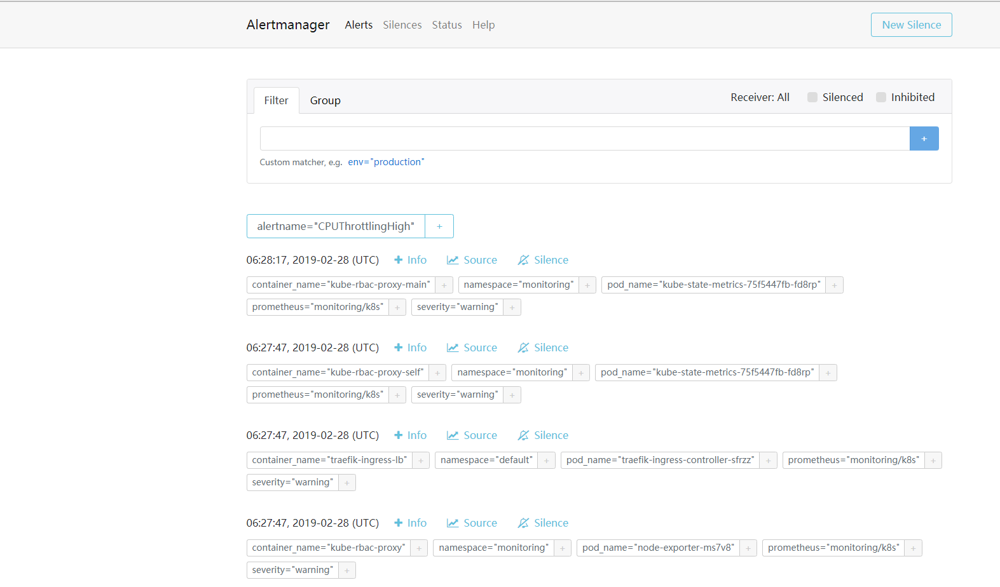


#### 13.3配置Promethe-Operator自定义报警

> OK ，到了这一步监控组件已经安装完成，接下来就是要理解怎么自定义规则，规则怎么写？报警怎么触发。

现在登陆到Prometheus的Dashboard发现已经有一些自带的规则了，还有已经触发的Alter，如下图

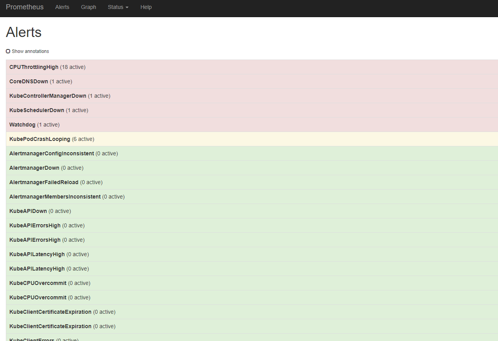


>但是这些报警信息是哪里来的呢？他们应该用怎样的方式通知我们呢？现在我们通过 Operator 部署的呢？我们可以在 Prometheus Dashboard 的 Config 页面下面**查看关于 AlertManager 的配置**：

```yaml
global:
  scrape_interval: 30s
  scrape_timeout: 10s
  evaluation_interval: 30s
  external_labels:
    prometheus: monitoring/k8s
    prometheus_replica: prometheus-k8s-0
alerting:
  alert_relabel_configs:
  - separator: ;
    regex: prometheus_replica
    replacement: $1
    action: labeldrop
  alertmanagers:
  - kubernetes_sd_configs:
    - role: endpoints
      namespaces:
        names:
        - monitoring
    scheme: http
    path_prefix: /
    timeout: 10s
    relabel_configs:
    - source_labels: [__meta_kubernetes_service_name]
      separator: ;
      regex: alertmanager-main
      replacement: $1
      action: keep
    - source_labels: [__meta_kubernetes_endpoint_port_name]
      separator: ;
      regex: web
      replacement: $1
      action: keep
rule_files:
- /etc/prometheus/rules/prometheus-k8s-rulefiles-0/*.yaml
```

上面 alertmanagers 实例的配置我们可以看到是通过角色为 endpoints 的 kubernetes 的服务发现机制获取的，匹配的是服务名为 alertmanager-main，端口名未 web 的 Service 服务，我们查看下 alertmanager-main 这个 Service：

```shell
$ kubectl describe svc alertmanager-main -n monitoring
Name:              alertmanager-main
Namespace:         monitoring
Labels:            alertmanager=main
Annotations:       kubectl.kubernetes.io/last-applied-configuration:
                     {"apiVersion":"v1","kind":"Service","metadata":{"annotations":{},"labels":{"alertmanager":"main"},"name":"alertmanager-main","namespace":"...
Selector:          alertmanager=main,app=alertmanager
Type:              ClusterIP
IP:                10.111.82.41
Port:              web  9093/TCP
TargetPort:        web/TCP
Endpoints:         100.64.2.6:9093,100.64.2.8:9093,100.64.3.6:9093
Session Affinity:  None
Events:            <none>
```

可以看到服务名正是 alertmanager-main，Port 定义的名称也是 web，符合上面的规则，所以 Prometheus 和 AlertManager 组件就正确关联上了。而对应的报警规则文件位于：/etc/prometheus/rules/prometheus-k8s-rulefiles-0/目录下面所有的 YAML 文件。我们可以进入 Prometheus 的 Pod 中验证下该目录下面是否有 YAML 文件：

```shell
$ kubectl exec -it prometheus-k8s-0 /bin/sh -n monitoring
Defaulting container name to prometheus.
Use 'kubectl describe pod/prometheus-k8s-0 -n monitoring' to see all of the containers in this pod.
/prometheus $ ls /etc/prometheus/rules/prometheus-k8s-rulefiles-0/
monitoring-prometheus-k8s-rules.yaml
/prometheus $ cat /etc/prometheus/rules/prometheus-k8s-rulefiles-0/monitoring-pr
ometheus-k8s-rules.yaml
groups:
- name: k8s.rules
  rules:
  - expr: |
      sum(rate(container_cpu_usage_seconds_total{job="kubelet", image!="", container_name!=""}[5m])) by (namespace)
    record: namespace:container_cpu_usage_seconds_total:sum_rate
......
```

这个 YAML 文件实际上就是我们之前创建的一个 PrometheusRule 文件包含的：

```shell
$ cat prometheus-rules.yaml
apiVersion: monitoring.coreos.com/v1
kind: PrometheusRule
metadata:
  labels:
    prometheus: k8s
    role: alert-rules
  name: prometheus-k8s-rules
  namespace: monitoring
spec:
  groups:
  - name: k8s.rules
    rules:
    - expr: |
        sum(rate(container_cpu_usage_seconds_total{job="kubelet", image!="", container_name!=""}[5m])) by (namespace)
      record: namespace:container_cpu_usage_seconds_total:sum_rate
```

我们这里的 PrometheusRule 的 name 为 prometheus-k8s-rules，namespace 为 monitoring，我们可以猜想到我们创建一个 PrometheusRule 资源对象后，会自动在上面的 prometheus-k8s-rulefiles-0 目录下面生成一个对应的<namespace>-<name>.yaml文件，所以如果以后我们需要自定义一个报警选项的话，只需要定义一个 PrometheusRule 资源对象即可。至于为什么 Prometheus 能够识别这个 PrometheusRule 资源对象呢？这就需要查看我们创建的 prometheus 这个资源对象了，里面有非常重要的一个属性 ruleSelector，用来匹配 rule 规则的过滤器，要求匹配具有 prometheus=k8s 和 role=alert-rules 标签的 PrometheusRule 资源对象，现在明白了吧？

```yaml
ruleSelector:
  matchLabels:
    prometheus: k8s
    role: alert-rules
```

所以我们要想自定义一个报警规则，只需要创建一个具有 prometheus=k8s 和 role=alert-rules 标签的 PrometheusRule 对象就行了，这里简单测试一个rule规则文件，[更多rules文件参考](https://github.com/yanghongfei/Kubernetes/tree/master/kube-prometheus/manifests/prometheus/prometheus_rules)

```yaml
$ cat prometheus-cpu-rules.yaml 
apiVersion: monitoring.coreos.com/v1
kind: PrometheusRule
metadata:
  labels:
    prometheus: k8s
    role: alert-rules
  name: prometheus-cpu-rules
  namespace: monitoring
spec:
  groups:
  - name: 主机CPU监控
    rules:
    - alert: CPU利用率过高
      annotations:
        detail:  "{{$labels.instance}}: CPU利用率过高于75% (当前值: {{ $value }})"
        summary: "{{$labels.instance}}: CPU利用率过高"
      expr: |
        100 - (avg by (instance) (irate(node_cpu_seconds_total{job="node-exporter",mode="idle"}[5m])) * 100) > 75
      for: 1m
      labels:
        severity: 严重
    - name: 主机CPU Load15 监控
    rules:
    - alert: CPU Load 15分钟过高
      annotations:
        detail:  "{{$labels.instance}}: 15分钟内CPU Load 过高，(当前值: {{ $value }})"
        summary: "{{$labels.instance}}: 15分钟内CPU Load 过高"
      expr: |
        (node_load15) > 1     #根据你的主机核心数来定
      for: 1m
      labels:
        severity: 严重
```

注意 label 标签一定至少要有 prometheus=k8s 和 role=alert-rules，创建完成后，隔一会儿再去容器中查看下 rules 文件夹


可以看到我们创建的 rule 文件已经被注入到了对应的 rulefiles 文件夹下面了，证明我们上面的设想是正确的。然后再去 Prometheus Dashboard 的 Alert 页面下面就可以查看到上面我们新建的报警规则了


**配置报警**

  我们知道了如何去添加一个报警规则配置项，但是这些报警信息用怎样的方式去发送呢？前面的课程中我们知道我们可以通过 AlertManager 的配置文件去配置各种报警接收器，现在我们是通过 Operator 提供的 alertmanager 资源对象创建的组件，应该怎样去修改配置呢？ 

  首先我们将 alertmanager-main 这个 Service 改为 NodePort 类型的 Service，修改完成后我们可以在页面上的 status 路径下面查看 AlertManager 的默认配置信息。

这些配置信息实际上是来自于我们之前在prometheus-operator/contrib/kube-prometheus/manifests目录下面创建的 alertmanager-secret.yaml 文件：

```shell
apiVersion: v1
data:
  alertmanager.yaml: Imdsb2JhbCI6IAogICJyZXNvbHZlX3RpbWVvdXQiOiAiNW0iCiJyZWNlaXZlcnMiOiAKLSAibmFtZSI6ICJudWxsIgoicm91dGUiOiAKICAiZ3JvdXBfYnkiOiAKICAtICJqb2IiCiAgImdyb3VwX2ludGVydmFsIjogIjVtIgogICJncm91cF93YWl0IjogIjMwcyIKICAicmVjZWl2ZXIiOiAibnVsbCIKICAicmVwZWF0X2ludGVydmFsIjogIjEyaCIKICAicm91dGVzIjogCiAgLSAibWF0Y2giOiAKICAgICAgImFsZXJ0bmFtZSI6ICJEZWFkTWFuc1N3aXRjaCIKICAgICJyZWNlaXZlciI6ICJudWxsIg==
kind: Secret
metadata:
  name: alertmanager-main
  namespace: monitoring
type: Opaque
```

可以将 alertmanager.yaml 对应的 value 值做一个 base64 解码：

```yaml
$ echo "Imdsb2JhbCI6IAogICJyZXNvbHZlX3RpbWVvdXQiOiAiNW0iCiJyZWNlaXZlcnMiOiAKLSAibmFtZSI6ICJudWxsIgoicm91dGUiOiAKICAiZ3JvdXBfYnkiOiAKICAtICJqb2IiCiAgImdyb3VwX2ludGVydmFsIjogIjVtIgogICJncm91cF93YWl0IjogIjMwcyIKICAicmVjZWl2ZXIiOiAibnVsbCIKICAicmVwZWF0X2ludGVydmFsIjogIjEyaCIKICAicm91dGVzIjogCiAgLSAibWF0Y2giOiAKICAgICAgImFsZXJ0bmFtZSI6ICJEZWFkTWFuc1N3aXRjaCIKICAgICJyZWNlaXZlciI6ICJudWxsIg==" | base64 -d
"global":
  "resolve_timeout": "5m"
"receivers":
- "name": "null"
"route":
  "group_by":
  - "job"
  "group_interval": "5m"
  "group_wait": "30s"
  "receiver": "null"
  "repeat_interval": "12h"
  "routes":
  - "match":
      "alertname": "DeadMansSwitch"
    "receiver": "null"
```

我们可以看到内容和上面查看的配置信息是一致的，所以如果我们想要添加自己的接收器，或者模板消息，我们就可以更改这个文件：

```yaml
cat alertmanager.yaml 
global:
  resolve_timeout: 5m
  smtp_smarthost: 'smtp.163.com:25'
  smtp_from: 'yanghongfei97@163.com'
  smtp_auth_username: 'yanghongfei97@163.com'
  smtp_auth_password: '<email_password>'
  smtp_hello: '163.com'
  smtp_require_tls: false
route:
  group_by: ['job', 'severity']
  group_wait: 30s
  group_interval: 5m
  repeat_interval: 12h
  receiver: default
  routes:
  - receiver: webhook
    match:
      alertname: CoreDNSDown
receivers:
- name: 'default'
  email_configs:
  - to: '1923671815@qq.com'
    send_resolved: true
- name: 'webhook'
  webhook_configs:
  - url: 'https://oapi.dingtalk.com/robot/send?access_token=xxxxx'
    send_resolved: true
```

将上面文件保存为 alertmanager.yaml，然后使用这个文件创建一个 Secret 对象：

```shell
# 先将之前的 secret 对象删除
$ kubectl delete secret alertmanager-main -n monitoring
secret "alertmanager-main" deleted
$ kubectl create secret generic alertmanager-main --from-file=alertmanager.yaml -n monitoring
secret "alertmanager-main" created
```

**这时候再次确认配置已经被更改，如下图**

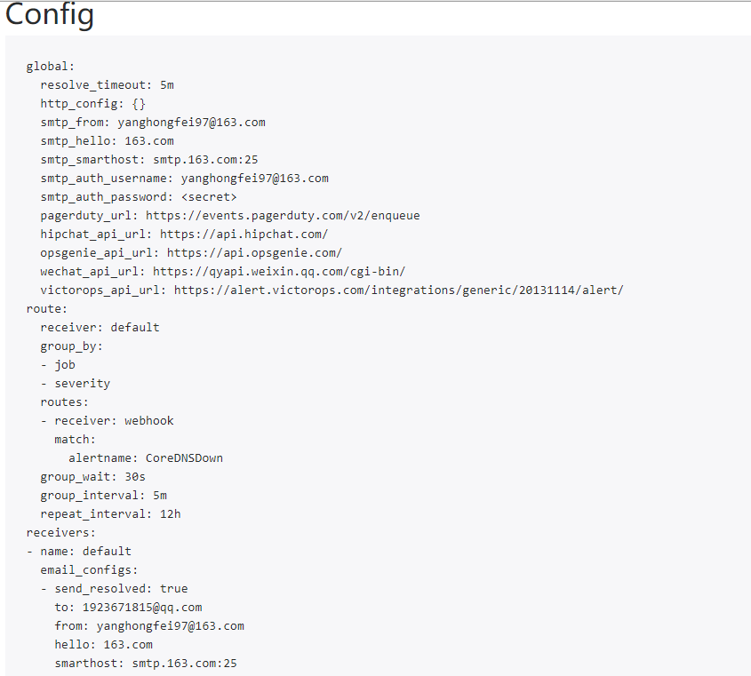

**以上是自带规则，当然读到这里你已经知道了他的rules逻辑，你可以自己进行自定义规则**

这里是我的自定义规则面板，和测试结果，rules规则文件我也放到了`promethues-rules`目录中,[更多rules文件参考](https://github.com/yanghongfei/Kubernetes/tree/master/kube-prometheus/manifests/prometheus/prometheus_rules)


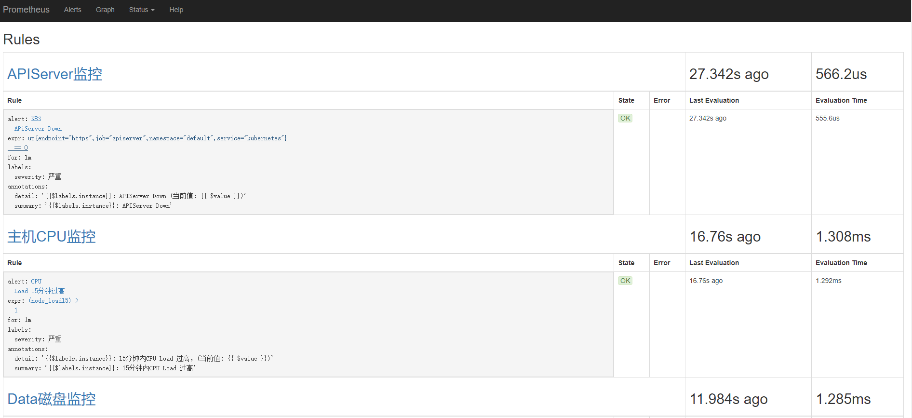

**CPU 15分钟Load>2报警**

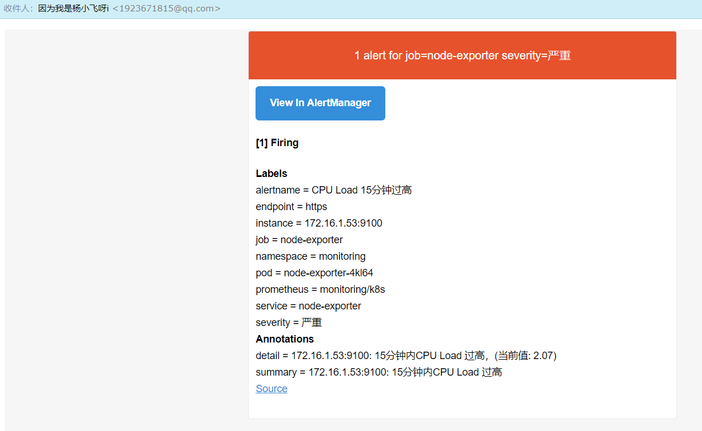


#### 13.4 使用Promethues监控外接ETCD集群 

- Q：为什么要监控ETCD？
- A： 因为K8S数据都是存在ETCD里面，ETCD非常重要！

> 因为默认Prometheus-operator是没有收集ETCD里面的数据的，因为ETCD比较重要，我们ETCD使用外接二进制形式部署高可用，因此这里ETCD需要单独配置serviceMonitor和services

- 参考文档：https://www.qikqiak.com/post/prometheus-operator-monitor-etcd/

**首先我们将需要使用到的证书通过 secret 对象保存到集群中去：(在 etcd 运行的节点)**

我这里是外接ETCD，证书也是前面部署生成的，所以我知道证书位置，若你的etcd是Kubeadm默认部署的，你需要先查看信息`kubectl get pod <etcd_pod_name> -n kube-system -o yaml`详细请参考[Prometheus监控ETCD](https://www.qikqiak.com/post/prometheus-operator-monitor-etcd/)

```shell
$ kubectl -n monitoring create secret generic etcd-certs --from-file=/etc/etcd/ssl/etcd.pem --from-file=/etc/etcd/ssl/etcd-key.pem --from-file=/etc/etcd/ssl/ca.pem
```

然后将上面创建的 etcd-certs 对象配置到 prometheus 资源对象中，直接更新 prometheus 资源对象即可：

```yaml
#因为的promethues有2个节点，所以2台机器都进行操作修改
$ kubectl edit prometheus k8s -n monitoring
#添加如下secrets属性
nodeSelector:
  beta.kubernetes.io/os: linux
replicas: 2
secrets:
- etcd-certs
```

更新完成后，我们就可以在 Prometheus 的 Pod 中获取到上面创建的 etcd 证书文件了，具体的路径我们可以进入 Pod 中查看

```shell
$ kubectl exec -it prometheus-k8s-0 /bin/sh -n monitoring
Defaulting container name to prometheus.
Use 'kubectl describe pod/prometheus-k8s-0 -n monitoring' to see all of the containers in this pod.
/ $ ls /etc/prometheus/secrets/etcd-certs/
ca.pem      etcd.pem  etcd-key.pem
```

**创建ServiceMonitor**

现在 Prometheus 访问 etcd 集群的证书已经准备好了，接下来创建 ServiceMonitor 对象即可（prometheus-serviceMonitorEtcd.yaml）

```yaml
apiVersion: monitoring.coreos.com/v1
kind: ServiceMonitor
metadata:
  name: etcd-k8s
  namespace: monitoring
  labels:
    k8s-app: etcd-k8s
spec:
  jobLabel: k8s-app
  endpoints:
  - port: port
    interval: 30s
    scheme: https
    tlsConfig:
      caFile: /etc/prometheus/secrets/etcd-certs/ca.pem
      certFile: /etc/prometheus/secrets/etcd-certs/etcd.pem
      keyFile: /etc/prometheus/secrets/etcd-certs/etcd-key.pem
      insecureSkipVerify: true
  selector:
    matchLabels:
      k8s-app: etcd
  namespaceSelector:
    matchNames:
    - kube-system
```

上面我们在 monitoring 命名空间下面创建了名为 etcd-k8s 的 ServiceMonitor 对象，基本属性和前面章节中的一致，匹配 kube-system 这个命名空间下面的具有 k8s-app=etcd 这个 label 标签的 Service，jobLabel 表示用于检索 job 任务名称的标签，和前面不太一样的地方是 endpoints 属性的写法，配置上访问 etcd 的相关证书，endpoints 属性下面可以配置很多抓取的参数，比如 relabel、proxyUrl，tlsConfig 表示用于配置抓取监控数据端点的 tls 认证，由于证书 serverName 和 etcd 中签发的可能不匹配，所以加上了 insecureSkipVerify=true


**创建Service**

ServiceMonitor 创建完成了，但是现在还没有关联的对应的 Service 对象，所以需要我们去手动创建一个 Service 对象（prometheus-etcdService.yaml）：

```yaml
apiVersion: v1
kind: Service
metadata:
  name: etcd-k8s
  namespace: kube-system
  labels:
    k8s-app: etcd
spec:
  type: ClusterIP
  clusterIP: None
  ports:
  - name: port
    port: 2379
    protocol: TCP

---
apiVersion: v1
kind: Endpoints
metadata:
  name: etcd-k8s
  namespace: kube-system
  labels:
    k8s-app: etcd
subsets:
- addresses:
  - ip: 172.16.1.50
   # nodeName: K8S01-Master01   集群有多个IP都要写进去
  - ip: 172.16.1.51
   # nodeName: K8S01-Master02
  - ip: 172.16.1.52
   # nodeName: K8S01-Node01
  - ip: 172.16.1.53
    #nodeName: K8S01-Node02
  - ip: 172.16.1.54
    #nodeName: K8S01-Node03
  ports:
  - name: port
    port: 2379
    protocol: TCP
```

Endpoints 的 subsets 中填写 etcd 集群的地址即可，我们这里是单节点的，填写一个即可，直接创建该 Service 资源：

```shell
$ kubectl create -f prometheus-etcdService.yaml
```

创建完成后，隔一会儿去 Prometheus 的 Dashboard 中查看 targets，便会有 etcd 的监控项了：

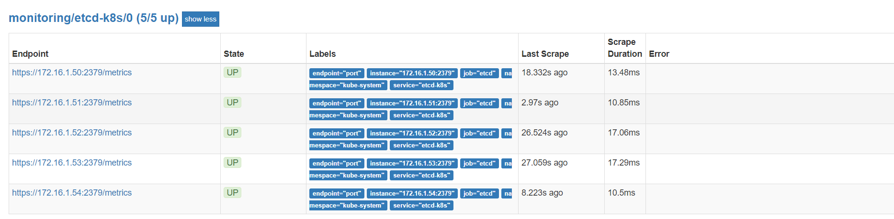

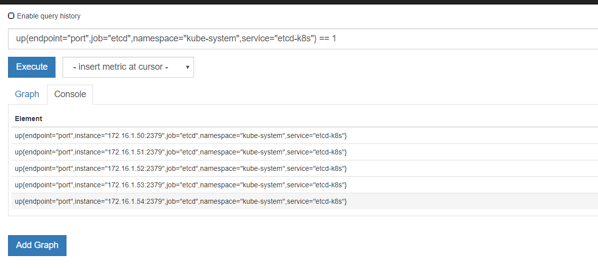


**配置ETCD监控报警规则**

到了这一步集群里面已经能prometheus到ETCD了，并且可以拿到数据，接下来就根据数据配置prometheus-rules规则，更多规则请参考：https://github.com/yanghongfei/Kubernetes/tree/master/kube-prometheus/manifests/prometheus/prometheus_rules

```yaml
apiVersion: monitoring.coreos.com/v1
kind: PrometheusRule
metadata:
  labels:
    prometheus: k8s
    role: alert-rules
  name: prometheus-etcd-rules
  namespace: monitoring
spec:
  groups:
  - name: EtcdMonitoring
    rules:
    - alert: EtcdDown 
      annotations:
        detail:  "{{$labels.instance}}: etcd down (当前值: {{ $value }})"
        summary: "{{$labels.instance}}: etcd 出现异常，请管理员尽快排查"
      expr: |
        up{endpoint="port",job="etcd",namespace="kube-system",service="etcd-k8s"} == 0
      for: 1m
      labels:
        severity: 严重
```

**另外附上自己整理的监控K8S集群规则**

规则路径：https://github.com/yanghongfei/Kubernetes/tree/master/kube-prometheus/manifests/prometheus/prometheus_rules

```shell
.
├── prometheus-altermanager-rules.yaml    #监控Altermanger存活
├── prometheus-cpu-rules.yaml             #监控NodeCPU利用率和NodeCPULoad负载
├── prometheus-deployment-rules.yaml      #监控K8S集群中是否有部署报错
├── prometheus-disk-rules.yaml            #监控磁盘空间，磁盘IO后续更新
├── prometheus-etcd-rules.yaml            #监控ETCD集群存活
├── prometheus-grafana-rules.yaml         #监控Grafana是否存活
├── prometheus-k8s-pod-rules.yaml         #监控K8S集群中POD重启和异常POD信息
├── prometheus-k8s-rules.yaml             #监控K8SMaster核心组件，如:APIServer 调度器等
├── prometheus-memory-rules.yaml          #监控Node主机内存使用情况
├── prometheus-node_exporter-rules.yaml   #监控Node采集器存活情况
└── prometheus-prometheus-rules.yaml      #监控Promethues服务存活
```

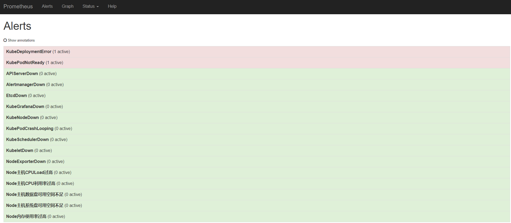


### 维护相关

#### 01. 强制删除Pod

```shell
$ kubectl delete  pods calico-node-wkmfl   --grace-period=0 --force --namespace kube-system
##强制重启pod
kubectl get pods coredns-bb849946b-jflvr -n kube-system -o yaml | kubectl replace --force -f -

##强制重新部署
kubectl get deployment grafana -n monitoring -o yaml   | kubectl replace --force -f -
```

#### 02. 重新获取集群Token

> 集群初始化时如未设置tokenTTL: "0s" 那么默认生成的token的有效期为24小时，当过期之后，该token就不可用了。另如果丢失kubeadm join加入集群命令，也同样可以通过以下方法解决

```shell
#重新生成token
$ kubeadm token create

#查看
$ kubeadm token list

#获取ca证书sha256编码hash值
$ openssl x509 -pubkey -in /etc/kubernetes/pki/ca.crt | openssl rsa -pubin -outform der 2>/dev/null | openssl dgst -sha256 -hex | sed 's/^.* //'

#使用以上命令生成的token和hash值，操作节点加入集群
$ kubeadm join --token qfk0zc.uobckpxnh54v5at3 --discovery-token-ca-cert-hash sha256:68efb4e280d110f3004a4e16ed09c5ded6c2421cb24a6077cf6171d5167b04d2  10.0.0.15:6443 --skip-preflight-checks
```

#### 03. Master节点也允许Pod容器

> 默认集群安装完成后，Master节点是不进行Pod分配的，资源不足/实验环境，让Master 节点也参与分配pod

```shell
$ kubectl taint nodes --all node-role.kubernetes.io/master-
```


#### 04. modprobe: FATAL: Module br_netfilter not found

> 有些系统内核里面没有br_netfilter，这时候需要我们更改系统内核。

```shell
modprobe br_netfilter   //报错: modprobe: FATAL: Module br_netfilter not found
cat <<EOF >  /etc/sysctl.d/k8s.conf
net.bridge.bridge-nf-call-ip6tables = 1
net.bridge.bridge-nf-call-iptables = 1
net.ipv4.ip_forward = 1
vm.swappiness=0
EOF
sysctl -p /etc/sysctl.d/k8s.conf
ls /proc/sys/net/bridge
```

- 解决办法：
  - 参考文档：https://linux.cn/article-8310-1.html

```shell
rpm --import https://www.elrepo.org/RPM-GPG-KEY-elrepo.org
rpm -Uvh http://www.elrepo.org/elrepo-release-7.0-2.el7.elrepo.noarch.rpm
yum --disablerepo="*" --enablerepo="elrepo-kernel" list available
yum --enablerepo=elrepo-kernel install kernel-ml -y
# 修改 GRUB 初始化页面的第一个内核将作为默认内核
sed -i s#GRUB_DEFAULT=saved#GRUB_DEFAULT=0#g /etc/default/grub  
# 重新创建内核配置
grub2-mkconfig -o /boot/grub2/grub.cfg
# 重启加载新内核
reboot
```


#### 05. Node配置Keepalived，避免整个Node挂掉，Tarefik解析不可用问题

- 配置VIP漂移
- Tarefik解析到VIP上(不再是NodeIP单点)

```shell
# 所有Node节点执行
yum install -y keepalived
systemctl enable keepalived
```

- Node01配置

```shell
cat <<EOF >/etc/keepalived/keepalived.conf
global_defs {
   router_id LVS_k8s
}

# vrrp_script CheckK8sMaster {
#     script "curl -k https://172.16.1.49:6443"    #VIP Address
#     interval 3
#     timeout 9
#     fall 2
#     rise 2
# }

vrrp_instance VI_1 {
    state MASTER
    interface ens32       #Your Network Interface Name
    virtual_router_id 61
    priority 120          #权重，数字大的为主，数字一样则选择第一台为Master
    advert_int 1
    mcast_src_ip 172.16.1.52  #local IP
    nopreempt
    authentication {
        auth_type PASS
        auth_pass sqP05dQgMSlzrxHj
    }
    unicast_peer {
        #172.16.1.52
        172.16.1.53    #node02
        172.16.1.54
    }
    virtual_ipaddress {
        172.16.1.59/24    # VIP
    }
    # track_script {
    #     CheckK8sMaster
    # }

}
EOF
```

- Node02配置

```shell
cat <<EOF >/etc/keepalived/keepalived.conf
global_defs {
   router_id LVS_k8s
}

# vrrp_script CheckK8sMaster {
#     script "curl -k https://172.16.1.49:6443"
#     interval 3
#     timeout 9
#     fall 2
#     rise 2
# }

vrrp_instance VI_1 {
    state MASTER
    interface ens32
    virtual_router_id 61
    priority 110
    advert_int 1
    mcast_src_ip 172.16.1.53   #local_ip
    nopreempt
    authentication {
        auth_type PASS
        auth_pass sqP05dQgMSlzrxHj
    }
    unicast_peer {
        172.16.1.52
        #172.16.1.53
        172.16.1.54
    }
    virtual_ipaddress {
        172.16.1.59/24      #vip
    }
    # track_script {
    #     CheckK8sMaster
    # }

}
EOF
```

- Node03配置

```shell
cat <<EOF >/etc/keepalived/keepalived.conf
global_defs {
   router_id LVS_k8s
}

# vrrp_script CheckK8sMaster {
#     script "curl -k https://172.16.1.49:6443"
#     interval 3
#     timeout 9
#     fall 2
#     rise 2
# }

vrrp_instance VI_1 {
    state MASTER
    interface ens32
    virtual_router_id 61
    priority 100
    advert_int 1
    mcast_src_ip 172.16.1.54   #local_ip
    nopreempt
    authentication {
        auth_type PASS
        auth_pass sqP05dQgMSlzrxHj
    }
    unicast_peer {
        172.16.1.52
        172.16.1.53
        #172.16.1.54
    }
    virtual_ipaddress {
        172.16.1.59/24      #vip
    }
    # track_script {
    #     CheckK8sMaster
    # }

}
EOF
```


- 启动服务

```shell
sed s#'KEEPALIVED_OPTIONS="-D"'#'KEEPALIVED_OPTIONS="-D -d -S 0"'#g /etc/sysconfig/keepalived -i   //配置日志文件
echo "local0.*    /var/log/keepalived.log" >> /etc/rsyslog.conf
service rsyslog restart
systemctl start keepalived
systemctl status keepalived
```

- 测试参考**8.4测试Keepalived可用性**


#### 06. POD容器不能访问外网问题

> 详细排查思路请参考**10.4测试Calico和DNS网络问题**

```shell

cat config.yaml   #你的SVC和POD地址段，添加2条规则
$ ps uax |grep kube-proxy  //确保加载了--cluster-cidr
$ iptables -nvL |grep FORWARD  //查看FORWARD 是否为ACCEPT 
$ iptables -P FORWARD ACCEPT  //开启IPtableS转发ACCEPT
$ sysctl -a | grep ip_forward //确认系统ip_forward开启

$ /sbin/iptables -t nat -I POSTROUTING -s  100.64.0.0/10 -j MASQUERADE
$ /sbin/iptables -t nat -I POSTROUTING -s  10.96.0.0/12 -j MASQUERADE

$ kubectl run -it --rm --image=infoblox/dnstools dns-client #测试
dnstools# ping qq.com  #可以ping通
```

#### 07. prometheus-operator部署完成后Targets 部分显示0/0问题

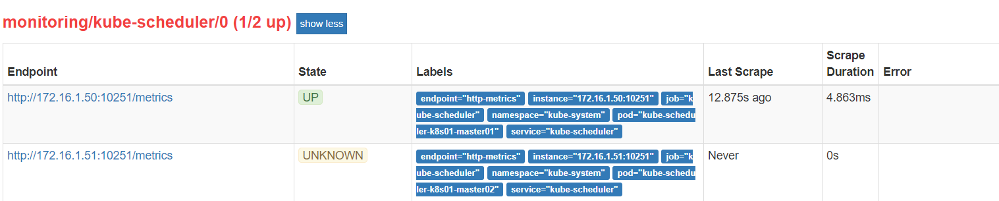

这里是因为Promethues-operator里面的serviceMonitor匹配不到Labels，详细请参考[阳明的博客](https://www.qikqiak.com/post/first-use-prometheus-operator/)


### 参考文档

部署参考文档：


https://www.kubernetes.org.cn/4956.html

https://www.qikqiak.com/post/how-to-use-ipvs-in-kubernetes/

https://www.qikqiak.com/post/first-use-prometheus-operator/

http://www.servicemesher.com/blog/prometheus-operator-manual/

https://www.qikqiak.com/post/prometheus-operator-monitor-etcd/

https://kubernetes.io/zh/docs/reference/setup-tools/kubeadm/kubeadm-init/

https://godoc.org/k8s.io/kubernetes/cmd/kubeadm/app/apis/kubeadm/v1beta1

https://github.com/kubernetes/kubernetes/blob/master/pkg/proxy/ipvs/README.md

Kubernetes二进制部署参考文档：https://github.com/yanghongfei/Kubernetes/tree/master/kubernetes-Binary，仅供参考，K8S版本迭代太快，这个二进制V1.6版本已经无法再完整部署起来了。


