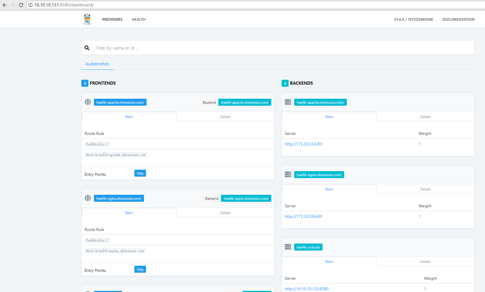
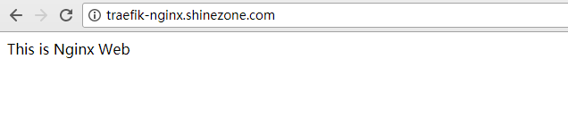
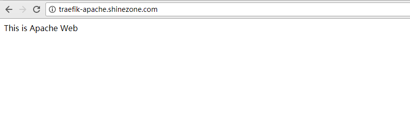
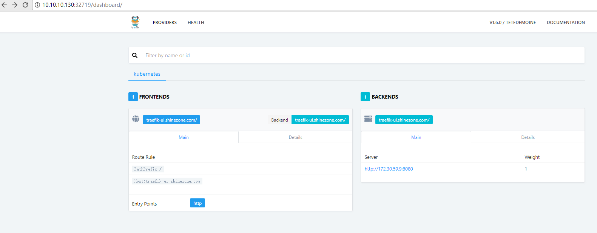
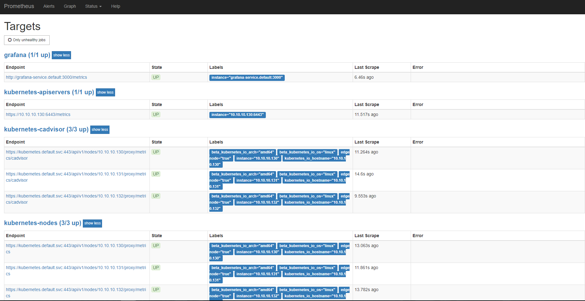
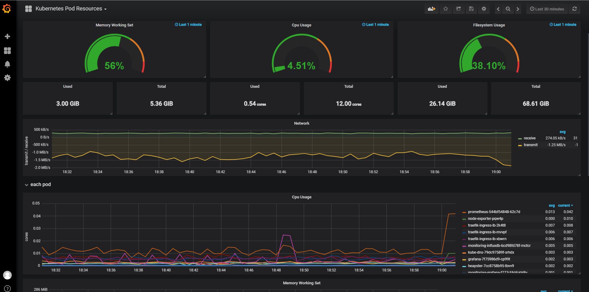
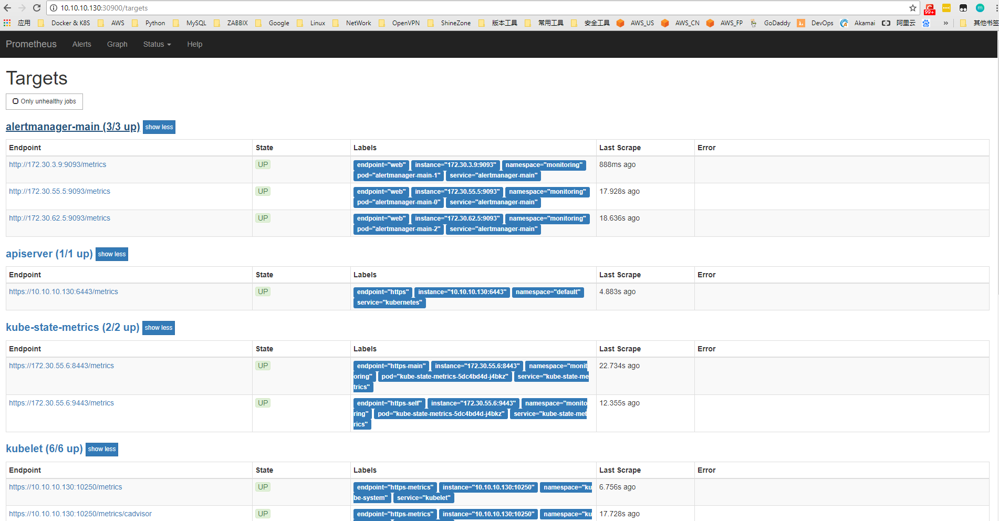

###                                    基于CentOS 7.4 部署Kubernetes1.10集群 


[TOC]


### 修订记录

|    Data    |   Author    | Type |       Content        | Version |
| :--------: | :---------: | :--: | :------------------: | :-----: |
| 2018-04-18 | YangHongFei |  A   |  Create  Documents   |  v0.1   |
| 2018-04-20 | YangHongFei |  A   |  Flannel Configure   |  v0.2   |
| 2018-04-27 | YangHongFei |  A   |  Add Dashboard  UI   |  v0.3   |
| 2018-05-03 | YangHongFei |  A   |   KubeDNS Heapster   |  v0.4   |
| 2018-05-24 | YangHongFei |  A   | Add Proetheus Server |  v0.5   |

**【修订类型：A-新增  M-修改 D-删除】**


**部署参考文档** ：

[GitBook JimmySong ](https://jimmysong.io/kubernetes-handbook/practice/)  ，[Githup Opsnull](https://github.com/opsnull/follow-me-install-kubernetes-cluster)  ，[Kubernetes中文社区]([Githup For Opsnull](https://jimmysong.io/kubernetes-handbook/practice/)  ) ，[Kubernetes Github官方](https://github.com/kubernetes/kubernetes)


 **YAML参考文档**

下文部署中会讲到很多部署应用程序，容器，资源管理等，这些都是用到YAML文件的，

其中YAML文件刷新资源文档，请参考官方[kubeclt replace](http://kubernetes.kansea.com/docs/user-guide/kubectl/kubectl_replace/)。`cat x.yaml | kubectl replace -f -`

请参考官方文档：For general information about working with config files,see [deploying applications](https://kubernetes.io/docs/tasks/run-application/run-stateless-application-deployment/), [configuring containers](https://kubernetes.io/docs/tasks/configure-pod-container/configure-pod-configmap/), [managing resources](https://kubernetes.io/docs/concepts/cluster-administration/manage-deployment/) and [ingress configuration rewrite](https://github.com/kubernetes/ingress-nginx/blob/master/docs/examples/rewrite/README.md).


### 01. 部署目的

#### 1.1 Kubernetes的特性

- 分布式部署
- 服务发现
- 服务实例保护
- 滚动升级
- 节点无痕维护
- 负载平衡
- 动态扩缩容

从而能够贴合未来微服部署维护的需求

**贴微服务，开发环境快速部署**

通过docker镜像，可以快速并且一致的为每个开发人员提供相同的linux开发环境，省去了每个员工自行部署开发环境带来的疑问和冗余，让开发人员能够能专注于code本身，节省大量时间


### 02. 环境说明

- 三台机器进行实验K8S v1.10集群环境，其中etcd node为三台复用
- Kubernetes中所有数据都是存储在etcd中的，etcd必须高可用集群
- 我这里Master是单点，Master故障并不会导致业务，Master主要是分发用户操作指令等操作；
- Master官方给出是用keepalived进行集群，建议也可以使用自建LB/商业AWS的（ALB ELB ）

|            System             |      Roles       |  IP Address  |
| :---------------------------: | :--------------: | :----------: |
| CentOS Linux release 7.4.1708 | Master/Node/Etcd | 10.10.10.130 |
| CentOS Linux release 7.4.1708 |   Node01/Etcd    | 10.10.10.131 |
| CentOS Linux release 7.4.1708 |   Node02/Etcd    | 10.10.10.132 |
| CentOS Linux release 7.4.1708 |      Harbor      | 172.16.0.181 |

#### 2.1 集群说明

|    Software     | Version |
| :-------------: | :-----: |
|   Kubernetes    |  1.10   |
|    Docker-CE    |  17.03  |
|      Etcd       |  3.1.5  |
|     Flannel     |  0.7.1  |
|    Dashboard    |  1.8.3  |
|    Heapster     |  1.5.0  |
| Traefik Ingress |  1.6.0  |


### 03. K8S集群名词说明

#### 3.1 Kubernetes

Kubernetes 是 Google 团队发起并维护的基于Docker的开源容器集群管理系统，它不仅支持常见的云平台，而且支持内部数据中心。

建于 Docker 之上的 Kubernetes 可以构建一个容器的调度服务，其目的是让用户透过Kubernetes集群来进行云端容器集群的管理，而无需用户进行复杂的设置工作。系统会自动选取合适的工作节点来执行具体的容器集群调度处理工作。其核心概念是Container Pod（容器仓）。一个Pod是有一组工作于同一物理工作节点的容器构成的。这些组容器拥有相同的网络命名空间/IP以及存储配额，可以根据实际情况对每一个Pod进行端口映射。此外，Kubernetes工作节点会由主系统进行管理，节点包含了能够运行Docker容器所用到的服务。

####  3.2 Docker

Docker是一个开源的引擎，可以轻松的为任何应用创建一个轻量级的、可移植的、自给自足的容器。开发者在笔记本上编译测试通过的容器可以批量地在生产环境中部署，包括VMs（虚拟机）、bare metal、OpenStack 集群和其他的基础应用平台。

####  3.3 Etcd

ETCD是用于共享配置和服务发现的分布式，一致性的KV存储系统。

#### 3.4 Flannel

Flannel 是CoreOS 下面的一个项目，目前被使用在 kubernetes 中，用于解决 docker 容器直接跨主机的通信问题


### 04. 开始部署Kubernetes集群

#### 4.1 安装前准备

截至2018年04月，Kubernetes目前文档版本：v1.10  官方版本迭代很快，我们选择目前文档版本搭建

#### 4.2 安装Docker-CE

```shell
wget https://download.docker.com/linux/centos/7/x86_64/stable/Packages/docker-ce-selinux-17.03.2.ce-1.el7.centos.noarch.rpm
wget https://download.docker.com/linux/centos/7/x86_64/stable/Packages/docker-ce-17.03.2.ce-1.el7.centos.x86_64.rpm
yum install docker-ce-selinux-17.03.2.ce-1.el7.centos.noarch.rpm
yum install docker-ce-17.03.2.ce-1.el7.centos.x86_64.rpm 
```

#### 4.3 关闭Selinux

```shell
修改/etc/selinux/config文件中设置SELINUX=disabled
$ setenforce 0
为了安全起见， docker 在 1.13 版本之后，将系统iptables 中 FORWARD 链的默认策略设置为 DROP
$ iptables -P FORWARD ACCEPT
```

#### 4.4 下载Kubernetes 1.10软件包

这里特别说明下，Kubernetes的官方Server二进制包包含了所有组件及脚本，后续服务都会逐个使用到，这里先下载准备好放在`/root` ，千万注意服务版本不要搞错，因为有些新版本参数已经改了很多。


```shell
wget https://dl.k8s.io/v1.10.0/kubernetes-client-linux-amd64.tar.gz
wget https://dl.k8s.io/v1.10.0/kubernetes-server-linux-amd64.tar.gz
```

#### 4.5 安装Go

````shell
wget https://dl.google.com/go/go1.10.1.linux-amd64.tar.gz
tar -C /usr/local -xzf go1.10.1.linux-amd64.tar.gz
export PATH=$PATH:/usr/local/go/bin
go version
go version go1.10.1 linux/amd64
````


### 05. 生成TLS证书和秘钥

#### 5.1 Kubernetes 集群所需证书

|       CA&Key       | etcd | api-server | proxy | kebectl | flanneld | harbor |
| :----------------: | :--: | :--------: | :---: | :-----: | :------: | :----: |
|       ca.pem       |  √   |     √      |   √   |    √    |    √     |        |
|     ca-key.pem     |      |     √      |       |         |          |        |
|      etcd.pem      |  √   |            |       |         |          |        |
|    etcd-key.pem    |  √   |            |       |         |          |        |
|   kubernetes.pem   |      |     √      |       |         |    √     |        |
| kubernetes-key.pem |      |     √      |       |         |    √     |        |
|   kube-proxy.pem   |      |            |   √   |         |          |        |
| kube-proxy-key.pem |      |            |   √   |         |          |        |
|     admin.pem      |      |            |       |    √    |          |        |
|   admin-key.pem    |      |            |       |    √    |          |        |
|    flanneld.pem    |      |            |       |         |    √     |        |
|  flanneld-key.pem  |      |            |       |         |    √     |        |
| shinezone.com.crt  |      |            |       |         |          |   √    |
| shinezone.com.key  |      |            |       |         |          |   √    |


#### 5.2 二进制安装CFSSL

```
wget https://pkg.cfssl.org/R1.2/cfssl_linux-amd64
chmod +x cfssl_linux-amd64
mv cfssl_linux-amd64 /usr/local/bin/cfssl

wget https://pkg.cfssl.org/R1.2/cfssljson_linux-amd64
chmod +x cfssljson_linux-amd64
mv cfssljson_linux-amd64 /usr/local/bin/cfssljson

wget https://pkg.cfssl.org/R1.2/cfssl-certinfo_linux-amd64
chmod +x cfssl-certinfo_linux-amd64
mv cfssl-certinfo_linux-amd64 /usr/local/bin/cfssl-certinfo

export PATH=/usr/local/bin:$PATH
```

#### 5.3 创建CA证书

```
mkdir /root/ssl
cd /root/ssl
cfssl print-defaults config > config.json
cfssl print-defaults csr > csr.json
# 根据config.json文件的格式创建如下的ca-config.json文件
# 过期时间设置成了 87600h
cat > ca-config.json <<EOF
{
  "signing": {
    "default": {
      "expiry": "87600h"
    },
    "profiles": {
      "kubernetes": {
        "usages": [
            "signing",
            "key encipherment",
            "server auth",
            "client auth"
        ],
        "expiry": "87600h"
      }
    }
  }
}
EOF
```

字段说明

- `ca-config.json`：可以定义多个 profiles，分别指定不同的过期时间、使用场景等参数；后续在签名证书时使用某个 profile；
- `signing`：表示该证书可用于签名其它证书；生成的 ca.pem 证书中 `CA=TRUE`；
- `server auth`：表示client可以用该 CA 对server提供的证书进行验证；
- `client auth`：表示server可以用该CA对client提供的证书进行验证；

#### 5.4 创建 CA 证书签名请求

创建 `ca-csr.json` 文件，内容如下：

vim ca-csr.json

```
{
  "CN": "kubernetes",
  "key": {
    "algo": "rsa",
    "size": 2048
  },
  "names": [
    {
      "C": "CN",
      "ST": "BeiJing",
      "L": "BeiJing",
      "O": "k8s",
      "OU": "System"
    }
  ],
    "ca": { 
       "expiry": "87600h"
    }
}
```

- "CN"：`Common Name`，kube-apiserver 从证书中提取该字段作为请求的用户名 (User Name)；浏览器使用该字段验证网站是否合法；
- "O"：`Organization`，kube-apiserver 从证书中提取该字段作为请求用户所属的组 (Group)；


#### 5.5 生成 CA 证书和私钥

```
cd /root/ssl
cfssl gencert -initca ca-csr.json | cfssljson -bare ca
ls ca*
ca-config.json  ca.csr  ca-csr.json  ca-key.pem  ca.pem
```


#### 5.6 创建 kubernetes 证书

创建 kubernetes 证书签名请求文件 `kubernetes-csr.json`：

```
{
    "CN": "kubernetes",
    "hosts": [
      "127.0.0.1",
      "10.10.10.130",
      "10.10.10.131",
      "10.10.10.132",
      "10.10.10.133",
      "10.10.10.134",
      "10.10.10.135", 
      "10.254.0.1",
      "kubernetes",
      "kubernetes.default",
      "kubernetes.default.svc",
      "kubernetes.default.svc.cluster",
      "kubernetes.default.svc.cluster.local"
    ],
    "key": {
        "algo": "rsa",
        "size": 2048
    },
    "names": [
        {
            "C": "CN",
            "ST": "BeiJing",
            "L": "BeiJing",
            "O": "k8s",
            "OU": "System"
        }
    ]
}
```

- 如果 hosts 字段不为空则需要指定授权使用该证书的 **IP 或域名列表**，由于该证书后续被 `etcd` 集群和 `kubernetes master` 集群使用，所以上面分别指定了 `etcd` 集群、`kubernetes master` 集群的主机 IP 和 **kubernetes 服务的服务 IP**（一般是 `kube-apiserver` 指定的 `service-cluster-ip-range` 网段的第一个IP，如 10.254.0.1）。
- 这是最小化安装的kubernetes集群，包括一个私有镜像仓库，三个节点的kubernetes集群，以上物理节点的IP也可以更换为主机名。

#### 5.7 生成 kubernetes 证书和私钥

```
$ cfssl gencert -ca=ca.pem -ca-key=ca-key.pem -config=ca-config.json -profile=kubernetes kubernetes-csr.json | cfssljson -bare kubernetes
$ ls kubernetes*
kubernetes.csr  kubernetes-csr.json  kubernetes-key.pem  kubernetes.pem
```


#### 5.8 创建admin证书

创建 admin 证书签名请求文件 `admin-csr.json`：

```
{
  "CN": "admin",
  "hosts": [],
  "key": {
    "algo": "rsa",
    "size": 2048
  },
  "names": [
    {
      "C": "CN",
      "ST": "BeiJing",
      "L": "BeiJing",
      "O": "system:masters",
      "OU": "System"
    }
  ]
}
```

- 后续 `kube-apiserver` 使用 `RBAC` 对客户端(如 `kubelet`、`kube-proxy`、`Pod`)请求进行授权；
- `kube-apiserver` 预定义了一些 `RBAC` 使用的 `RoleBindings`，如 `cluster-admin` 将 Group `system:masters` 与 Role `cluster-admin` 绑定，该 Role 授予了调用`kube-apiserver` 的**所有 API**的权限；
- O 指定该证书的 Group 为 `system:masters`，`kubelet` 使用该证书访问 `kube-apiserver` 时 ，由于证书被 CA 签名，所以认证通过，同时由于证书用户组为经过预授权的 `system:masters`，所以被授予访问所有 API 的权限；

**注意**：这个admin 证书，是将来生成管理员用的kube config 配置文件用的，现在我们一般建议使用RBAC 来对kubernetes 进行角色权限控制， kubernetes 将证书中的CN 字段 作为User， O 字段作为 Group（具体参考[ Kubernetes中的用户与身份认证授权](https://jimmysong.io/kubernetes-handbook/guide/authentication.html)中 X509 Client Certs 一段）。

----------------------------------------------------------------------------------------------------------------------------------------------

在搭建完 kubernetes 集群后，我们可以通过命令: `kubectl get clusterrolebinding cluster-admin -o yaml` ,查看到 `clusterrolebinding cluster-admin` 的 subjects 的 kind 是 Group，name 是 `system:masters`。 `roleRef` 对象是 `ClusterRole cluster-admin`。 意思是凡是 `system:masters Group`的 user 或者 `serviceAccount` 都拥有 `cluster-admin` 的角色。 因此我们在使用 kubectl 命令时候，才拥有整个集群的管理权限。可以使用 `kubectl get clusterrolebinding cluster-admin -o yaml` 来查看。

```
$ kubectl get clusterrolebinding cluster-admin -o yaml
apiVersion: rbac.authorization.k8s.io/v1
kind: ClusterRoleBinding
metadata:
  annotations:
    rbac.authorization.kubernetes.io/autoupdate: "true"
  creationTimestamp: 2017-04-11T11:20:42Z
  labels:
    kubernetes.io/bootstrapping: rbac-defaults
  name: cluster-admin
  resourceVersion: "52"
  selfLink: /apis/rbac.authorization.k8s.io/v1/clusterrolebindings/cluster-admin
  uid: e61b97b2-1ea8-11e7-8cd7-f4e9d49f8ed0
roleRef:
  apiGroup: rbac.authorization.k8s.io
  kind: ClusterRole
  name: cluster-admin
subjects:
- apiGroup: rbac.authorization.k8s.io
  kind: Group
  name: system:masters
```

-----------------------------------------------------------------------------------------------------------------------------------------------

#### 5.9 生成admin证书和秘钥

```
cfssl gencert -ca=ca.pem -ca-key=ca-key.pem -config=ca-config.json -profile=kubernetes admin-csr.json | cfssljson -bare admin
ls admin*
admin.csr  admin-csr.json  admin-key.pem  admin.pem
```


#### 5.10 创建kube-proxy证书

```
{
  "CN": "system:kube-proxy",
  "hosts": [],
  "key": {
    "algo": "rsa",
    "size": 2048
  },
  "names": [
    {
      "C": "CN",
      "ST": "BeiJing",
      "L": "BeiJing",
      "O": "k8s",
      "OU": "System"
    }
  ]
```

- CN 指定该证书的 User 为 `system:kube-proxy`；
- `kube-apiserver` 预定义的 RoleBinding `cluster-admin` 将User `system:kube-proxy` 与 Role `system:node-proxier` 绑定，该 Role 授予了调用 `kube-apiserver` Proxy 相关 API 的权限；


生成 kube-proxy 客户端证书和私钥

```
cfssl gencert -ca=ca.pem -ca-key=ca-key.pem -config=ca-config.json -profile=kubernetes  kube-proxy-csr.json | cfssljson -bare kube-proxy
$ ls kube-proxy*
kube-proxy.csr  kube-proxy-csr.json  kube-proxy-key.pem  kube-proxy.pem
```


#### 5.11 分发证书

将生成的证书和秘钥文件（后缀名为`.pem`）拷贝到所有机器的 `/etc/kubernetes/ssl` 目录下备用；

```shell
mkdir -p /etc/kubernetes/ssl
cp *.pem /etc/kubernetes/ssl
scp -r /etc/kubernetes node01:/etc/
scp -r /etc/kubernetes node02:/etc/
```


### 06. 安装kubectl命令行工具

#### 6.1 安装kubectl

kubectl使用kubenetes包，准备工作的时候已经下载好了，在`/root/`

```shell
wget https://dl.k8s.io/v1.6.0/kubernetes-client-linux-amd64.tar.gz
tar -xzvf kubernetes-client-linux-amd64.tar.gz
cp kubernetes/client/bin/kube* /usr/bin/
chmod a+x /usr/bin/kube*
```

#### 6.2 创建kubectl kubeconfig文件

Master节点操作

```
export KUBE_APISERVER="https://10.10.10.130:6443"
kubectl config set-cluster kubernetes \
  --certificate-authority=/etc/kubernetes/ssl/ca.pem \
  --embed-certs=true \
  --server=${KUBE_APISERVER}
  
# 设置客户端认证参数
kubectl config set-credentials admin \
  --client-certificate=/etc/kubernetes/ssl/admin.pem \
  --embed-certs=true \
  --client-key=/etc/kubernetes/ssl/admin-key.pem
# 设置上下文参数
kubectl config set-context kubernetes \
  --cluster=kubernetes \
  --user=admin
# 设置默认上下文
kubectl config use-context kubernetes  
```

- `admin.pem` 证书 OU 字段值为 `system:masters`，`kube-apiserver` 预定义的 RoleBinding `cluster-admin` 将 Group `system:masters` 与 Role `cluster-admin` 绑定，该 Role 授予了调用`kube-apiserver` 相关 API 的权限；
- 生成的 kubeconfig 被保存到 `~/.kube/config` 文件；

**注意：**`~/.kube/config`文件拥有对该集群的最高权限，请妥善保管。


#### 6.3 创建TLS Bootstrapping Token

```
export BOOTSTRAP_TOKEN=$(head -c 16 /dev/urandom | od -An -t x | tr -d ' ')
cat > token.csv <<EOF
${BOOTSTRAP_TOKEN},kubelet-bootstrap,10001,"system:kubelet-bootstrap"
EOF
```


#### 6.4 创建 kubelet bootstrapping kubeconfig 文件

```
cd /etc/kubernetes/
export KUBE_APISERVER="https://10.10.10.130:6443"
# 设置集群参数
kubectl config set-cluster kubernetes \
  --certificate-authority=/etc/kubernetes/ssl/ca.pem \
  --embed-certs=true \
  --server=${KUBE_APISERVER} \
  --kubeconfig=bootstrap.kubeconfig

# 设置客户端认证参数
kubectl config set-credentials kubelet-bootstrap \
  --token=${BOOTSTRAP_TOKEN} \
  --kubeconfig=bootstrap.kubeconfig

# 设置上下文参数
kubectl config set-context default \
  --cluster=kubernetes \
  --user=kubelet-bootstrap \
  --kubeconfig=bootstrap.kubeconfig

# 设置默认上下文
kubectl config use-context default --kubeconfig=bootstrap.kubeconfig
```


#### 6.5 创建 kube-proxy kubeconfig 文件

```
cd /etc/kubernetes/
export KUBE_APISERVER="https://10.10.10.130:6443"

# 设置集群参数
kubectl config set-cluster kubernetes \
  --certificate-authority=/etc/kubernetes/ssl/ca.pem \
  --embed-certs=true \
  --server=${KUBE_APISERVER} \
  --kubeconfig=kube-proxy.kubeconfig
# 设置客户端认证参数
kubectl config set-credentials kube-proxy \
  --client-certificate=/etc/kubernetes/ssl/kube-proxy.pem \
  --client-key=/etc/kubernetes/ssl/kube-proxy-key.pem \
  --embed-certs=true \
  --kubeconfig=kube-proxy.kubeconfig
# 设置上下文参数
kubectl config set-context default \
  --cluster=kubernetes \
  --user=kube-proxy \
  --kubeconfig=kube-proxy.kubeconfig
# 设置默认上下文
kubectl config use-context default --kubeconfig=kube-proxy.kubeconfig
```

#### 6.6 分发Kubeconfig文件

2个kubeconfig文件分发到所有的Node机器上`/etc/kubernetes/`目录

```
scp -r ./*.kubeconfig node01:/etc/kubernetes/
scp -r ./*.kubeconfig node02:/etc/kubernetes/
```


### 07. 创建高可用etcd集群

- K8S服务使用etcd存储所有数据，etcd为集群，三台机器进行复用。
- 注意：etcd集群最坏不能坏掉最后一台，不然etcd整个挂掉会导致整个k8s无法进行恢复，数据丢失

```
wget https://github.com/coreos/etcd/releases/download/v3.1.5/etcd-v3.1.5-linux-amd64.tar.gz
tar -xvf etcd-v3.1.5-linux-amd64.tar.gz
mv etcd-v3.1.5-linux-amd64/etcd* /usr/local/bin
```

#### 7.1 创建etcd的systemd unit文件

在/usr/lib/systemd/system/目录下创建文件etcd.service，内容如下。注意替换IP地址为你自己的etcd集群的主机IP。

```shell
[Unit]
Description=Etcd Server
After=network.target
After=network-online.target
Wants=network-online.target
Documentation=https://github.com/coreos

[Service]
Type=notify
WorkingDirectory=/var/lib/etcd/
EnvironmentFile=-/etc/etcd/etcd.conf
ExecStart=/usr/local/bin/etcd \
  --name ${ETCD_NAME} \
  --cert-file=/etc/kubernetes/ssl/kubernetes.pem \
  --key-file=/etc/kubernetes/ssl/kubernetes-key.pem \
  --peer-cert-file=/etc/kubernetes/ssl/kubernetes.pem \
  --peer-key-file=/etc/kubernetes/ssl/kubernetes-key.pem \
  --trusted-ca-file=/etc/kubernetes/ssl/ca.pem \
  --peer-trusted-ca-file=/etc/kubernetes/ssl/ca.pem \
  --initial-advertise-peer-urls ${ETCD_INITIAL_ADVERTISE_PEER_URLS} \
  --listen-peer-urls ${ETCD_LISTEN_PEER_URLS} \
  --listen-client-urls ${ETCD_LISTEN_CLIENT_URLS},http://127.0.0.1:2379 \
  --advertise-client-urls ${ETCD_ADVERTISE_CLIENT_URLS} \
  --initial-cluster-token ${ETCD_INITIAL_CLUSTER_TOKEN} \
  --initial-cluster infra1=https://10.10.10.130:2380,infra2=https://10.10.10.131:2380,infra3=https://10.10.10.132:2380 \
  --initial-cluster-state new \
  --data-dir=${ETCD_DATA_DIR}
Restart=on-failure
RestartSec=5
LimitNOFILE=65536
```

- 指定 `etcd` 的工作目录为 `/var/lib/etcd`，数据目录为 `/var/lib/etcd`，需在启动服务前创建这个目录，否则启动服务的时候会报错“Failed at step CHDIR spawning /usr/bin/etcd: No such file or directory”；

  ```
  mkdir -p /var/lib/etcd ; mkdir -p /etc/etcd/
  ```

- 为了保证通信安全，需要指定 etcd 的公私钥(cert-file和key-file)、Peers 通信的公私钥和 CA 证书(peer-cert-file、peer-key-file、peer-trusted-ca-file)、客户端的CA证书（trusted-ca-file）；

- 创建 `kubernetes.pem` 证书时使用的 `kubernetes-csr.json` 文件的 `hosts` 字段**包含所有 etcd 节点的IP**，否则证书校验会出错；

- `--initial-cluster-state` 值为 `new` 时，`--name` 的参数值必须位于 `--initial-cluster` 列表中；


#### 7.2 创建环境配置文件

- 10.10.10.130是我Master节点的IP地址，scp到其余node节点，改对应IP地址和ETCD_NAME即可

  ```shell
  scp etcd.service node01:/usr/lib/systemd/system/
  scp etcd.service node02:/usr/lib/systemd/system/
  scp -r /etc/etcd node01:/etc/
  scp -r /etc/etcd node02:/etc/
  ```

- `:%s#10.10.10.130#10.10.10.132#g`  vim批量修改IP地址

```
vim /etc/etcd/etcd.conf

# [member]
ETCD_NAME=infra1
ETCD_DATA_DIR="/var/lib/etcd"
ETCD_LISTEN_PEER_URLS="https://10.10.10.130:2380"
ETCD_LISTEN_CLIENT_URLS="https://10.10.10.130:2379"

#[cluster]
ETCD_INITIAL_ADVERTISE_PEER_URLS="https://10.10.10.130:2380"
ETCD_INITIAL_CLUSTER_TOKEN="etcd-cluster"
ETCD_ADVERTISE_CLIENT_URLS="https://10.10.10.130:2379"
```

#### 7.3 启动etcd集群服务

注意： 因为etcd启动文件里面配置了etcd的集群信息，所以启动的顺序是：infra1-->infra2-->infra3

意思是：启动infra1的时候etcd会处于等待状态，这时候去同时启动其余的etcd节点，全部启动即可

```
systemctl daemon-reload
systemctl enable etcd
systemctl start etcd
systemctl status etcd
```

#### 7.4 验证etcd服务正常

```shell
[root@OPS-SZNW-01-Master system]# etcdctl \
>   --ca-file=/etc/kubernetes/ssl/ca.pem \
>   --cert-file=/etc/kubernetes/ssl/kubernetes.pem \
>   --key-file=/etc/kubernetes/ssl/kubernetes-key.pem \
>   cluster-health
2018-04-18 17:20:49.943443 I | warning: ignoring ServerName for user-provided CA for backwards compatibility is deprecated
2018-04-18 17:20:49.944091 I | warning: ignoring ServerName for user-provided CA for backwards compatibility is deprecated
member c6e694d272df93e8 is healthy: got healthy result from https://10.10.10.130:2379
member c7c97558714bdfa7 is healthy: got healthy result from https://10.10.10.132:2379
member e513d2bb76c02ca1 is healthy: got healthy result from https://10.10.10.131:2379
cluster is healthy
```

- 可以看到结果为cluster is healthy 为集群服务正常


### 08. 部署Master节点

#### 8.1 Master节点包含组件

- Kube-apiserver

- kube-scheduler

- kube-controller-manger

  ​

目前这三个服务是部署在同一台机器上的

#### 8.2 获取最新的二进制文件

- 目前版本: V1.10.1 
- 此步操作只在Master节点
- kubernetes server源码文件在**安装前准备**的时候已经下载了，在`/root`目录下
- 直接将二进制文件拷贝到指定路径下`/usr/local/bin`

```shell
 wget https://dl.k8s.io/v1.10.0/kubernetes-server-linux-amd64.tar.gz
 tar -xzvf kubernetes-server-linux-amd64.tar.gz
 cd kubernetes
 tar -xzvf  kubernetes-src.tar.gz
 cp -r server/bin/{kube-apiserver,kube-controller-manager,kube-scheduler,kubectl,kube-proxy,kubelet} /usr/local/bin/
```


#### 8.3 Kube-apiserver配置和启动

**创建kube-apiserver的service配置文件**

service配置文件路径：`/usr/lib/systemd/system/kube-apiserver.service`

```
[Unit]
Description=Kubernetes API Service
Documentation=https://github.com/GoogleCloudPlatform/kubernetes
After=network.target
After=etcd.service

[Service]
EnvironmentFile=-/etc/kubernetes/config
EnvironmentFile=-/etc/kubernetes/apiserver
ExecStart=/usr/local/bin/kube-apiserver \
        $KUBE_LOGTOSTDERR \
        $KUBE_LOG_LEVEL \
        $KUBE_ETCD_SERVERS \
        $KUBE_API_ADDRESS \
        $KUBE_API_PORT \
        $KUBELET_PORT \
        $KUBE_ALLOW_PRIV \
        $KUBE_SERVICE_ADDRESSES \
        $KUBE_ADMISSION_CONTROL \
        $KUBE_API_ARGS
Restart=on-failure
Type=notify
LimitNOFILE=65536

[Install]
WantedBy=multi-user.target
```

#### 8.4 创建`/etc/kubernetes/config`文件

该配置文件同时被kube-apiserver，kube-controller-manager、kube-scheduler、kubelet、kube-proxy使用。

```
###
# kubernetes system config
#
# The following values are used to configure various aspects of all
# kubernetes services, including
#
#   kube-apiserver.service
#   kube-controller-manager.service
#   kube-scheduler.service
#   kubelet.service
#   kube-proxy.service
# logging to stderr means we get it in the systemd journal
KUBE_LOGTOSTDERR="--logtostderr=true"

# journal message level, 0 is debug
KUBE_LOG_LEVEL="--v=0"

# Should this cluster be allowed to run privileged docker containers
KUBE_ALLOW_PRIV="--allow-privileged=true"

# How the controller-manager, scheduler, and proxy find the apiserver
#KUBE_MASTER="--master=http://sz-pg-oam-docker-test-001.tendcloud.com:8080"
KUBE_MASTER="--master=http://10.10.10.130:8080"
```

#### 8.5 创建`/etc/kubernetes/apiserver`配置文件

- 我的kubernetest版本是v1.10版本，下面参数进行了修改，适用于1.9+
- `--enable-bootstrap-token-auth`是1.9+的KUBE_API_ARGS参数，低于1.9版本请使用：`--experimental-bootstrap-token-auth`
- `KUBE_API_ARGS`环境变量中的`--authorization-mode=Node,RBAC`是针对v1.9+版本的，低于1.9版本请修改参数为：`--authorization-mode=RBAC`

```
###
## kubernetes system config
##
## The following values are used to configure the kube-apiserver
##
#
## The address on the local server to listen to.
#KUBE_API_ADDRESS="--insecure-bind-address=sz-pg-oam-docker-test-001.tendcloud.com"
KUBE_API_ADDRESS="--advertise-address=10.10.10.130 --bind-address=10.10.10.130 --insecure-bind-address=10.10.10.130"
#
## The port on the local server to listen on.
#KUBE_API_PORT="--port=8080"
#
## Port minions listen on
#KUBELET_PORT="--kubelet-port=10250"
#
## Comma separated list of nodes in the etcd cluster
KUBE_ETCD_SERVERS="--etcd-servers=https://10.10.10.130:2379,https://10.10.10.131:2379,https://10.10.10.132:2379"
#
## Address range to use for services
KUBE_SERVICE_ADDRESSES="--service-cluster-ip-range=10.254.0.0/16"
#
## default admission control policies
KUBE_ADMISSION_CONTROL="--admission-control=ServiceAccount,NamespaceLifecycle,NamespaceExists,LimitRanger,ResourceQuota"
#
## Add your own!
KUBE_API_ARGS="--authorization-mode=Node,RBAC --runtime-config=rbac.authorization.k8s.io/v1beta1 --kubelet-https=true --enable-bootstrap-token-auth --token-auth-file=/etc/kubernetes/token.csv --service-node-port-range=30000-32767 --tls-cert-file=/etc/kubernetes/ssl/kubernetes.pem --tls-private-key-file=/etc/kubernetes/ssl/kubernetes-key.pem --client-ca-file=/etc/kubernetes/ssl/ca.pem --service-account-key-file=/etc/kubernetes/ssl/ca-key.pem --etcd-cafile=/etc/kubernetes/ssl/ca.pem --etcd-certfile=/etc/kubernetes/ssl/kubernetes.pem --etcd-keyfile=/etc/kubernetes/ssl/kubernetes-key.pem --enable-swagger-ui=true --apiserver-count=3 --audit-log-maxage=30 --audit-log-maxbackup=3 --audit-log-maxsize=100 --audit-log-path=/var/lib/audit.log --event-ttl=1h"
```

#### 8.6 启动apiserver

```
systemctl daemon-reload
systemctl enable kube-apiserver
systemctl start kube-apiserver
systemctl status kube-apiserver
```


#### 8.7 kube-controller-manager配置和启动

**创建kube-controller-manager的services配置文件**

文件路径：`/usr/lib/systemd/system/kube-controller-manager.service`

```
[Unit]
Description=Kubernetes Controller Manager
Documentation=https://github.com/GoogleCloudPlatform/kubernetes

[Service]
EnvironmentFile=-/etc/kubernetes/config
EnvironmentFile=-/etc/kubernetes/controller-manager
ExecStart=/usr/local/bin/kube-controller-manager \
        $KUBE_LOGTOSTDERR \
        $KUBE_LOG_LEVEL \
        $KUBE_MASTER \
        $KUBE_CONTROLLER_MANAGER_ARGS
Restart=on-failure
LimitNOFILE=65536

[Install]
WantedBy=multi-user.target
```

配置文件：`/etc/kubernetes/controller-manager`

```
 ###
# The following values are used to configure the kubernetes controller-manager

# defaults from config and apiserver should be adequate

# Add your own!
KUBE_CONTROLLER_MANAGER_ARGS="--address=127.0.0.1 --service-cluster-ip-range=10.254.0.0/16 --cluster-name=kubernetes --cluster-signing-cert-file=/etc/kubernetes/ssl/ca.pem --cluster-signing-key-file=/etc/kubernetes/ssl/ca-key.pem  --service-account-private-key-file=/etc/kubernetes/ssl/ca-key.pem --root-ca-file=/etc/kubernetes/ssl/ca.pem --leader-elect=true"xxxxxxxxxx 
```

- `--service-cluster-ip-range` 参数指定 Cluster 中 Service 的CIDR范围，该网络在各 Node 间必须路由不可达，必须和 kube-apiserver 中的参数一致；
- `--cluster-signing-*` 指定的证书和私钥文件用来签名为 TLS BootStrap 创建的证书和私钥；
- `--root-ca-file` 用来对 kube-apiserver 证书进行校验，**指定该参数后，才会在Pod 容器的 ServiceAccount 中放置该 CA 证书文件**；
- `--address` 值必须为 `127.0.0.1`，kube-apiserver 期望 scheduler 和 controller-manager 在同一台机器；

#### 8.8 启动kube-controller-manager

```shell
systemctl daemon-reload
systemctl enable kube-controller-manager
systemctl start kube-controller-manager
systemctl status kube-controller-manager
```

每个组件启动后，可以使用`kubectl get componentstatuses`查看各个组件的状态

- `kubectl get componentstatuses`也可以简写`kubectl get cs`
- 下面看到scheduler状态为：`unhealthy`，是因为我们还没配置和启动`scheduler`

```shell
[root@OPS-SZNW-01-Master kubernetes]# kubectl get componentstatuses
NAME                 STATUS      MESSAGE                                                                                        ERROR
scheduler            Unhealthy   Get http://127.0.0.1:10251/healthz: dial tcp 127.0.0.1:10251: getsockopt: connection refused   
controller-manager   Healthy     ok                                                                                             
etcd-0               Healthy     {"health": "true"}                                                                             
etcd-1               Healthy     {"health": "true"}                                                                             
etcd-2               Healthy     {"health": "true"}                                                                             
[root@OPS-SZNW-01-Master kubernetes]# kubectl get cs
NAME                 STATUS      MESSAGE                                                                                        ERROR
scheduler            Unhealthy   Get http://127.0.0.1:10251/healthz: dial tcp 127.0.0.1:10251: getsockopt: connection refused   
controller-manager   Healthy     ok                                                                                             
etcd-2               Healthy     {"health": "true"}                                                                             
etcd-0               Healthy     {"health": "true"}                                                                             
etcd-1               Healthy     {"health": "true"}                                                                             
```


#### 8.9 配置和启动kube-scheduler

**创建kube-scheduler的service启动配置文件**

文件路径：`/usr/lib/systemd/system/kube-scheduler.service`

```
[Unit]
Description=Kubernetes Scheduler Plugin
Documentation=https://github.com/GoogleCloudPlatform/kubernetes

[Service]
EnvironmentFile=-/etc/kubernetes/config
EnvironmentFile=-/etc/kubernetes/scheduler
ExecStart=/usr/local/bin/kube-scheduler \
            $KUBE_LOGTOSTDERR \
            $KUBE_LOG_LEVEL \
            $KUBE_MASTER \
            $KUBE_SCHEDULER_ARGS
Restart=on-failure
LimitNOFILE=65536

[Install]
WantedBy=multi-user.target
```

配置文件：`/etc/kubernetes/scheduler`

- `--addresss=127.0.0.1`因为kube-apiserver ， scheduler 和 controller-manager 在同一台机器
- 做到这一步，注意，`kube-apiserver`,`scheduer`,`controller-manager`都为Master机器上部署和开启服务，因为三者的配置文件都是写的`127.0.0.1`

```
###
# kubernetes scheduler config

# default config should be adequate

# Add your own!
KUBE_SCHEDULER_ARGS="--leader-elect=true --address=127.0.0.1"
```

#### 8.10 启动kube-scheduler

```
systemctl daemon-reload
systemctl enable kube-scheduler
systemctl start kube-scheduler
systemctl status kube-scheduler
```

**使用`kubectl get cs验证master节点的功能`**

- 这里再次确认，可以看出etcd集群，scheduler,controller-manager都是正常的状态

```shell
[root@OPS-SZNW-01-Master kubernetes]# kubectl get cs
NAME                 STATUS    MESSAGE              ERROR
controller-manager   Healthy   ok                   
scheduler            Healthy   ok                   
etcd-0               Healthy   {"health": "true"}   
etcd-1               Healthy   {"health": "true"}   
etcd-2               Healthy   {"health": "true"}   
```


### 09. 安装Flannel网络插件

- 所有的Node节点都需要安装flannel插件才能让所有的Pod加入到一个局域网中。


- 本次安装方式为yum安装，版本：v0.71
- 本次实验flannel网络为：172.30.0.0/16   (简称: Docker,Pod 的VPC 网络)
- Flannel网络需要覆盖Docker网络，也就是说Docker启动时需要绑定Flannel网络（需修改配置文件）
- 每台Node启动Flannel的时候，都会注册一个subenet 路径：`/run/flannel/`


#### 9.1 yum安装Flanenel插件

```shell
yum install flannel -y
```

#### 9.2 创建flannel启动配置文件

路径：`/usr/lib/systemd/system/flanneld.service`


```
[Unit]
Description=Flanneld overlay address etcd agent
After=network.target
After=network-online.target
Wants=network-online.target
After=etcd.service
Before=docker.service

[Service]
Type=notify
EnvironmentFile=/etc/sysconfig/flanneld
EnvironmentFile=-/etc/sysconfig/docker-network
ExecStart=/usr/bin/flanneld-start \
  -etcd-endpoints=${FLANNEL_ETCD_ENDPOINTS} \
  -etcd-prefix=${FLANNEL_ETCD_PREFIX} \
  $FLANNEL_OPTIONS
ExecStartPost=/usr/libexec/flannel/mk-docker-opts.sh -k DOCKER_NETWORK_OPTIONS -d /run/flannel/docker
Restart=on-failure

[Install]
WantedBy=multi-user.target
RequiredBy=docker.service
```

#### 9.3 创建flannel config文件

路径：`/etc/sysconfig/flanneld`

```
# Flanneld configuration options  

# etcd url location.  Point this to the server where etcd runs
FLANNEL_ETCD_ENDPOINTS="https://10.10.10.130:2379,https://10.10.10.131:2379,https://10.10.10.132:2379"

# etcd config key.  This is the configuration key that flannel queries
# For address range assignment
FLANNEL_ETCD_PREFIX="/kube-centos/network"

# Any additional options that you want to pass
FLANNEL_OPTIONS="-etcd-cafile=/etc/kubernetes/ssl/ca.pem -etcd-certfile=/etc/kubernetes/ssl/kubernetes.pem -etcd-keyfile=/etc/kubernetes/ssl/kubernetes-key.pem"
```

#### 9.4 在etcd中创建网络（VPC)

- 创建好配置文件前，先不进行启动，先进行创建一个大的网络，因为启动的时候会基于这个网络自动分配subnet（网段地址），分配的地址可在`/run/flannel`目录下看到。

**执行以下命令进行创建网络**

```

#1. 首先创建一个虚拟目录，后续subnet和config都会存在这个目录下，这个目录真实物理机不存在的
etcdctl --endpoints=https://10.10.10.130:2379,https://10.10.10.131:2379,https://10.10.10.132:2379 \
  --ca-file=/etc/kubernetes/ssl/ca.pem \
  --cert-file=/etc/kubernetes/ssl/kubernetes.pem \
  --key-file=/etc/kubernetes/ssl/kubernetes-key.pem \
  mkdir /kube-centos/network   

#2. 基于第一步的网络中，创建一个config, 也就是一个VPC的网络：172.30.0.0/16
etcdctl --endpoints=https://10.10.10.130:2379,https://10.10.10.131:2379,https://10.10.10.132:2379 \
  --ca-file=/etc/kubernetes/ssl/ca.pem \
  --cert-file=/etc/kubernetes/ssl/kubernetes.pem \
  --key-file=/etc/kubernetes/ssl/kubernetes-key.pem \
  mk /kube-centos/network/config '{"Network":"172.30.0.0/16","SubnetLen":24,"Backend":{"Type":"vxlan"}}'
  
```

#### 9.5 启动Flannel

```shell
systemctl daemon-reload
systemctl enable flanneld
systemctl start flanneld
systemctl status flanneld
```

#### 9.6 查看flannel网段信息

- 执行以下命令即可查看subnet网段信息
- 注意：这一步如果查看不到信息，因为还没有flannel启动。
- 每启动一个flannel 就会生成随机的一个网段

```shell
$ etcdctl --endpoints=${ETCD_ENDPOINTS}   --ca-file=/etc/kubernetes/ssl/ca.pem   --cert-file=/etc/kubernetes/ssl/kubernetes.pem   --key-file=/etc/kubernetes/ssl/kubernetes-key.pem   ls /kube-centos/network/subnets

/kube-centos/network/subnets/172.30.7.0-24   
/kube-centos/network/subnets/172.30.83.0-24
/kube-centos/network/subnets/172.30.32.0-24
```


#### 9.7 启动docker

启动之前你需要了解以下知识：

使用`systemctl`命令启动flanneld后，会自动执行`./mk-docker-opts.sh -i`生成如下两个文件环境变量文件：

```shell
$ tree /run/flannel/
/run/flannel/
├── docker       #是flannel启动后自动生成的，其中包含了docker启动时需要的参数
└── subnet.env   #flannel网络信息

这两个文件是mk-docker-opts.sh脚本生成环境变量文件默认的保存位置，docker启动的时候需要加载这几个配置文件才可以加入到flannel创建的虚拟网络里。
```

- 上面说到配置flannel网络是要覆盖docker的网络，也就是说docker所用的网络是flannel的，启动docker之前，**这里先修改下docker的默认配置，一定要修改，因为要绑定flannel网络IP**；
- 修改docker的配置文件`/usr/lib/systemd/system/docker.service`，增加一条环境变量配置：

```
EnvironmentFile=-/run/flannel/docker    #这是需要新增的，参考下面
EnvironmentFile=/run/flannel/subnet.env #导入文件变量
ExecStart=/usr/bin/dockerd --log-level=error $DOCKER_NETWORK_OPTIONS
flanneld 启动时将网络配置写入到 /run/flannel/docker 文件中的变量 DOCKER_NETWORK_OPTIONS，dockerd 命令行上指定该变量值来设置 docker0 网桥参数；

如果指定了多个 EnvironmentFile 选项，则必须将 /run/flannel/docker 放在最后(确保 docker0 使用 flanneld 生成的 bip 参数)；
```


#### 9.8 Docker Services配置文件

```

[Unit]
Description=Docker Application Container Engine
Documentation=https://docs.docker.com
After=network.target firewalld.service

[Service]
Type=notify
# the default is not to use systemd for cgroups because the delegate issues still
# exists and systemd currently does not support the cgroup feature set required
# for containers run by docker

EnvironmentFile=/run/flannel/subnet.env
ExecStart=/usr/bin/dockerd --log-level=error $DOCKER_NETWORK_OPTIONS
ExecReload=/bin/kill -s HUP $MAINPID
EnvironmentFile=-/run/flannel/docker
# Having non-zero Limit*s causes performance problems due to accounting overhead
# in the kernel. We recommend using cgroups to do container-local accounting.
LimitNOFILE=infinity
LimitNPROC=infinity
LimitCORE=infinity
# Uncomment TasksMax if your systemd version supports it.
# Only systemd 226 and above support this version.
#TasksMax=infinity
TimeoutStartSec=0
# set delegate yes so that systemd does not reset the cgroups of docker containers
Delegate=yes
# kill only the docker process, not all processes in the cgroup
KillMode=process

[Install]
WantedBy=multi-user.target
```
- 也可以不修改配置文件，但是不易于维护，命令如下

- （若上面步骤启动绑定不到flannel网卡，请使用以下docker指定参数启动即可，实踩坑。） ：

  ```
  source /run/flannel/subnet.env
  docker daemon --bip=${FLANNEL_SUBNET} --mtu=${FLANNEL_MTU} &
  ```


#### 9.9 测试各Node节点网络连通性

- 测试的时候分别在不同的时候ping dokcer网关即可
- 确保docker 和flannel都是启动状态

```
systemctl start docker 
systemctl start flanneld

etcdctl --endpoints=${ETCD_ENDPOINTS}   --ca-file=/etc/kubernetes/ssl/ca.pem   --cert-file=/etc/kubernetes/ssl/kubernetes.pem   --key-file=/etc/kubernetes/ssl/kubernetes-key.pem   ls /kube-centos/network/subnets

ping 172.30.7.1
ping 172.30.32.1
ping 172.30.83.1
```


#### 9.10 关于Flannel启动相关问题记录

- flannel和docker启动后，ifconfig看到flannel和docker的网络不是一个网络问题

```shell
#1. 首先停到flannel docker服务
$ systemctl stop  flannel 
$ systemctl stop  docker

#2. 删除/run/flannel/下的文件，使重新分配
$ rm -rf /run/flannel/*
$ rm -rf /var/run/docker/*
$ ip link del flannel.1
$ ip link del docker0

#3. 使用etcdctl ls查看subnets信息，没用的删除掉
$ etcdctl --endpoints=${ETCD_ENDPOINTS}   --ca-file=/etc/kubernetes/ssl/ca.pem   --cert-file=/etc/kubernetes/ssl/kubernetes.pem   --key-file=/etc/kubernetes/ssl/kubernetes-key.pem   ls /kube-centos/network/subnets

/kube-centos/network/subnets/172.30.32.0-24
/kube-centos/network/subnets/172.30.7.0-24
/kube-centos/network/subnets/172.30.83.0-24

$ etcdctl --endpoints=${ETCD_ENDPOINTS}   --ca-file=/etc/kubernetes/ssl/ca.pem   --cert-file=/etc/kubernetes/ssl/kubernetes.pem   --key-file=/etc/kubernetes/ssl/kubernetes-key.pem   rmdir /kube-centos/network/subnets/172.30.7.0-24

#4. 启动flannel网络
$ systemctl daemon-reload
$ systemctl enable flanneld
$ systemctl start flanneld
$ systemctl status flanneld
#5. 启动docker服务，一定要确保docker启动的时候bip flannel网络
$ systemctl start docker
若使用service启动不了，请使用以下docker指定参数启动即可
$ source /run/flannel/subnet.env
$ docker daemon --bip=${FLANNEL_SUBNET} --mtu=${FLANNEL_MTU} &
```


### 10. 部署Node节点

Kubernetes Node节点必须包含的组件如下：

- Flanneld ： 网络插件，请参考**09安装Flannel网络插件**
- Docker    :   这里使用Docker-CE版本，CE17.03版本，[Kubernetes对Docker版本支持](https://github.com/kubernetes/kubernetes/blob/master/CHANGELOG-1.10.md#known-issuesϼ\g)
- kubelet   :    二进制安装
- kube-proxy：二进制安装


#### 10.1 部署Node前首先要确认

- Flannel网络插件已经启动
- Docker服务启动，各个节点网关通信
- `/etc/kubernetes/ssl` Master节点生成的Key拷贝到所有node节点上


- `/etc/kubernetes/config`文件必须存在，该配置文件同时被kube-apiserver，kube-controller-manager、kube-scheduler、kubelet、kube-proxy使用。


#### 10.2 安装和配置kubelet

在kubernetes集群中，每个Node节点都会启动kubelet进程，用来处理Master节点下发到本节点的任务，管理Pod和其中的容器。kubelet会在API Server上注册节点信息，定期向Master汇报节点资源使用情况，并通过cAdvisor监控容器和节点资源。可以把kubelet理解成【Server-Agent】架构中的agent，是Node上的pod管家。 

- 注意：本文kubernetes版本：v1.10  ，这里需要关闭swap分区，否则kubelet启动失败。


```
vim /etc/fstab   #注释掉swap这一行
#UUID=12d0950c-57d2-4388-965f-b846883151cf swap         swap    defaults     0  0
```

kubelet 启动时向 kube-apiserver 发送 TLS bootstrapping 请求，需要先将 bootstrap token 文件中的 kubelet-bootstrap 用户赋予 system:node-bootstrapper cluster 角色(role)， 然后 kubelet 才能有权限创建认证请求(certificate signing requests)：

```
cd /etc/kubernetes
kubectl create clusterrolebinding kubelet-bootstrap \
  --clusterrole=system:node-bootstrapper \
  --user=kubelet-bootstrap
```

#### 10.3 获取kubelet和kube-proxy的二进制文件

- kubelte和kube-proxy二进制文件也都在kubernetes-server包里面，前面**4.1安全前准备**的时候已经下载好了，注意：这里一定要注意kubernetes版本的安装包
- 另外说明下：我这里kubelet文件目录放在了/opt/kubernetes下，为什么放在这里，是因为网上暂时没有v1.10的文档，实测踩了很多坑，卡了很久，最后看了官方文档，使用官方给的脚本和参数，然后结合自己情况改了下，就放到了`/opt/kubernetes`下 。

```
wget https://dl.k8s.io/v1.10.0/kubernetes-server-linux-amd64.tar.gz  #已经在/root下存在
cd /root/kubernetes/
cp -r ./server/bin/{kube-proxy,kubelet} /usr/local/bin/
cp -r ./server/bin/{kube-proxy,kubelet} /opt/kubernetes/bin/
```

#### 10.4 创建kubelet的service启动文件

文件位置：`/usr/lib/systemd/system/kubelet.service` ，这是官方v1.10给出的参数。

```
[Unit]
Description=Kubernetes Kubelet
After=docker.service
Requires=docker.service

[Service]
EnvironmentFile=-/opt/kubernetes/cfg/kubelet
ExecStart=/opt/kubernetes/bin/kubelet       ${KUBE_LOGTOSTDERR}     \
                    ${KUBE_LOG_LEVEL}       \
                    ${NODE_ADDRESS}         \
                    ${NODE_PORT}            \
                    ${NODE_HOSTNAME}        \
                    ${KUBELET_KUBECONFIG}   \
                    ${KUBE_ALLOW_PRIV}      \
                    ${KUBELET__DNS_IP}      \
                    ${KUBELET_DNS_DOMAIN}   \
                    $KUBELET_ARGS
Restart=on-failure
KillMode=process

[Install]
WantedBy=multi-user.target
```

#### 10.5 创建kubelet配置文件

文件位置：`/opt/kubernetes/cfg/kubelet`

kubelet启动前先创建`mkdir -p /var/lib/kubelet`目录

kubelet v.1.10高版本中变了很多参数，取消了`--apiserver`参数。

kubelet v.1.10高版本需要在配置文件中强制指定`KUBELET_ARGS="--fail-swap-on=false"` 不然启动失败

```
# --logtostderr=true: log to standard error instead of files
KUBE_LOGTOSTDERR="--logtostderr=true"

#  --v=0: log level for V logs
KUBE_LOG_LEVEL="--v=4"

# --address=0.0.0.0: The IP address for the Kubelet to serve on (set to 0.0.0.0 for all interfaces)
NODE_ADDRESS="--address=10.10.10.130"

# --port=10250: The port for the Kubelet to serve on. Note that "kubectl logs" will not work if you set this flag.
NODE_PORT="--port=10250"

# --hostname-override="": If non-empty, will use this string as identification instead of the actual hostname.
NODE_HOSTNAME="--hostname-override=10.10.10.130"

# Path to a kubeconfig file, specifying how to connect to the API server.
KUBELET_KUBECONFIG="--kubeconfig=/opt/kubernetes/cfg/kubelet.kubeconfig"

# --allow-privileged=false: If true, allow containers to request privileged mode. [default=false]
KUBE_ALLOW_PRIV="--allow-privileged=false"

# DNS info
KUBELET__DNS_IP="--cluster-dns=10.254.0.2"
KUBELET_DNS_DOMAIN="--cluster-domain=cluster.local"

# Add your own!
KUBELET_ARGS="--fail-swap-on=false"
```

#### 10.6 kubelet常用参数和问题点说明

`NODE_ADDRESS="--address=10.10.10.130"`  修改自己的Node IP地址

`KUBELET_KUBECONFIG="--kubeconfig=/opt/kubernetes/cfg/kubelet.kubeconfig"` 启动后生成，里面记录Master等信息，因为高版本取消了apiserver参数，即在kubeconfig里面。kubelet之前并不存在，请看下文，当通过CSR请求后会自动生成`kubelet.kubeconfig`文件，如果你的节点上已经生成了，你可以将该文件拷贝到该路径下，并重命名为`kubelet.kubeconfig`，所有node节点可以共用同一个kubelet.kubeconfig文件，这样新添加的节点就不需要再创建CSR请求就能自动添加到kubernetes集群中。同样，在任意能够访问到kubernetes集群的主机上使用`kubectl --kubeconfig`命令操作集群时，只要使用`~/.kube/config`文件就可以通过权限认证，因为这里面已经有认证信息并认为你是admin用户，对集群拥有所有权限

`/root/kubernetes/cluster/centos/node/` 官方给出的node部署脚本，可供参考。

#### 10.7 启动kubelet服务

```
systemctl daemon-reload
systemctl enable kubelet
systemctl start kubelet
systemctl status kubelet
```

#### 10.8 通过kubelet的TLS证书请求

这里如果是cp了`~/.kube/config`文件 有最大权限则不需要验证

kubelet 首次启动时向 kube-apiserver 发送证书签名请求，必须通过后 kubernetes 系统才会将该 Node 加入到集群。

查看未授权的 CSR 请求

```
$ kubectl get csr
NAME        AGE       REQUESTOR           CONDITION
csr-2b308   4m        kubelet-bootstrap   Pending
$ kubectl get nodes
No resources found.

```

通过 CSR 请求

```
$ kubectl certificate approve csr-2b308
certificatesigningrequest "csr-2b308" approved
$ kubectl get nodes
NAME           STATUS    ROLES     AGE       VERSION
10.10.10.130   Ready     <none>    1d        v1.10.0
10.10.10.131   Ready     <none>    1d        v1.10.0
10.10.10.132   Ready     <none>    1d        v1.10.0
```

自动生成了 kubelet kubeconfig 文件和公私钥

```
$ ls -l /etc/kubernetes/kubelet.kubeconfig
-rw------- 1 root root 2284 Apr  7 02:07 /opt/kubernetes/cfg/kubelet.kubeconfig
$ ls -l /etc/kubernetes/ssl/kubelet*
-rw-r--r-- 1 root root 1046 Apr  7 02:07 /etc/kubernetes/ssl/kubelet-client.crt
-rw------- 1 root root  227 Apr  7 02:04 /etc/kubernetes/ssl/kubelet-client.key
-rw-r--r-- 1 root root 1103 Apr  7 02:07 /etc/kubernetes/ssl/kubelet.crt
-rw------- 1 root root 1675 Apr  7 02:07 /etc/kubernetes/ssl/kubelet.key
```


#### 10.9 配置kube-proxy

service是一组pod的服务抽象，相当于一组pod的LB，负责将请求分发给对应的pod。service会为这个LB提供一个IP，一般称为cluster IP。 kube-proxy的作用主要是负责service的实现，具体来说，就是实现了内部从pod到service和外部的从node port向service的访问 。

安装conntrack

```
yum install -y conntrack-tools
```

**创建 kube-proxy 的service配置文件**

文件路径`/usr/lib/systemd/system/kube-proxy.service`。

```
[Unit]
Description=Kubernetes Proxy
After=network.target

[Service]
EnvironmentFile=-/opt/kubernetes/cfg/kube-proxy
ExecStart=/opt/kubernetes/bin/kube-proxy    ${KUBE_LOGTOSTDERR} \
                    ${KUBE_LOG_LEVEL}   \
                    ${NODE_HOSTNAME}    \
                    ${KUBE_MASTER}      \
                    $KUBE_PROXY_ARG
Restart=on-failure

[Install]
WantedBy=multi-user.target
```

kube-proxy配置文件`/opt/kubernetes/cfg/kube-proxy`

```
# --logtostderr=true: log to standard error instead of files
KUBE_LOGTOSTDERR="--logtostderr=true"

#  --v=0: log level for V logs
KUBE_LOG_LEVEL="--v=4"

# --hostname-override="": If non-empty, will use this string as identification instead of the actual hostname.
NODE_HOSTNAME="--hostname-override=10.10.10.130"

# --master="": The address of the Kubernetes API server (overrides any value in kubeconfig)
KUBE_MASTER="--master=http://10.10.10.130:8080"

KUBE_PROXY_ARG="--cluster-cidr=10.254.0.0/16"
```

#### 10.10 启动kube-proxy

```
systemctl daemon-reload
systemctl enable kube-proxy
systemctl start kube-proxy
systemctl status kube-proxy
```

#### 10.11 验证测试

我们起一个nginx pod验证集群是否可用

```
$ kubectl run nginx --image=nginx --replicas=3  #指定三个副本，启动nginx
$ kubectl get pod
NAME                                     READY     STATUS    RESTARTS   AGE
nginx-65899c769f-7bkjd                   1/1       Running   0          6h
nginx-65899c769f-nv6s4                   1/1       Running   1          1d
nginx-65899c769f-r4vpf                   1/1       Running   0          6h

$ kubectl get pod -o wide  #可以看到pod都是在哪些节点上
NAME                                     READY     STATUS    RESTARTS   AGE       IP            NODE
nginx-65899c769f-7bkjd                   1/1       Running   0          6h        172.30.57.4   10.10.10.132
nginx-65899c769f-nv6s4                   1/1       Running   1          1d        172.30.59.2   10.10.10.130
nginx-65899c769f-r4vpf                   1/1       Running   0          6h        172.30.33.4   10.10.10.131

$ kubectl get all --all-namespaces  #查看所有namespaces 所有的pod services状态 
```

 下面的这个图是我测试环境的图片，可以看到我起了很多Pod节点

#### 10.12 Service代理pod对外暴露端口

server和pod的是有关联的，基本概念中说到过，service是代理pod向外对外端口，使能访问到pod

上面截图中可以看到，pod的Ip和端口，但是不可能使用这种方式直接访问pod IP+port的，因为k8s里面中，是贴合无状态的服务，更新和发布或者坏掉，都是直接把pod直接干掉，因为pod是k8s中是最小的单元。直接访问pod IP+port ，是万万不可行的，**正常的访问方式是：service代理pod对外暴露端口，然后后续使用ingress（基于七层的反向代理）来反向代理service，然后用户进行访问，这样就算是pod坏了也不会影响到用户访问，因为pod一开都是多副本的。**

这里使用kubectl expose 参数

意思是：将88端口对应pod的80 type是NodePort

```
$ kubectl expose deployment nginx  --port=88 --target-port=80 --type=NodePort
$ kubectl get services  nginx
NAME      TYPE       CLUSTER-IP      EXTERNAL-IP   PORT(S)        AGE
nginx     NodePort   10.254.164.19   <none>        88:32089/TCP   1d
```

`kubectl get services nginx`输出的结果，这里解释一下。

-  CLUSTER-IP ： 是这一组容器组对外的IP地址 也就是集群IP地址
-  PORT(S) ： 这里可以看到88:32089 2个端口，这里刚接触会有很多人不太明白，88的端口是上面我们执行expose的时候对外暴露的时候定义的一个端口，32089 是随机生成的一个端口，这个端口就是你的宿主机的端口，你可以使用这个端口去访问你的nginx去测试。

**下面我访问三个Node机器的IP进行测试**

 

 


### 11. 安装Dashboard插件

截至2018-04月份，Dashboard的最新版本是：1.83  支持中文

官方文件目录：[https://github.com/kubernetes/kubernetes/tree/master/cluster/addons/dashboard](https://github.com/kubernetes/kubernetes/tree/master/cluster/addons/dashboard)

dashboard安装比较简单，直接通过ymal文件指定启动即可。用到三个文件，如下：

```
├── dashboard-controller.yaml   #可以理解为管理文件，配置文件，可以控制dashboard资源使用大小
├── dashboard-rbac.yaml         #因为kube-apiserver启用了RBAC认证，这里连接也需要用到
└── dashboard-service.yaml      #dashboar的service文件
```


#### 11.1 dashboard文件配置 

` dashboard-controller.yaml` 文件内容：

这里面指定了dashboard image地址，这里地址我用的默认的google的，如果下载不到使用内网Harbor

```
apiVersion: extensions/v1beta1
kind: Deployment
metadata:
  name: kubernetes-dashboard
  namespace: kube-system
  labels:
    k8s-app: kubernetes-dashboard
    kubernetes.io/cluster-service: "true"
    addonmanager.kubernetes.io/mode: Reconcile
spec:
  selector:
    matchLabels:
      k8s-app: kubernetes-dashboard
  template:
    metadata:
      labels:
        k8s-app: kubernetes-dashboard
      annotations:
        scheduler.alpha.kubernetes.io/critical-pod: ''
    spec:
      serviceAccountName: dashboard
      containers:
      - name: kubernetes-dashboard
        image: gcr.io/google_containers/kubernetes-dashboard-amd64:v1.8.3
        resources:
          limits:
            cpu: 100m
            memory: 50Mi
          requests:
            cpu: 100m
            memory: 50Mi
        ports:
        - containerPort: 9090
        livenessProbe:
          httpGet:
            path: /
            port: 9090
          initialDelaySeconds: 30
          timeoutSeconds: 30
      tolerations:
      - key: "CriticalAddonsOnly"
        operator: "Exists"
```


`dashboard-rbac.yaml` 文件内容:

```
apiVersion: v1
kind: ServiceAccount
metadata:
  name: dashboard
  namespace: kube-system

---

kind: ClusterRoleBinding
apiVersion: rbac.authorization.k8s.io/v1beta1
metadata:
  name: dashboard
subjects:
  - kind: ServiceAccount
    name: dashboard
    namespace: kube-system
roleRef:
  kind: ClusterRole
  name: cluster-admin
  apiGroup: rbac.authorization.k8s.io
```


`dashboard-service.yaml` 文件内容：

```
apiVersion: v1
kind: Service
metadata:
  name: kubernetes-dashboard
  namespace: kube-system
  labels:
    k8s-app: kubernetes-dashboard
    kubernetes.io/cluster-service: "true"
    addonmanager.kubernetes.io/mode: Reconcile
spec:
  type: NodePort 
  selector:
    k8s-app: kubernetes-dashboard
  ports:
  - port: 80
    targetPort: 9090
```


#### 11.2 启动dashboard服务

将上面的三个文件放到一个目录下，然后使用create创建，删除使用delete -f .  

```
 kubectl create -f  .
```


#### 11.3 检查执行结果

dashboard启动在kube-system 这个namesplaces中的

```
$ kubectl get services kubernetes-dashboard -n kube-system
NAME                   TYPE       CLUSTER-IP      EXTERNAL-IP   PORT(S)        AGE
kubernetes-dashboard   NodePort   10.254.78.207   <none>        80:32367/TCP   1d

$ kubectl get deployment kubernetes-dashboard  -n kube-system
NAME                   DESIRED   CURRENT   UP-TO-DATE   AVAILABLE   AGE
kubernetes-dashboard   1         1         1            1           1d

$ kubectl get pods  -n kube-system | grep dashboard
kubernetes-dashboard-66c657c6dc-fnvnb   1/1       Running   2          1d
```

#### 11.4 访问dashboard

有以下三种方式：

- kubernetes-dashboard 服务暴露了 NodePort，可以使用 `http://NodeIP:nodePort` 地址访问 dashboard
- 通过 API server 访问 dashboard（https 6443端口和http 8080端口方式）
- 通过 kubectl proxy 访问 dashboard 

以上，我是使用APIServer访问的，使用6443 HTTPS访问，建议使用此方式


##### 11.4.1 通过kubectl proxy访问dashboard

启动代理

```
 $ kubectl proxy --address='10.10.10.130' --port=8086 --accept-hosts='^*$'
Starting to serve on 10.10.10.130:8086
```

浏览器访问 URL：[http://10.10.10.130:8086/ui](http://10.10.10.130:8086/ui) 自动跳转到：[http://172.20.0.113:8086/api/v1/proxy/namespaces/kube-system/services/kubernetes-dashboard/#/workload?namespace=default](http://172.20.0.113:8086/api/v1/proxy/namespaces/kube-system/services/kubernetes-dashboard/#/workload?namespace=default)


##### 11.4.2 通过APIServer访问dashboard

获取集群信息

```shell
$ kubectl cluster-info
Kubernetes master is running at https://10.10.10.130:6443
kubernetes-dashboard is running at https://10.10.10.130:6443/api/v1/namespaces/kube-system/services/kubernetes-dashboard/proxy
```

浏览器使用HTTPS访问使用：

https://10.10.10.130:6443/api/v1/namespaces/kube-system/services/kubernetes-dashboard/proxy


**注意**：

使用自签发的HTTPS访问需要浏览器导入证书

首先服务器端转换证书格式，然后导入，，自行百度浏览器证书导入方法

```
openssl pkcs12 -export -in admin.pem  -out admin.p12 -inkey admin-key.pem
```

将生成的`admin.p12`证书导入的你的电脑，导出的时候记住你设置的密码，导入的时候还要用到。


如果你不想使用HTTPS访问，可以使用HTTP访问方式，需要使用tocken登陆

获取tocken

```
kubectl -n kube-system describe secret $(kubectl -n kube-system get secret | grep admin-user | awk '{print $1}')
```

浏览器使用HTTP访问使用：

 http://10.10.10.130:8080/api/v1/namespaces/kube-system/services/kubernetes-dashboard/proxy

 


### 12. 安装KubeDNS插件

目前Kubernetes使用的DNS有2种，分别是kube-dns 和 CoreDNS，个人推荐使用coredns

这里kubedns先用于测试，后续会说到如何升级为coredns, 简单说下kubernetes为什么要使用dns？

这时候你仔细回顾下就会明白，你在k8s里面起一个pod，这时候pod有一个IP地址，但是IP是内部的IP地址，pod最小单元变换很大的，有异常就会干掉重新开一个pod，这时候IP会随时变动的，，外部不可能访问这个地址的，这时候你就需要使用service 将你的pod代理出去对外暴露端口，使用`kubectl get svc --all-namesplace`可以看到相关的`NAME` `CLUSTER-IP`，对外集群的IP等，你可以使用这个集群IP进行访问你的资源，但是这个集群IP后续也可能会变掉，或者代码里面写的时候，对外访问的时候不可能直接去请求这个IP地址，这时候这个概念就和我们最常见的DNS域名解析一样了，我们到这一步也是需要在k8s里面搭建一个DNS，用于NAME解析和服务发现，最后结合ingress七层负载均衡，就可以实现业务访问了

结论就是：不管你的pod 怎么变动，我中间有kubedns和ingress七层负载，只要里面有pod在running，就不会导致业务中断，关于ingress的章节后续会说到安装配置和使用。

组合成服务发现+负载均衡（kubedns/coredns+ Traefik ingress）


官方yaml文件地址： [kubedns for yaml](https://github.com/kubernetes/kubernetes/tree/master/cluster/addons/dns) 

该插件直接使用kubernetes部署，官方image地址：

```
gcr.io/google_containers/k8s-dns-dnsmasq-nanny-amd64:1.14.1
gcr.io/google_containers/k8s-dns-kube-dns-amd64:1.14.1
gcr.io/google_containers/k8s-dns-sidecar-amd64:1.14.1
```

国内的可以使用网上时速云iamge地址：

```
index.tenxcloud.com/jimmy/k8s-dns-dnsmasq-nanny-amd64:1.14.1
index.tenxcloud.com/jimmy/k8s-dns-kube-dns-amd64:1.14.1
index.tenxcloud.com/jimmy/k8s-dns-sidecar-amd64:1.14.1
```

#### 12.1 创建kubedns yaml文件

kubedns需要用到的ymal文件如下，这里我贴出来，也可以参考：[githup for rootsongjc](https://github.com/rootsongjc/kubernetes-handbook/tree/master/manifests/kubedns)

```
$ ls *.yaml
kubedns-cm.yaml  kubedns-controller.yaml  kubedns-sa.yaml  kubedns-svc.yaml
```

**kubedns-cm.yaml**内容：

```
# Copyright 2016 The Kubernetes Authors.
#
# Licensed under the Apache License, Version 2.0 (the "License");
# you may not use this file except in compliance with the License.
# You may obtain a copy of the License at
#
#     http://www.apache.org/licenses/LICENSE-2.0
#
# Unless required by applicable law or agreed to in writing, software
# distributed under the License is distributed on an "AS IS" BASIS,
# WITHOUT WARRANTIES OR CONDITIONS OF ANY KIND, either express or implied.
# See the License for the specific language governing permissions and
# limitations under the License.

apiVersion: v1
kind: ConfigMap
metadata:
  name: kube-dns
  namespace: kube-system
  labels:
    addonmanager.kubernetes.io/mode: EnsureExists
```

**kubedns-controller.yaml**内容：

这里面是deployment内容，image镜像文件请确认能够下载下来

```
# Copyright 2016 The Kubernetes Authors.
#
# Licensed under the Apache License, Version 2.0 (the "License");
# you may not use this file except in compliance with the License.
# You may obtain a copy of the License at
#
#     http://www.apache.org/licenses/LICENSE-2.0
#
# Unless required by applicable law or agreed to in writing, software
# distributed under the License is distributed on an "AS IS" BASIS,
# WITHOUT WARRANTIES OR CONDITIONS OF ANY KIND, either express or implied.
# See the License for the specific language governing permissions and
# limitations under the License.

# Should keep target in cluster/addons/dns-horizontal-autoscaler/dns-horizontal-autoscaler.yaml
# in sync with this file.

# __MACHINE_GENERATED_WARNING__

apiVersion: extensions/v1beta1
kind: Deployment
metadata:
  name: kube-dns
  namespace: kube-system
  labels:
    k8s-app: kube-dns
    kubernetes.io/cluster-service: "true"
    addonmanager.kubernetes.io/mode: Reconcile
spec:
  # replicas: not specified here:
  # 1. In order to make Addon Manager do not reconcile this replicas parameter.
  # 2. Default is 1.
  # 3. Will be tuned in real time if DNS horizontal auto-scaling is turned on.
  strategy:
    rollingUpdate:
      maxSurge: 10%
      maxUnavailable: 0
  selector:
    matchLabels:
      k8s-app: kube-dns
  template:
    metadata:
      labels:
        k8s-app: kube-dns
      annotations:
        scheduler.alpha.kubernetes.io/critical-pod: ''
    spec:
      tolerations:
      - key: "CriticalAddonsOnly"
        operator: "Exists"
      volumes:
      - name: kube-dns-config
        configMap:
          name: kube-dns
          optional: true
      containers:
      - name: kubedns
        image: index.tenxcloud.com/jimmy/k8s-dns-kube-dns-amd64:1.14.1
        resources:
          # TODO: Set memory limits when we've profiled the container for large
          # clusters, then set request = limit to keep this container in
          # guaranteed class. Currently, this container falls into the
          # "burstable" category so the kubelet doesn't backoff from restarting it.
          limits:
            memory: 170Mi
          requests:
            cpu: 100m
            memory: 70Mi
        livenessProbe:
          httpGet:
            path: /healthcheck/kubedns
            port: 10054
            scheme: HTTP
          initialDelaySeconds: 60
          timeoutSeconds: 5
          successThreshold: 1
          failureThreshold: 5
        readinessProbe:
          httpGet:
            path: /readiness
            port: 8081
            scheme: HTTP
          # we poll on pod startup for the Kubernetes master service and
          # only setup the /readiness HTTP server once that's available.
          initialDelaySeconds: 3
          timeoutSeconds: 5
        args:
        - --domain=cluster.local.
        - --dns-port=10053
        - --config-dir=/kube-dns-config
        - --v=2
        #__PILLAR__FEDERATIONS__DOMAIN__MAP__
        env:
        - name: PROMETHEUS_PORT
          value: "10055"
        ports:
        - containerPort: 10053
          name: dns-local
          protocol: UDP
        - containerPort: 10053
          name: dns-tcp-local
          protocol: TCP
        - containerPort: 10055
          name: metrics
          protocol: TCP
        volumeMounts:
        - name: kube-dns-config
          mountPath: /kube-dns-config
      - name: dnsmasq
        image: index.tenxcloud.com/jimmy/k8s-dns-dnsmasq-nanny-amd64:1.14.1
        livenessProbe:
          httpGet:
            path: /healthcheck/dnsmasq
            port: 10054
            scheme: HTTP
          initialDelaySeconds: 60
          timeoutSeconds: 5
          successThreshold: 1
          failureThreshold: 5
        args:
        - -v=2
        - -logtostderr
        - -configDir=/etc/k8s/dns/dnsmasq-nanny
        - -restartDnsmasq=true
        - --
        - -k
        - --cache-size=1000
        - --log-facility=-
        - --server=/cluster.local./127.0.0.1#10053
        - --server=/in-addr.arpa/127.0.0.1#10053
        - --server=/ip6.arpa/127.0.0.1#10053
        ports:
        - containerPort: 53
          name: dns
          protocol: UDP
        - containerPort: 53
          name: dns-tcp
          protocol: TCP
        # see: https://github.com/kubernetes/kubernetes/issues/29055 for details
        resources:
          requests:
            cpu: 150m
            memory: 20Mi
        volumeMounts:
        - name: kube-dns-config
          mountPath: /etc/k8s/dns/dnsmasq-nanny
      - name: sidecar
        image: index.tenxcloud.com/jimmy/k8s-dns-sidecar-amd64:1.14.1
        livenessProbe:
          httpGet:
            path: /metrics
            port: 10054
            scheme: HTTP
          initialDelaySeconds: 60
          timeoutSeconds: 5
          successThreshold: 1
          failureThreshold: 5
        args:
        - --v=2
        - --logtostderr
        - --probe=kubedns,127.0.0.1:10053,kubernetes.default.svc.cluster.local.,5,A
        - --probe=dnsmasq,127.0.0.1:53,kubernetes.default.svc.cluster.local.,5,A
        ports:
        - containerPort: 10054
          name: metrics
          protocol: TCP
        resources:
          requests:
            memory: 20Mi
            cpu: 10m
      dnsPolicy: Default  # Don't use cluster DNS.
      serviceAccountName: kube-dns
```

**kubedns-sa.yaml** 内容：

```
apiVersion: v1
kind: ServiceAccount
metadata:
  name: kube-dns
  namespace: kube-system
  labels:
    kubernetes.io/cluster-service: "true"
    addonmanager.kubernetes.io/mode: Reconcile
```

**kubedns-svc.yaml** 内容：

```
 # Copyright 2016 The Kubernetes Authors.
#
# Licensed under the Apache License, Version 2.0 (the "License");
# you may not use this file except in compliance with the License.
# You may obtain a copy of the License at
#
#     http://www.apache.org/licenses/LICENSE-2.0
#
# Unless required by applicable law or agreed to in writing, software
# distributed under the License is distributed on an "AS IS" BASIS,
# WITHOUT WARRANTIES OR CONDITIONS OF ANY KIND, either express or implied.
# See the License for the specific language governing permissions and
# limitations under the License.

# __MACHINE_GENERATED_WARNING__

apiVersion: v1
kind: Service
metadata:
  name: kube-dns
  namespace: kube-system
  labels:
    k8s-app: kube-dns
    kubernetes.io/cluster-service: "true"
    addonmanager.kubernetes.io/mode: Reconcile
    kubernetes.io/name: "KubeDNS"
spec:
  selector:
    k8s-app: kube-dns
  clusterIP: 10.254.0.2
  ports:
  - name: dns
    port: 53
    protocol: UDP
  - name: dns-tcp
    port: 53
    protocol: TCP
```

**系统预定义的 RoleBinding**

预定义的 RoleBinding `system:kube-dns` 将 kube-system 命名空间的 `kube-dns` ServiceAccount 与 `system:kube-dns` Role 绑定， 该 Role 具有访问 kube-apiserver DNS 相关 API 的权限；

```
$ kubectl get clusterrolebindings system:kube-dns -o yaml
apiVersion: rbac.authorization.k8s.io/v1beta1
kind: ClusterRoleBinding
metadata:
  annotations:
    rbac.authorization.kubernetes.io/autoupdate: "true"
  creationTimestamp: 2017-04-11T11:20:42Z
  labels:
    kubernetes.io/bootstrapping: rbac-defaults
  name: system:kube-dns
  resourceVersion: "58"
  selfLink: /apis/rbac.authorization.k8s.io/v1beta1/clusterrolebindingssystem%3Akube-dns
  uid: e61f4d92-1ea8-11e7-8cd7-f4e9d49f8ed0
roleRef:
  apiGroup: rbac.authorization.k8s.io
  kind: ClusterRole
  name: system:kube-dns
subjects:
- kind: ServiceAccount
  name: kube-dns
  namespace: kube-system
```

`kubedns-controller.yaml` 中定义的 Pods 时使用了 `kubedns-sa.yaml` 文件定义的 `kube-dns`ServiceAccount，所以具有访问 kube-apiserver DNS 相关 API 的权限。


#### 12.2 执行kubedns yaml文件

```
$ ls *.yaml
kubedns-cm.yaml  kubedns-controller.yaml  kubedns-sa.yaml  kubedns-svc.yaml
$ kubectl create -f .
$ kubectl get pods -n kube-system |grep kube-dns
kube-dns-79dc97589f-r6hxl               3/3       Running   0          57m
```


#### 12.3 使用busybox验证kubedns的功能

BusyBox 是一个集成了三百多个最常用Linux命令和工具的软件。BusyBox 包含了一些简单的工具，例如ls、cat和echo等等，还包含了一些更大、更复杂的工具，例grep、find、mount以及telnet。有些人将 BusyBox 称为 Linux 工具里的[瑞士军刀](https://baike.baidu.com/item/%E7%91%9E%E5%A3%AB%E5%86%9B%E5%88%80)。简单的说BusyBox就好像是个大工具箱，它集成压缩了 Linux 的许多工具和命令，也包含了 Android 系统的自带的shell。

**busybox yaml**文件内容

```
apiVersion: v1
kind: Pod
metadata:
  name : busybox
  namespace: default
spec:
  containers:
  - image: busybox
    command:
      - sleep
      - "3600"
    imagePullPolicy: IfNotPresent
    name: busybox
  restartPolicy: Always
```

**创建busybox**

```
$ kubectl -f busybox.yaml
$ kubectl get pods -o wide |grep busybox
busybox                               1/1       Running   20         20h       172.30.57.6   10.10.10.132
```

**nslookup解析命令测试**

先获取service 的NAME，然后使用nslookup解析看是否能正常解析

```
$ kubectl get svc
NAME                TYPE        CLUSTER-IP       EXTERNAL-IP   PORT(S)        AGE
kubernetes          ClusterIP   10.254.0.1       <none>        443/TCP        14d
my-nginx            ClusterIP   10.254.190.18    <none>        80/TCP         3h
nginx               NodePort    10.254.164.19    <none>        88:32089/TCP   6d
nginx-yanghongfei   NodePort    10.254.100.139   <none>        89:32087/TCP   6d
```

```
[root@OPS-SZNW-01-Master ~]#  kubectl exec -ti busybox -- nslookup busybox
Server:    10.254.0.2
Address 1: 10.254.0.2 kube-dns.kube-system.svc.cluster.local

Name:      busybox
Address 1: 172.30.57.6 busybox
[root@OPS-SZNW-01-Master ~]# kubectl exec -ti busybox -- nslookup kubernetes.default
Server:    10.254.0.2
Address 1: 10.254.0.2 kube-dns.kube-system.svc.cluster.local

Name:      kubernetes.default
Address 1: 10.254.0.1 kubernetes.default.svc.cluster.local
[root@OPS-SZNW-01-Master ~]# kubectl exec -ti busybox -- nslookup nginx-yanghongfei
Server:    10.254.0.2
Address 1: 10.254.0.2 kube-dns.kube-system.svc.cluster.local

Name:      nginx-yanghongfei
Address 1: 10.254.100.139 nginx-yanghongfei.default.svc.cluster.local
```

#### 12.4 升级CoreDNS

- KubeDNS为老版本的DNS，目前推荐使用CoreDNS，方式如下：
```
cd CoreDNS; tree
.
├── coredns.yaml.sed
└── deploy.sh

$ ./deploy.sh | kubectl apply -f -
```
**移除掉老的kube-dns，查看并测试**

```
$ kubectl delete --namespace=kube-system deployment kube-dns
$ kubectl get pods -n kube-system |grep coredns;kubectl cluster-info |grep CoreDNS
$ kubectl exec -ti busybox -- nslookup my-apache
```

- 部署参考文档：
  https://jimmysong.io/kubernetes-handbook/practice/coredns.html
- 官方提供脚本地址：
  https://github.com/coredns/deployment/blob/master/kubernetes/deploy.sh
  https://github.com/coredns/deployment/blob/master/kubernetes/coredns.yaml.sed


### 13. 安装Heapster插件

Heapster是容器集群监控和性能分析工具，支持Kubernetes和CoreOS。 
Kubernetes有个监控agent—`cAdvisor`。在每个kubernetes Node上都会运行`cAdvisor`，它会收集本机以及容器的监控数据(cpu,memory,filesystem,network,uptime)。

#### 13.1 下载heapster

到 [heapster release 页面](https://github.com/kubernetes/heapster/releases) 下载最新版本的 heapster。

截至2018年05月份，目前heapster是v1.5.2

```
$ wget https://github.com/kubernetes/heapster/archive/v1.5.2.zip
$ cd heapster-1.5.2/ 
部署文件在deploy目录下,这里面我们主要使用到RBAC和influxdb的三个配置文件
$ tree /root/heapster-1.5.2/deploy
/root/heapster-1.5.2/deploy
├── docker
│   └── Dockerfile
├── kube-config
│   ├── google
│   │   └── heapster.yaml
│   ├── influxdb
│   │   ├── grafana.yaml
│   │   ├── heapster.yaml
│   │   └── influxdb.yaml
│   ├── rbac
│   │   └── heapster-rbac.yaml
│   ├── standalone
│   │   └── heapster-controller.yaml
│   ├── standalone-test
│   │   ├── heapster-controller.yaml
│   │   ├── heapster-service.yaml
│   │   └── heapster-summary-controller.yaml
│   └── standalone-with-apiserver
│       ├── common.sh
│       ├── heapster-apiserver-secrets.template
│       ├── heapster-deployment.yaml
│       ├── heapster-service.yaml
│       └── startup.sh
└── kube.sh
```


#### 13.3 准备YAML文件

一共使用到四个文件，这里我把文件内容贴出来，作为留档使用。

```
│   ├── influxdb
│   │   ├── grafana.yaml   #grafana展示
│   │   ├── heapster.yaml  #收集提供Dashboard展示
│   │   └── influxdb.yaml  #可以简单理解为一个DataSource仓库(参考grafana后续图)
│   ├── rbac
│   │   └── heapster-rbac.yaml  #RBAC认证
```


**grafana.yaml**

```
apiVersion: extensions/v1beta1
kind: Deployment
metadata:
  name: monitoring-grafana
  namespace: kube-system
spec:
  replicas: 1
  template:
    metadata:
      labels:
        task: monitoring
        k8s-app: grafana
    spec:
      containers:
      - name: grafana
        image: gcr.io/google_containers/heapster-grafana-amd64:v4.4.3
        ports:
        - containerPort: 3000
          protocol: TCP
        volumeMounts:
        - mountPath: /etc/ssl/certs
          name: ca-certificates
          readOnly: true
        - mountPath: /var
          name: grafana-storage
        env:
        - name: INFLUXDB_HOST
          value: monitoring-influxdb
        - name: GF_SERVER_HTTP_PORT
          value: "3000"
          # The following env variables are required to make Grafana accessible via
          # the kubernetes api-server proxy. On production clusters, we recommend
          # removing these env variables, setup auth for grafana, and expose the grafana
          # service using a LoadBalancer or a public IP.
        - name: GF_AUTH_BASIC_ENABLED
          value: "false"
        - name: GF_AUTH_ANONYMOUS_ENABLED
          value: "true"
        - name: GF_AUTH_ANONYMOUS_ORG_ROLE
          value: Admin
        - name: GF_SERVER_ROOT_URL
          # If you're only using the API Server proxy, set this value instead:
          value: /api/v1/namespaces/kube-system/services/monitoring-grafana/proxy
          #value: /
      volumes:
      - name: ca-certificates
        hostPath:
          path: /etc/ssl/certs
      - name: grafana-storage
        emptyDir: {}
---
apiVersion: v1
kind: Service
metadata:
  labels:
    # For use as a Cluster add-on (https://github.com/kubernetes/kubernetes/tree/master/cluster/addons)
    # If you are NOT using this as an addon, you should comment out this line.
    kubernetes.io/cluster-service: 'true'
    kubernetes.io/name: monitoring-grafana
  name: monitoring-grafana
  namespace: kube-system
spec:
  # In a production setup, we recommend accessing Grafana through an external Loadbalancer
  # or through a public IP.
  # type: LoadBalancer
  # You could also use NodePort to expose the service at a randomly-generated port
  # type: NodePort
  ports:
  - port: 80
    targetPort: 3000
  selector:
    k8s-app: grafana
```

**heapster.yaml**

```
apiVersion: v1
kind: ServiceAccount
metadata:
  name: heapster
  namespace: kube-system
---
kind: ClusterRoleBinding
apiVersion: rbac.authorization.k8s.io/v1beta1
metadata:
  name: heapster
subjects:
  - kind: ServiceAccount
    name: heapster
    namespace: kube-system
roleRef:
  kind: ClusterRole
  name: cluster-admin
  apiGroup: rbac.authorization.k8s.io

---

apiVersion: extensions/v1beta1
kind: Deployment
metadata:
  name: heapster
  namespace: kube-system
spec:
  replicas: 1
  template:
    metadata:
      labels:
        task: monitoring
        k8s-app: heapster
    spec:
      serviceAccountName: heapster
      containers:
      - name: heapster
        image: registry.cn-hangzhou.aliyuncs.com/google-containers/heapster-amd64:v1.4.2
        imagePullPolicy: IfNotPresent
        command:
        - /heapster
        - --source=kubernetes:https://kubernetes.default
        - --sink=influxdb:http://monitoring-influxdb.kube-system.svc:8086
---
apiVersion: v1
kind: Service
metadata:
  labels:
    task: monitoring
    # For use as a Cluster add-on (https://github.com/kubernetes/kubernetes/tree/master/cluster/addons)
    # If you are NOT using this as an addon, you should comment out this line.
    kubernetes.io/cluster-service: 'true'
    kubernetes.io/name: Heapster
  name: heapster
  namespace: kube-system
spec:
  ports:
  - port: 80
    targetPort: 8082
  selector:
    k8s-app: heapster
```


**influxdb.yaml**

```
apiVersion: extensions/v1beta1
kind: Deployment
metadata:
  name: monitoring-influxdb
  namespace: kube-system
spec:
  replicas: 1
  template:
    metadata:
      labels:
        task: monitoring
        k8s-app: influxdb
    spec:
      containers:
      - name: influxdb
        image: registry.cn-hangzhou.aliyuncs.com/google-containers/heapster-influxdb-amd64:v1.1.1
        volumeMounts:
        - mountPath: /data
          name: influxdb-storage
      volumes:
      - name: influxdb-storage
        emptyDir: {}
---
apiVersion: v1
kind: Service
metadata:
  labels:
    task: monitoring
    # For use as a Cluster add-on (https://github.com/kubernetes/kubernetes/tree/master/cluster/addons)
    # If you are NOT using this as an addon, you should comment out this line.
    kubernetes.io/cluster-service: 'true'
    kubernetes.io/name: monitoring-influxdb
  name: monitoring-influxdb
  namespace: kube-system
spec:
  ports:
  - port: 8086
    targetPort: 8086
  selector:
    k8s-app: influxdb
```

**heapster-rbac.yaml**

```
kind: ClusterRoleBinding
apiVersion: rbac.authorization.k8s.io/v1beta1
metadata:
  name: heapster
roleRef:
  apiGroup: rbac.authorization.k8s.io
  kind: ClusterRole
  name: system:heapster
subjects:
- kind: ServiceAccount
  name: heapster
  namespace: kube-system
```


#### 13.3 创建heapster

创建启动之前首先你需要确保以下2点

- 1. 你的kubernetes集群kubedns/coredns必须是正常运行的，因为heapster配置文件中有几处是用到了域名，如：`kubernetes.defaults`这些，没有DNS的话就是启动起来也看不到图形的，因为请求不到，这个实测，最后无奈回头先装的DNS服务
  2. 以上几个yaml文件里面指定的image是否可以正常`dock pull`

```
$ kubectl create -f .
```


#### 13.4 查看服务状态 

一般情况下running后，dashboard会显示图形的，网上也有说等待10分钟左右。

```
$ kubectl get pods -n kube-system |grep  -E "monitoring|heapster"
heapster-7cc8758b95-64l28               1/1       Running   0          33m
monitoring-grafana-f777cf4d4-6blpj      1/1       Running   0          35m
monitoring-influxdb-6cd98fd78f-sgztq    1/1       Running   0          21h
```

接下来我们查看Dashboard的界面，可以看到图形已经展示出来了。 


#### 13.5 查看Grafana展示

通过`kubectl cluster-info`获取Grafana的访问地址

```
$ kubectl cluster-info
Kubernetes master is running at https://10.10.10.130:6443
Heapster is running at https://10.10.10.130:6443/api/v1/namespaces/kube-system/services/heapster/proxy
KubeDNS is running at https://10.10.10.130:6443/api/v1/namespaces/kube-system/services/kube-dns:dns/proxy
kubernetes-dashboard is running at https://10.10.10.130:6443/api/v1/namespaces/kube-system/services/kubernetes-dashboard/proxy
monitoring-grafana is running at https://10.10.10.130:6443/api/v1/namespaces/kube-system/services/monitoring-grafana/proxy
monitoring-influxdb is running at https://10.10.10.130:6443/api/v1/namespaces/kube-system/services/monitoring-influxdb/proxy
```

Grafana默认有2个面板监控，clusterNodes 和pods 


#### 13.6 解决Grafana只显示默认NameSpace问题

grafana虽然可以访问了，但是你会发现里面只有`default`和`kube-system`这2个默认的NameSpace

这个问题的解决办法[kubernetes/heapster/issues/1279](https://github.com/kubernetes/heapster/issues/1279)，我这里记录下用于存档。

Tempating---> Values--Edit---Save  保存刷新网页，（注：若namespaces里是空的，是不会显示的） 


#### 13.7 创建Namespaces空间，验证展示

Namespaces创建命令参看官方文档：[kubectl create namespace](https://kubernetes-v1-4.github.io/docs/user-guide/kubectl/kubectl_create_namespace/)

```
$ kubectl create namespace yanghongfei
$ kubectl get all -n yanghongfei   #查看没有任何信息
```

模拟启动一个busybox，启动`yanghongfei`这个Namespace中，配置文件如下

```
apiVersion: v1
kind: Pod
metadata:
  name : busybox
  namespace: yanghongfei
spec:
  containers:
  - image: busybox
    command:
      - sleep
      - "3600"
    imagePullPolicy: IfNotPresent
    name: busybox
  restartPolicy: Always
```

创建`yanghongfei`namespalce中的busybox

```
kubectl create -f busybox.yaml  
#这是配置文件指定了namespace，没指定请加-n 参数启动到指定namespace
kubectl run nginx-yanghongfei-namespacestest --image=nginx -n yanghongfei  #例
```

最后查看grafana 和 Dashborad  namesplace展示 


### 14. 安装 Traefik Ingress

#### 14.1 Ingress简介

Ingress是什么,官方文档了解一下：https://kubernetes.io/docs/concepts/services-networking/ingress/

##### 14.1.2 理解Ingress

简单的说，ingress就是从kubernetes集群外访问集群的入口，将用户的URL请求转发到不同的service上。Ingress相当于nginx、apache等负载均衡方向代理服务器，其中还包括规则定义，即URL的路由信息，路由信息得的刷新由[Ingress controller](https://kubernetes.io/docs/concepts/services-networking/ingress/#ingress-controllers)来提供。 目前常见为`Nginx Ingress`和`Traefik Ingress`

##### 14.1.3 理解Ingress Controller

Ingress Controller 实质上可以理解为是个监视器，Ingress Controller 通过不断地跟 kubernetes API 打交道，实时的感知后端 service、pod 等变化，比如新增和减少 pod，service 增加与减少等；当得到这些变化信息后，Ingress Controller 再结合下文的 Ingress 生成配置，然后更新反向代理负载均衡器，并刷新其配置，达到服务发现的作用。


#### 14.2 Treafik Ingress对比Nginx Ingress的优势，为什么选择Treafik。

##### 14.2.1 Traefik简介

Traefik官网：https://traefik.io/

Traefik官方文档：https://docs.traefik.io/user-guide/kubernetes/

**Traefik介绍**

在日常工作中，我们经常使用 Nginx、Apache 等工具作为反向代理、负载均衡，**而 Træfik 是一个为了让部署微服务更加便捷而诞生的 HTTP 反向代理、负载均衡工具。它支持多种后台 (Docker、Swarm、Kubernetes、Mesos、Consul、Etcd…) 来自动、动态的刷新配置文件，以实现快速地服务发现。**在 Kubernetes 集群中使用，可以完全替代 ngxin + Ingress Controller，快速实现服务的暴漏

引用 [Traefik 官网文档](https://docs.traefik.io/) 中的一张图片，可以简要说明一下什么是 Traefik。 

##### 14.2.2 Traefik工作图


从上图可以看出，在我们日常业务开发中，我们会部署一系列微服务，外部网络要通过 `domain`、`path`、负载均衡等转发到后端私有网络中，微服务之所以称为微，是因为它是动态变化的，它会经常被增加、删除、干掉或者被更新。而且传统的反向代理对服务动态变化的支持不是很方便，也就是服务变更后，我们不是很容易立马改变配置和热加载。traefik 的出现就是为了解决这个问题，它可以时刻监听服务注册或服务编排 API，随时感知后端服务变化，自动重新更改配置并热重新加载，期间服务不会暂停或停止，这对于用户来说是无感知的。

##### 14.2.3 Traefik的特性优势

参考官方文档特性：https://docs.traefik.io/

- 速度快
- 不需要安装其他依赖，使用 GO 语言编译可执行文件
- 支持最小化官方 Docker 镜像
- 支持多种后台，如 Docker, Swarm mode, Kubernetes, Marathon, Consul, Etcd, Rancher, Amazon ECS 等等
- 支持 REST API
- 配置文件热重载，不需要重启进程
- 支持自动熔断功能
- 支持轮训、负载均衡
- 提供简洁的 UI 界面
- 支持 Websocket, HTTP/2, GRPC
- 自动更新 HTTPS 证书
- 支持高可用集群模式


##### 14.2.4 Nginx和Traefik区别

###### 14.2.4.1 Nginx在Kubernetes中负载实现方式

- 1. 通过Ingress Controller 不断和Kubernetes API交互
  2. 实时获取后端Service 和 Pod的变换，然后动态刷新配置使之生效

######　14.2.4.2 Traefik在Kubernetes中负载实现方式

- 1. Traefik本身设计就能够实时和Kubernetes API交互
  2. 自动交互感知后端Service Pod变化，自动更新配置并热重载，则不需要重启进程
  3. 支持多平台，快速便捷的UI界面等，参考以上优势 / 官方：[Traefik的特性](https://docs.traefik.io/)


#### 14.3 部署Traefik Ingress（DaemonSet方式，建议使用）

- 注意：这里创建Traefik 使用Daemonset方式，Daemonset会在每个节点上启动一个pod，这样不管你访问哪个Node节点都可以负载均衡


- 使用yaml文件进行部署.

```
.
├── ingress.yaml
├── traefik-ds.yaml
├── traefik-rbac.yaml
└── traefik-ui.yaml
```

**创建traefik-rbac.yaml** 

将用于service account验证。

```
apiVersion: v1
kind: ServiceAccount
metadata:
  name: ingress
  namespace: kube-system

---

kind: ClusterRoleBinding
apiVersion: rbac.authorization.k8s.io/v1beta1
metadata:
  name: ingress
subjects:
  - kind: ServiceAccount
    name: ingress
    namespace: kube-system
roleRef:
  kind: ClusterRole
  name: cluster-admin
  apiGroup: rbac.authorization.k8s.io
```

**创建traefik-ds.yaml**

我们使用DaemonSet类型来部署Traefik，并使用`nodeSelector`来限定Traefik所部署的主机。

```
apiVersion: extensions/v1beta1
kind: DaemonSet
metadata:
  name: traefik-ingress-lb
  namespace: kube-system
  labels:
    k8s-app: traefik-ingress-lb
spec:
  template:
    metadata:
      labels:
        k8s-app: traefik-ingress-lb
        name: traefik-ingress-lb
    spec:
      terminationGracePeriodSeconds: 60
      hostNetwork: true
      restartPolicy: Always
      serviceAccountName: ingress
      containers:
      - image: traefik
        name: traefik-ingress-lb
        resources:
          limits:
            cpu: 200m
            memory: 30Mi
          requests:
            cpu: 100m
            memory: 20Mi
        ports:
        - name: http
          containerPort: 80
          hostPort: 80
        - name: admin
          containerPort: 8580
          hostPort: 8580
        args:
        - --web
        - --web.address=:8580
        - --kubernetes
      nodeSelector:
        edgenode: "true"
```

默认端口是：8080 ，避免冲突，改成了8580

**注意**：我们使用了`nodeSelector`选择边缘节点来调度traefik-ingress-lb运行在它上面，所有你需要使用：

```
kubectl label nodes 10.10.10.130 edgenode=true
kubectl label nodes 10.10.10.131 edgenode=true
kubectl label nodes 10.10.10.132 edgenode=true
```

给三个node打标签，这样traefik的pod才会调度到这几台主机上，否则会一直处于`pending`状态。

关于使用Traefik作为边缘节点请参考[边缘节点配置](https://jimmysong.io/kubernetes-handbook/practice/edge-node-configuration.html)。


**创建Traefik UI**

```
apiVersion: v1
kind: Service
metadata:
  name: traefik-web-ui
  namespace: kube-system
spec:
  selector:
    k8s-app: traefik-ingress-lb
  ports:
  - name: web
    port: 80
    targetPort: 8580
---
apiVersion: extensions/v1beta1
kind: Ingress
metadata:
  name: traefik-web-ui
  namespace: kube-system
spec:
  rules:
  - host: traefik-ui.local
    http:
      paths:
      - path: /
        backend:
          serviceName: traefik-web-ui
          servicePort: web
```

**创建Ingress，用于测试**

- 注意，这里`my-nginx` 和 `my-apache` services我已经有了（没有的参考下面创建）
- 域名和ServiceName根据实际自行修改

```
apiVersion: extensions/v1beta1
kind: Ingress
metadata:
  name: traefik-ingress
  namespace: default
spec:
  rules:
  - host: traefik-nginx.shinezone.com
    http:
      paths:
      - path: /
        backend:
          serviceName: my-nginx
          servicePort: 80
  - host: traefik-apache.shinezone.com
    http:
      paths:
      - path: /
        backend:
          serviceName: my-apache
          servicePort: 80
```

**my-nginx.yaml**

- image我使用的私用镜像库，也可以用官方的hup.docker.com

```
apiVersion: extensions/v1beta1
kind: Deployment
metadata:
  name: my-nginx
spec:
  replicas: 1
  template:
    metadata:
      labels:
        run : my-nginx
    spec:
      containers:
      - name: my-apache
        image: harbor.shinezone.com/shinezonetest/nginx:latest 
        ports:
        - containerPort: 80

---
apiVersion: v1
kind: Service
metadata:
  name: my-nginx
  labels:
    run: my-nginx
spec:
  ports:
  - port: 80
    protocol: TCP
  selector:
    run: my-apache
```

**my-apache.yaml**

- image我使用的私用镜像库，也可以用官方的https://hub.docker.com/

```
apiVersion: extensions/v1beta1
kind: Deployment
metadata:
  name: my-apache
spec:
  replicas: 1
  template:
    metadata:
      labels:
        run : my-apache
    spec:
      containers:
      - name: my-apache
        image: harbor.shinezone.com/shinezonetest/httpd:latest
        ports:
        - containerPort: 80

---
apiVersion: v1
kind: Service
metadata:
  name: my-apache
  labels:
    run: my-apache
spec:
  ports:
  - port: 80
    protocol: TCP
  selector:
    run: my-apache
```

**创建启动Traefik**

- 把以上yaml文件进行创建

```
$ kubectl create -f .
$ kubectl get pods --all-namespaces -o wide |grep traefik  #每个node都会有pod存在  
kube-system   traefik-ingress-lb-fz7gc                1/1       Running   0          1h        10.10.10.132   10.10.10.132
kube-system   traefik-ingress-lb-x6fxv                1/1       Running   0          1h        10.10.10.131   10.10.10.131
kube-system   traefik-ingress-lb-ztwqc                1/1       Running   2          1h        10.10.10.130   10.10.10.130
```

**访问Traefik**

OK，此时看到Traefik已经running了，说明：80 对应的服务端口，8580 对应的 UI 端口，我们可以通过查看服务暴漏端口号浏览器访问下了提供的 UI 界面。

访问方式：`http://<node/master_ip>:<node_port>/dashboard/#/` 




 #### 14.4 测试Traefik Ingress

访问我们刚刚启动的2个`my-nginx`和`my-apache`

我的网站主页是被我修改过的，登陆修改命令：`kubectl exec -ti  my-nginx-7d74dd5487-htjps -n default bash`

```
$ curl Host:traefik-apache.shinezone.com http://172.30.33.6:80
This is Apache Web

$ curl Host:traefik-nginx.shinezone.com http://172.30.59.6:80
This is Nginx Web
```

以上，使用集群机器访问traefik ingress可以不用加入域名解析，若集群外机器访问则需要加入本地hosts

```
$ cat /etc/hosts   #nodeIP随便绑定，DaemonSet模式，后续也会将nodeip负载起来
10.10.10.132 traefik-nginx.shinezone.com
10.10.10.131 traefik-apache.shinezone.com
```







#### 14.5 部署Traefik Ingress（Development方式，不建议使用，仅了解） 

同样是使用yaml文件进行部署，githup获取版本文件

```
$ git clone https://github.com/containous/traefik.git
$ cd traefik/examples/k8s/
$ tree   #这些yaml文件是部署的时候所用到的
.
├── cheese-deployments.yaml
├── cheese-ingress.yaml
├── cheese-services.yaml
├── cheeses-ingress.yaml
├── traefik-deployment.yaml
├── traefik-ds.yaml
├── traefik-rbac.yaml
└── ui.yaml
```

创建之前，贴出yaml文件用于留档。

**traefik-rbac.yaml**文件内容：

```
---
kind: ClusterRole
apiVersion: rbac.authorization.k8s.io/v1beta1
metadata:
  name: traefik-ingress-controller
rules:
  - apiGroups:
      - ""
    resources:
      - services
      - endpoints
      - secrets
    verbs:
      - get
      - list
      - watch
  - apiGroups:
      - extensions
    resources:
      - ingresses
    verbs:
      - get
      - list
      - watch
---
kind: ClusterRoleBinding
apiVersion: rbac.authorization.k8s.io/v1beta1
metadata:
  name: traefik-ingress-controller
roleRef:
  apiGroup: rbac.authorization.k8s.io
  kind: ClusterRole
  name: traefik-ingress-controller
subjects:
- kind: ServiceAccount
  name: traefik-ingress-controller
  namespace: kube-system
```

**trakfik-deployment.ymal**文件内容：

```
---
apiVersion: v1
kind: ServiceAccount
metadata:
  name: traefik-ingress-controller
  namespace: kube-system
---
kind: Deployment
apiVersion: extensions/v1beta1
metadata:
  name: traefik-ingress-controller
  namespace: kube-system
  labels:
    k8s-app: traefik-ingress-lb
spec:
  replicas: 1
  selector:
    matchLabels:
      k8s-app: traefik-ingress-lb
  template:
    metadata:
      labels:
        k8s-app: traefik-ingress-lb
        name: traefik-ingress-lb
    spec:
      serviceAccountName: traefik-ingress-controller
      terminationGracePeriodSeconds: 60
      containers:
      - image: traefik
        name: traefik-ingress-lb
        args:
        - --api
        - --kubernetes
        - --logLevel=INFO
---
kind: Service
apiVersion: v1
metadata:
  name: traefik-ingress-service
  namespace: kube-system
spec:
  selector:
    k8s-app: traefik-ingress-lb
  ports:
    - protocol: TCP
      port: 80
      name: web
    - protocol: TCP
      port: 8080
      name: admin
  type: NodePort
```


创建rbac和deployment文件，查看状态

```
$ kubectl create -f traefik-rbac.yaml
$ kubectl create -f traefik-deployment.yaml
$ kubectl get pods --all-namespaces -o wide |grep traefik
kube-system   traefik-ingress-controller-68994b879-gbw7l         1/1       Running   0          1m        172.30.59.9   10.10.10.130
$ kubectl get svc --all-namespaces -o wide |grep traefik
kube-system   traefik-ingress-service   NodePort    10.254.205.215   <none>        80:30978/TCP,8080:32719/TCP   6m        k8s-app=traefik-ingress-l
```

OK，此时看到Traefik已经running了，并且启动了80，8080端口，80 对应的服务端口，8080 对应的 UI 端口，我们可以通过查看服务暴漏端口号浏览器访问下了提供的 UI 界面。

访问方式：`http://<node/master_ip>:<node_port>/dashboard/#/` 

我的访问地址如下：http://10.10.10.130:32719/dashboard/#/ 


初次访问，可以看到dashboard什么都没，因为我们还没配置规则，下一步进行安装UI界面

创建之前，我这修改了yaml中，host字段域名：`host: traefik-ui.shinezone.com`

**ui.yaml**文件内容

```
---
apiVersion: v1
kind: Service
metadata:
  name: traefik-web-ui
  namespace: kube-system
spec:
  selector:
    k8s-app: traefik-ingress-lb
  ports:
  - name: web
    port: 80
    targetPort: 8080
---
apiVersion: extensions/v1beta1
kind: Ingress
metadata:
  name: traefik-web-ui
  namespace: kube-system
spec:
  rules:
  - host: traefik-ui.shinezone.com
    http:
      paths:
      - path: /
        backend:
          serviceName: traefik-web-ui
          servicePort: web
```

```
$ kubectl create -f ui.yaml
service "traefik-web-ui" created
ingress "traefik-web-ui" created

$ kubectl get service --all-namespaces |grep traefik
kube-system   traefik-ingress-service   NodePort    10.254.205.215   <none>        80:30978/TCP,8080:32719/TCP   22m
kube-system   traefik-web-ui            ClusterIP   10.254.163.57    <none>        80/TCP                        54s
```

可以看到这个启动是很快的，这时候我们饭回来看我们`http://10.10.10.130:32719/dashboard/`界面

如下图，可以看到没有刷新，用户无感知的就直接识别到了`host: traefik-ui.shinezone.com ` 


traetfik-web-ui测试

上文中创建ui.yaml配置文件，里面有一段是这样子的

```
  - host: traefik-ui.shinezone.com
    http:
      paths:
      - path: /
        backend:
          serviceName: traefik-web-ui  #这里就是指定的traefik自己，可以kubectl get svc看下
          servicePort: web
```

上面截图中看到BACKENDS 对应的Server里面只有1个后端地址，这是因为我们启动traefik的时候就起来一个pod，这时候我们可以在kubernetes dashborad网页上修改`replicas`副本数量，改为三个，然后观察Traefik UI结果。

 下图是traefik已经将副本扩展到了三个

登陆Traefik查看，用户无感知的很快就自动识别到了，可以看到算法是[WRR（加权轮训调度算法）](https://baike.baidu.com/item/WRR)


最后，说了上面那么多的实现方式，也讲了那么多用户无感知，肯定是要测试的，记得上问中有说到我这个`http://traefik-ui.shinezone.com` 这个域名对应的`ServerName`是`traefik-web-ui`可以通过` kubectl get svc  --all-namespaces  |grep traefik-web-ui`查看到，`traefik-web-ui`Service就是Traefik的UI

接下来我们来访问下这个域名，因为外层没有DNS，我测试机器先绑定本地`/etc/hosts`

注意：这里因为traefik已经部署到了三台机器上，意思是本地hosts随意写一个nodeip都可以访问到

```
Linux实例，Windows本地hosts写法一样
$ cat /etc/hosts
10.10.10.130 traefik-ui.shinezone.com
#或者 10.10.10.131 traefik-ui.shinezone.com
#或者 10.10.10.132 traefik-ui.shinezone.com
```

访问域名+NodePort：`http://traefik-ui.shinezone.com`


##### 

好了，上边我们通过部署一个 Traefik 提供的 traefik-web-ui 服务,现在我们自定义一个 Ingress 来实现服务暴漏。本次实验将Dashboard进行通过Ingress进行访问。

- 1. 通过`kubectl get svc`获取到k8s dashboard的`NAME`和`Port`

```
$ kubectl get svc --all-namespaces |grep dashboard
kube-system   kubernetes-dashboard      NodePort    10.254.78.207    <none>        80:32367/TCP                  7d
```

- 2 . 编写`kubernetes-dashboard-traefik`YAML文件

```
$  more kubernetes-dashboard-traefik.yaml 
apiVersion: extensions/v1beta1
kind: Ingress
metadata:
  name: kubernetes-dashboard-traefik
  namespace: kube-system
  annotations:
    kubernetes.io/ingress.class: traefik
spec:
  rules:
  - host: kubernetes-ui.shinezone.com
    http:
      paths:
      - path: /  
        backend:
          serviceName: kubernetes-dashboard  #上面查看到的NAME
          servicePort: 80                    #上面看到的端口
```

- 3 . 创建文件并查看

```
$ kubectl create -f  kubernetes-dashboard-traefik.yaml
$ kubectl get ingress --all-namespaces
NAMESPACE     NAME                           HOSTS                         ADDRESS   PORTS     AGE
kube-system   kubernetes-dashboard-traefik   kubernetes-ui.shinezone.com             80        9m
kube-system   traefik-web-ui                 traefik-ui.shinezone.com                80        3h
```

- 4.绑定hosts域名，测试

```
$ cat /etc/hosts
10.10.10.132 traefik-ui.shinezone.com
10.10.10.130 kubernetes-ui.shinezone.com
```

 可以看到traefik ingress快速展示了出来

访问测试

注：这次我们配置文件转发的时候只转发到`/`下，所以说访问的时候要加上全路径：

`https://kubernetes-ui.shinezone.com:6443/api/v1/namespaces/kube-system/services/kubernetes-dashboard/proxy/` 


- 5.上面我们可以看到traefik ingress看到k8s-ui只有一个副本，那就是我们只能通过一台node机器去访问，如果绑定到别的机器上面肯定是访问不到的，这面我们测试下，修改本地hosts

```
$ cat /ets/hosts  #把130改成131 访问测试
10.10.10.131 kubernetes-ui.shinezone.com
```

 这里看到不能访问是正常的（想要每个node都访问就必须将副本增加，让之分布到每个node节点）

  自定义ingress转发目录规则(仅供参考)

- 我这里没有目录的配置，网上看到了一些文档，先贴出来保存，YAML文件如下：
- 注意：这里我们根据路径来转发，需要指明 rule 为 PathPrefixStrip，配置为`traefik.frontend.rule.type: PathPrefixStrip`


```
$  my-k8s-traefik.yaml
apiVersion: extensions/v1beta1
kind: Ingress
metadata:
  name: my-k8s-traefik
  namespace: kube-system
  annotations:
    kubernetes.io/ingress.class: traefik
    traefik.frontend.rule.type: PathPrefixStrip
spec:
  rules:
  - host: my.k8s.traefik
    http:
      paths:
      - path: /dashboard
        backend:
          serviceName: kubernetes-dashboard
          servicePort: 80
      - path: /kibana
        backend:
          serviceName: kibana-logging
          servicePort: 5601

```


### 15. Prometheus监控报警

参考文档：[What is Prometheus?](https://prometheus.io/docs/introduction/overview/#what-is-prometheus)  ，[为什么选择Prometheus](https://songjiayang.gitbooks.io/prometheus/content/introduction/why.html) ，[Prometheus安装文档](https://blog.csdn.net/chenleiking/article/details/80009529) 。

> 1. Prometheus 属于一站式监控告警平台，依赖少，功能齐全。
> 2. Prometheus 数据查询语句表现更强大，内置强大的统计函数。
> 3. Prometheus 在数据库扩展性以及持久性没InfluxDB，OpenTSD，BSensu 好。
> 4. Prometheus 不仅适用主机监控，还适用于容器 Cloud, SaaS, Openstack，Container 监控 。

#### 15.1 Prometheus 架构图

官方Prometheus架构图


Prometheus 主要模块：

- Server                //主要用于抓取数据和存储时序数据，另外还提供查询和 Alert Rule 配置管理 
- Exporters          //各种汇报数据 
- Pushgateway   
- PromQL
- Alertmanager   //发送警报
- WebUI               


Prometheus 工作逻辑：

> 1. Prometheus Server定期从静态配置的targets或者服务发现的targets拉取数据
> 2. Prometheus 当新拉取的数据大于配置内存缓存区的时候，会将数据持久化到磁盘 
> 3. Prometheus 配置rules，然后定时查询数据，当条件触发的时候，将alert推送到Alertmanager
> 4. Prometheus Alertmanager 收到警告的时候，根据配置，聚合，去重，降噪， 最后发出警告。


#### 15.2 安装Prometheus Server

- 一键安装控请参考：  **15.3 安装promethues-operator**

**安装前，先简单说明下环境：**

> 本集群以上使用K8S基础监控组件：Heapster+InfluxDB+Grafana，基础监控没问题，但是缺少报警功能。
>
> 改用Prometheus进行监控报警，之前的Heapster+InfluxDB+Grafana可以不删除，无冲突。安装过程如下：


##### 15.2.1 安装nfs-utils

> 为什么要安装NFS？ 因为Prometheus要持久化数据，要用到PersistentVolume ，本集群使用到NFS，NFS搭建过程不进行说明，自行百度安装，注意：请确保集群中的每个Node都要安装nfs，否则Prometheus会报错。以下信息为我的nfs测试：`mount -t nfs -o nolock 172.16.80.104:/data/nfs_k8s/yhf  /mnt/nfs` 

```shell
$ yum -y install nfs-utils
```


##### 15.2.2 部署node-exporter

`node-exporter-ds.yml`文件内容：

```

---
kind: DaemonSet
apiVersion: apps/v1beta2
metadata:
  labels:
    app: node-exporter
  name: node-exporter
  namespace: default
spec:
  revisionHistoryLimit: 10
  selector:
    matchLabels:
      app: node-exporter
  template:
    metadata:
      labels:
        app: node-exporter
    spec:
      containers:
        - name: node-exporter
          image: prom/node-exporter:latest
          ports:
            - containerPort: 9100
              protocol: TCP
      hostNetwork: true
      hostPID: true
      tolerations:
        - effect: NoSchedule
          operator: Exists
---
kind: Service
apiVersion: v1
metadata:
  labels:
    app: node-exporter
  name: node-exporter-service
  namespace: default
spec:
  ports:
    - port: 9100
      targetPort: 9100
  selector:
    app: node-exporter
  clusterIP: None
```

**DaemonSet部署node-exporter**

> Node-exporter用于采集kubernetes集群中各个节点的物理指标，比如：Memory、CPU等。可以直接在每个物理节点是直接安装，这里我们使用DaemonSet部署到每个节点上，使用 `hostNetwork: true` 和 `hostPID: true` 使其获得Node的物理指标信息。

```shell
$ kubectl create -f  node-exporter-ds.yml
$ kubectl get pods |grep exporter
node-exporter-pqw4p           1/1       Running   0          2h
node-exporter-q56dm           1/1       Running   0          2h
node-exporter-wc46p           1/1       Running   0          2h
```

**访问测试**

```
$ curl http://10.10.10.130:9100/metrics 
```


##### 15.2.3 部署Prometheus

`prometheus.yml `内容如下:

```

---
apiVersion: rbac.authorization.k8s.io/v1beta1
kind: ClusterRole
metadata:
  name: prometheus
rules:
  - apiGroups: [""] # "" indicates the core API group
    resources:
      - nodes
      - nodes/proxy
      - services
      - endpoints
      - pods
    verbs:
      - get
      - watch
      - list
  - apiGroups:
      - extensions
    resources:
      - ingresses
    verbs:
      - get
      - watch
      - list
  - nonResourceURLs: ["/metrics"]
    verbs:
      - get
---
apiVersion: v1
kind: ServiceAccount
metadata:
  name: prometheus
  namespace: default
  labels:
    app: prometheus
---
apiVersion: rbac.authorization.k8s.io/v1beta1
kind: ClusterRoleBinding
metadata:
  name: prometheus
subjects:
  - kind: ServiceAccount
    name: prometheus
    namespace: default
roleRef:
  kind: ClusterRole
  name: prometheus
  apiGroup: rbac.authorization.k8s.io
---
apiVersion: v1
kind: ConfigMap
metadata:
  name: prometheus-conf
  namespace: default
  labels:
    app: prometheus
data:
  prometheus.yml: |-
    # my global config
    global:
      scrape_interval:     15s # Set the scrape interval to every 15 seconds. Default is every 1 minute.
      evaluation_interval: 15s # Evaluate rules every 15 seconds. The default is every 1 minute.
      # scrape_timeout is set to the global default (10s).

    # Alertmanager configuration
    alerting:
      alertmanagers:
      - static_configs:
        - targets:
          # - alertmanager:9093

    # Load rules once and periodically evaluate them according to the global 'evaluation_interval'.
    rule_files:
      # - "first_rules.yml"
      # - "second_rules.yml"

    # A scrape configuration containing exactly one endpoint to scrape:
    # Here it's Prometheus itself.
    scrape_configs:
      # The job name is added as a label `job=<job_name>` to any timeseries scraped from this config.
      - job_name: 'prometheus'

        # metrics_path defaults to '/metrics'
        # scheme defaults to 'http'.

        static_configs:
          - targets: ['localhost:9090']
      - job_name: 'grafana'
        static_configs:
          - targets:
              - 'grafana-service.default:3000'

      - job_name: 'kubernetes-apiservers'

        kubernetes_sd_configs:
        - role: endpoints


        scheme: https

        tls_config:
          ca_file: /var/run/secrets/kubernetes.io/serviceaccount/ca.crt

        bearer_token_file: /var/run/secrets/kubernetes.io/serviceaccount/token


        relabel_configs:
        - source_labels: [__meta_kubernetes_namespace, __meta_kubernetes_service_name, __meta_kubernetes_endpoint_port_name]
          action: keep
          regex: default;kubernetes;https


      - job_name: 'kubernetes-nodes'

        # Default to scraping over https. If required, just disable this or change to
        # `http`.
        scheme: https

        tls_config:
          ca_file: /var/run/secrets/kubernetes.io/serviceaccount/ca.crt
        bearer_token_file: /var/run/secrets/kubernetes.io/serviceaccount/token

        kubernetes_sd_configs:
        - role: node

        relabel_configs:
        - action: labelmap
          regex: __meta_kubernetes_node_label_(.+)
        - target_label: __address__
          replacement: kubernetes.default.svc:443
        - source_labels: [__meta_kubernetes_node_name]
          regex: (.+)
          target_label: __metrics_path__
          replacement: /api/v1/nodes/${1}/proxy/metrics


      - job_name: 'kubernetes-cadvisor'

        # Default to scraping over https. If required, just disable this or change to
        # `http`.
        scheme: https


        tls_config:
          ca_file: /var/run/secrets/kubernetes.io/serviceaccount/ca.crt
        bearer_token_file: /var/run/secrets/kubernetes.io/serviceaccount/token

        kubernetes_sd_configs:
        - role: node

        relabel_configs:
        - action: labelmap
          regex: __meta_kubernetes_node_label_(.+)
        - target_label: __address__
          replacement: kubernetes.default.svc:443
        - source_labels: [__meta_kubernetes_node_name]
          regex: (.+)
          target_label: __metrics_path__
          replacement: /api/v1/nodes/${1}/proxy/metrics/cadvisor


      # service then set this appropriately.
      - job_name: 'kubernetes-service-endpoints'

        kubernetes_sd_configs:
        - role: endpoints

        relabel_configs:
        - source_labels: [__meta_kubernetes_service_annotation_prometheus_io_scrape]
          action: keep
          regex: true
        - source_labels: [__meta_kubernetes_service_annotation_prometheus_io_scheme]
          action: replace
          target_label: __scheme__
          regex: (https?)
        - source_labels: [__meta_kubernetes_service_annotation_prometheus_io_path]
          action: replace
          target_label: __metrics_path__
          regex: (.+)
        - source_labels: [__address__, __meta_kubernetes_service_annotation_prometheus_io_port]
          action: replace
          target_label: __address__
          regex: ([^:]+)(?::\d+)?;(\d+)
          replacement: $1:$2
        - action: labelmap
          regex: __meta_kubernetes_service_label_(.+)
        - source_labels: [__meta_kubernetes_namespace]
          action: replace
          target_label: kubernetes_namespace
        - source_labels: [__meta_kubernetes_service_name]
          action: replace
          target_label: kubernetes_name

      - job_name: 'kubernetes-services'

        metrics_path: /probe
        params:
          module: [http_2xx]

        kubernetes_sd_configs:
        - role: service

        relabel_configs:
        - source_labels: [__meta_kubernetes_service_annotation_prometheus_io_probe]
          action: keep
          regex: true
        - source_labels: [__address__]
          target_label: __param_target
        - target_label: __address__
          replacement: blackbox-exporter.example.com:9115
        - source_labels: [__param_target]
          target_label: instance
        - action: labelmap
          regex: __meta_kubernetes_service_label_(.+)
        - source_labels: [__meta_kubernetes_namespace]
          target_label: kubernetes_namespace
        - source_labels: [__meta_kubernetes_service_name]
          target_label: kubernetes_name

      - job_name: 'kubernetes-ingresses'

        metrics_path: /probe
        params:
          module: [http_2xx]

        kubernetes_sd_configs:
          - role: ingress

        relabel_configs:
          - source_labels: [__meta_kubernetes_ingress_annotation_prometheus_io_probe]
            action: keep
            regex: true
          - source_labels: [__meta_kubernetes_ingress_scheme,__address__,__meta_kubernetes_ingress_path]
            regex: (.+);(.+);(.+)
            replacement: ${1}://${2}${3}
            target_label: __param_target
          - target_label: __address__
            replacement: blackbox-exporter.example.com:9115
          - source_labels: [__param_target]
            target_label: instance
          - action: labelmap
            regex: __meta_kubernetes_ingress_label_(.+)
          - source_labels: [__meta_kubernetes_namespace]
            target_label: kubernetes_namespace
          - source_labels: [__meta_kubernetes_ingress_name]
            target_label: kubernetes_name

      - job_name: 'kubernetes-pods'

        kubernetes_sd_configs:
        - role: pod

        relabel_configs:
        - source_labels: [__meta_kubernetes_pod_annotation_prometheus_io_scrape]
          action: keep
          regex: true
        - source_labels: [__meta_kubernetes_pod_annotation_prometheus_io_path]
          action: replace
          target_label: __metrics_path__
          regex: (.+)
        - source_labels: [__address__, __meta_kubernetes_pod_annotation_prometheus_io_port]
          action: replace
          regex: ([^:]+)(?::\d+)?;(\d+)
          replacement: $1:$2
          target_label: __address__
        - action: labelmap
          regex: __meta_kubernetes_pod_label_(.+)
        - source_labels: [__meta_kubernetes_namespace]
          action: replace
          target_label: kubernetes_namespace
        - source_labels: [__meta_kubernetes_pod_name]
          action: replace
          target_label: kubernetes_pod_name
---
apiVersion: v1
kind: ConfigMap
metadata:
  name: prometheus-rules
  namespace: default
  labels:
    app: prometheus
data:
  cpu-usage.rule: |
    groups:
      - name: NodeCPUUsage
        rules:
          - alert: NodeCPUUsage
            expr: (100 - (avg by (instance) (irate(node_cpu{name="node-exporter",mode="idle"}[5m])) * 100)) > 75
            for: 2m
            labels:
              severity: "page"
            annotations:
              summary: "{{$labels.instance}}: High CPU usage detected"
              description: "{{$labels.instance}}: CPU usage is above 75% (current value is: {{ $value }})"
---
apiVersion: v1
kind: PersistentVolume
metadata:
  name: "prometheus-data-pv"
  labels:
    name: prometheus-data-pv
    release: stable
spec:
  capacity:
    storage: 5Gi
  accessModes:
    - ReadWriteOnce
  persistentVolumeReclaimPolicy: Recycle
  nfs:
    path: /data/nfs_k8s/yhf
    server: 172.16.80.104

---
apiVersion: v1
kind: PersistentVolumeClaim
metadata:
  name: prometheus-data-pvc
  namespace: default
spec:
  accessModes:
    - ReadWriteOnce
  resources:
    requests:
      storage: 5Gi
  selector:
    matchLabels:
      name: prometheus-data-pv
      release: stable

---
kind: Deployment
apiVersion: apps/v1beta2
metadata:
  labels:
    app: prometheus
  name: prometheus
  namespace: default
spec:
  replicas: 1
  revisionHistoryLimit: 10
  selector:
    matchLabels:
      app: prometheus
  template:
    metadata:
      labels:
        app: prometheus
    spec:
      serviceAccountName: prometheus
      securityContext:
        runAsUser: 65534
        fsGroup: 65534
      containers:
        - name: prometheus
          image: prom/prometheus:latest
          volumeMounts:
            - mountPath: /prometheus
              name: prometheus-data-volume
            - mountPath: /etc/prometheus/prometheus.yml
              name: prometheus-conf-volume
              subPath: prometheus.yml
            - mountPath: /etc/prometheus/rules
              name: prometheus-rules-volume
          ports:
            - containerPort: 9090
              protocol: TCP
      volumes:
        - name: prometheus-data-volume
          persistentVolumeClaim:
            claimName: prometheus-data-pvc
        - name: prometheus-conf-volume
          configMap:
            name: prometheus-conf
        - name: prometheus-rules-volume
          configMap:
            name: prometheus-rules
      tolerations:
        - key: node-role.kubernetes.io/master
          effect: NoSchedule

---
kind: Service
apiVersion: v1
metadata:
  annotations:
    prometheus.io/scrape: 'true'
  labels:
    app: prometheus
  name: prometheus-service
  namespace: default
spec:
  ports:
    - port: 9090
      targetPort: 9090
  selector:
    app: prometheus
  type: NodePort
```

```shell
$ kubectl create -f prometheus.yml
$ kubectl get pods |grep prometheus
prometheus-544bf54848-62c7d   1/1       Running   0          2h
```

**访问测试**

使用NodeIP+NodePort访问

```
$ kubectl get svc | grep prometheus
prometheus-service      NodePort    10.254.227.222   <none>        9090:32614/TCP   2h
```


##### 15.2.4 部署Prometheus-Grafana

`grafana_prometheus.yml`文件内容： 

```

apiVersion: v1
kind: PersistentVolume
metadata:
  name: "grafana-data-pv"
  labels:
    name: grafana-data-pv
    release: stable
spec:
  capacity:
    storage: 5Gi
  accessModes:
    - ReadWriteOnce
  persistentVolumeReclaimPolicy: Recycle
  nfs:
    path: /data/nfs_k8s/yhf
    server: 172.16.80.104
---
apiVersion: v1
kind: PersistentVolumeClaim
metadata:
  name: grafana-data-pvc
  namespace: default
spec:
  accessModes:
    - ReadWriteOnce
  resources:
    requests:
      storage: 5Gi
  selector:
    matchLabels:
      name: grafana-data-pv
      release: stable
---
kind: Deployment
apiVersion: apps/v1beta2
metadata:
  labels:
    app: grafana
  name: grafana
  namespace: default
spec:
  replicas: 1
  revisionHistoryLimit: 10
  selector:
    matchLabels:
      app: grafana
  template:
    metadata:
      labels:
        app: grafana
    spec:
      containers:
        - name: grafana
          image: harbor.shinezone.com/shinezonetest/grafana:1.0
          env:
            - name: GF_AUTH_BASIC_ENABLED
              value: "true"
            - name: GF_AUTH_ANONYMOUS_ENABLED
              value: "false"
          readinessProbe:
            httpGet:
              path: /login
              port: 3000
          volumeMounts:
            - mountPath: /var/lib/grafana
              name: grafana-data-volume
          ports:
            - containerPort: 3000
              protocol: TCP
      volumes:
        - name: grafana-data-volume
          persistentVolumeClaim:
            claimName: grafana-data-pvc
---
kind: Service
apiVersion: v1
metadata:
  labels:
    app: grafana
  name: grafana-service
  namespace: default
spec:
  ports:
    - port: 3000
      targetPort: 3000
  selector:
    app: grafana
  type: NodePort
```

```
$ kubectl create -f grafana_prometheus.yml
$ kubectl get pods |grep grafana
grafana-7f75986d9-cp99t       1/1       Running   0          2h
```

**访问测试**

首先需要import k8spod的json文件，下载地址：<https://pan.baidu.com/s/1y7HDQCPXy9LCAzA01uzIBQ> 

操作过程：添加datasource---> import json file---> upload. json file






#### 15.3 安装promethues-operator 

> promethues-operator是一个通过监听K8s内CRD资源的变更操作事件来自动创建，配置并管理prometheus监控系统的一个控制器，可以理解成是一个类似于controller-manager的东西，只不过它的管理对象不是ds/deploy/sts/svc等 , [官方Github](https://github.com/coreos/prometheus-operator)。

参考文档：

https://prometheus.io/docs/

http://tool.oschina.net/encrypt?type=3

https://github.com/coreos/prometheus-operator

https://github.com/camilb/prometheus-kubernetes

https://fengxsong.github.io/2018/01/26/Prometheus-Operator/

https://coreos.com/operators/prometheus/docs/latest/user-guides/getting-started.html


##### 15.3.1 整套方案所用组件

- 1. Prometheus

> prometheus是一个开源的监控告警系统，具有由度量名称和键/值对标识的时间序列数据的多维数据模型、灵活的查询语言，监控模式是通过HTTP主动去拉取exporters上基于时间序列的监控采集数据，同时也能通过中间网关来支持推送型的监控数据收集，所有的监控目标都是通过配置型的或是服务发现，或是静态配置，提供了HTTP页面支持图形和仪表盘的展示 


- 2. Alertmanager

> alertmanager处理由客户端应用程序发送的prometheus警报，将重复的告警信息通过特定的标签去分组，并将它们路由到正确的接收方，特点是能够grouping、抑制、设置静默等。 


- 3. webhook

> Alertmanger通过webhook方式发送告警信息，webhook提供多种接口，如: email，Wechat，[详见官网](https://prometheus.io/docs/alerting/configuration/)。


- 4. Grafana

> 有了prometheus去收集数据，那我们还需要将这些metrics通过web页面展示出来，那grafana就是这样的一个工具，它支持多种数据源，能让你查询、展示或者基于这些告警数据来发送警报（虽然也支持prometheus数据源但是我们并没有使用到），最实用的是它在社区有维护了很多开箱即用的面板模板，只需要少少的修改就能展示出一个很详细的展示面板出来。当然，它也实现了自己的一套DSL语言 


- 5. Node-Exporter

> 一个golang写的能够采集硬件以及OS信息的收集器，采集目标包括cpu/硬盘/conntrack/文件系统/负载/网络连接信息/硬件信息等，在K8S内使用daemonSet的方式运行，保证每台节点主机都能监控起自身的信息 


- 6. cAdvisor

> cAdvisor是二进制部署K8S集群时候Kubelet自带的一个服务，默认开启4194端口，也是用于监控Node本身资源信息，如：CPU，Mem，File，NetWork等，详细信息可使用`NodeIP:4194/containers/`访问查看。


- 7. Kube-state-metrics

> 这个插件通过去APISERVER获取K8S内对象并生成对象对应的监控数据，例如nodes、pods、deployments
>
>  当然。二进制部署的时候kubelet也会暴露出来10250端口，可以通过`NodeIP:10250/metrics`查看详细信息


以上，`Node Exporter`,`cAdvisor`,`Kube-state-metrics`都是属于采集器，Prometheus用于数据存储，Grafana用来展示数据，AlertManager用于发送报警信息。


##### 15.3.2 DownLoad Prometheus-Operator

Clone the repository and checkout the latest release:  

```
git clone https://github.com/coreos/prometheus-operator
```

##### 15.3.3 自定义配置

> 以下为一些配置文件所在位置，根据自己需求进行修改

- **Prometheus replicas:** default **2** ==> `manifests/prometheus/prometheus-k8s.yaml`
- **persistent volume size:** default **40Gi** ==> `manifests/prometheus/prometheus-k8s.yaml`
- **allocated memory for Prometheus pods:** default **2Gi** ==> `manifests/prometheus/prometheus-k8s.yaml`
- **Alertmanager replicas:** default **3** ==> `manifests/alertmanager/alertmanager.yaml`
- **Alertmanager configuration:** ==> `assets/alertmanager/alertmanager.yaml`
- **custom Grafana dashboards:** add yours in `assets/grafana/` with names ending in `-dashboard.json`
- **custom alert rules:** ==> `assets/prometheus/rules/`

**修改alertmanger email配置**

>  注： 这里Alertmanger部署的时候，需要去加载`Alertmanager configuration`配置文件，这个文件的内容需要base64加密，把密文信息粘贴到：`manifests/alertmanager/alertmanager-config.yaml `

```shell
$ cd contrib/kube-prometheus
$ cat assets/alertmanager/alertmanager.yaml | base64
```

##### 15.3.4 部署Prometheus-operator

Prometheus-operator部署很简单，相信部署和删除等操作可以查看README文档

```shell
$ kubectl apply -f bundle.yaml  
$ cd contrib/kube-prometheus
$ more README.md
$ hack/cluster-monitoring/deploy  //Namesplace:monitoring
clusterrolebinding.rbac.authorization.k8s.io "prometheus-operator" created
clusterrole.rbac.authorization.k8s.io "prometheus-operator" created
serviceaccount "prometheus-operator" created
service "prometheus-operator" created
deployment.apps "prometheus-operator" created
Waiting for Operator to register custom resource definitions...done!
clusterrolebinding.rbac.authorization.k8s.io "node-exporter" created
clusterrole.rbac.authorization.k8s.io "node-exporter" created
daemonset.extensions "node-exporter" created
serviceaccount "node-exporter" created
service "node-exporter" created
clusterrolebinding.rbac.authorization.k8s.io "kube-state-metrics" created
clusterrole.rbac.authorization.k8s.io "kube-state-metrics" created
deployment.extensions "kube-state-metrics" created
rolebinding.rbac.authorization.k8s.io "kube-state-metrics" created
role.rbac.authorization.k8s.io "kube-state-metrics-resizer" created
serviceaccount "kube-state-metrics" created
service "kube-state-metrics" created
secret "grafana-credentials" created
secret "grafana-credentials" unchanged
configmap "grafana-dashboard-definitions-0" created
configmap "grafana-dashboards" created
configmap "grafana-datasources" created
deployment.apps "grafana" created
service "grafana" created
configmap "prometheus-k8s-rules" created
serviceaccount "prometheus-k8s" created
servicemonitor.monitoring.coreos.com "alertmanager" created
servicemonitor.monitoring.coreos.com "kube-apiserver" created
servicemonitor.monitoring.coreos.com "kube-controller-manager" created
servicemonitor.monitoring.coreos.com "kube-scheduler" created
servicemonitor.monitoring.coreos.com "kube-state-metrics" created
servicemonitor.monitoring.coreos.com "kubelet" created
servicemonitor.monitoring.coreos.com "node-exporter" created
servicemonitor.monitoring.coreos.com "prometheus-operator" created
servicemonitor.monitoring.coreos.com "prometheus" created
service "prometheus-k8s" created
prometheus.monitoring.coreos.com "k8s" created
role.rbac.authorization.k8s.io "prometheus-k8s" created
role.rbac.authorization.k8s.io "prometheus-k8s" created
role.rbac.authorization.k8s.io "prometheus-k8s" created
clusterrole.rbac.authorization.k8s.io "prometheus-k8s" created
rolebinding.rbac.authorization.k8s.io "prometheus-k8s" created
rolebinding.rbac.authorization.k8s.io "prometheus-k8s" created
rolebinding.rbac.authorization.k8s.io "prometheus-k8s" created
clusterrolebinding.rbac.authorization.k8s.io "prometheus-k8s" created
secret "alertmanager-main" created
service "alertmanager-main" created
alertmanager.monitoring.coreos.com "main" created
```


默认SVC使用NodePort暴露三个端口。

> - 30900  //Prometheus UI
> - 30902  //Grafana UI
> - 30903 //AlertManager UI

```shell
$ kubectl -n monitoring get pods
NAME                                   READY     STATUS        RESTARTS   AGE
alertmanager-main-0                    2/2       Running       0          20s
alertmanager-main-1                    2/2       Running       0          13s
alertmanager-main-2                    1/2       Running       0          7s
grafana-5ff55ffbc9-vkt9w               1/1       Running       0          29s
kube-state-metrics-5dc4bd4d-j4bkz      4/4       Running       0          14s
kube-state-metrics-67bd59d744-qhl8j    4/4       Running       0          31s
node-exporter-7fhcx                    2/2       Running       0          30s
node-exporter-jvqwg                    2/2       Running       0          30s
node-exporter-spm5t                    2/2       Running       0          31s
prometheus-k8s-0                       2/2       Running       0          23s
prometheus-k8s-1                       2/2       Running       0          23s
prometheus-operator-855567c449-2mzhl   1/1       Running       0          34s

$ kubectl get svc -n monitoring
NAME                    TYPE        CLUSTER-IP       EXTERNAL-IP   PORT(S)             AGE
alertmanager-main       NodePort    10.254.96.66     <none>        9093:30903/TCP      1h
alertmanager-operated   ClusterIP   None             <none>        9093/TCP,6783/TCP   22h
grafana                 NodePort    10.254.192.122   <none>        3000:30902/TCP      1h
kube-state-metrics      ClusterIP   None             <none>        8443/TCP,9443/TCP   1h
node-exporter           ClusterIP   None             <none>        9100/TCP            1h
prometheus-k8s          NodePort    10.254.17.218    <none>        9090:30900/TCP      1h
prometheus-operated     ClusterIP   None             <none>        9090/TCP            22h
prometheus-operator     ClusterIP   10.254.6.105     <none>        8080/TCP            1h
```


**效果图**





### 20 错误记录

#### 20.1 Node 节点机器不能查看集群信息 

错误信息：

`The connection to the server localhost:8080 was refused - did you specify the right host or port?`

说明：这个问题是因为Node节点没有权限去访问集群信息，需要额外授权用户，基于.kube/config访问

```
# 设置集群项中名为kubernetes的apiserver地址与根证书
$ kubectl config set-cluster kubernetes --server=https://10.10.10.130:6443 --certificate-authority=/etc/kubernetes/ssl/ca.pem 

# 设置用户项中cluster-admin用户证书认证字段
$ kubectl config set-credentials cluster-admin --certificate-authority=/etc/kubernetes/ssl/ca.pem --client-key=/etc/kubernetes/ssl/admin-key.pem --client-certificate=/etc/kubernetes/ssl/admin.pem

# 设置环境项中名为default的默认集群和用户
$ kubectl config set-context default --cluster=kubernetes --user=cluster-admin 
# 设置默认环境项为default

$ kubectl config use-context default
# 再次测试使用node节点已HTTPS方式请求集群
$ kubectl get pod
NAME                                  READY     STATUS    RESTARTS   AGE
nginx-65899c769f-7bkjd                1/1       Running   0          4d
nginx-65899c769f-nv6s4                1/1       Running   1          5d
nginx-65899c769f-r4vpf                1/1       Running   0          4d
nginx-yanghongfei-699fd67bd7-76b6c    1/1       Running   0          4d
nginx-yanghongfei-699fd67bd7-gt9tb    1/1       Running   0          4d
nginx-yanghongfei-699fd67bd7-vxxd2    1/1       Running   0          4d
nginx-yanghongfei-699fd67bd7-xt98g    1/1       Running   0          4d
nginx-yanghongfei-699fd67bd7-ztsgf    1/1       Running   0          4d
nginx-yanghongfei1-758f4dbb4c-25fqz   1/1       Running   0          3d
nginx-yanghongfei1-758f4dbb4c-xsg24   1/1       Running   0          3d
```


#### 20.2 Node 节点机器无法访问其余Node机器的Pod,pod之间无法通信

- 问题：测试的时候使用Node机器去访问`kubectl get svc`的`cluster-ip`发现有时候能够访问，有时候则不能访问，然后根据`kubectl get pods -o wide`查看每个pod节点分配的IP，然后根据pod的节点IP去请求，最好验证为，Node机器本身的pod是可以通信的， 因为pod都是借助flanneld来通信的，测试了不同node之前访问flanneld的docker网关都是Ok，然后去请求其余node的pod ip地址则不能行，那就证实了不通node里面的pod无法通信，出现此问题根据以下命令进行排查。    

```
$ ps uax |grep kube-proxy  //确保加载了--cluster-cidr
$ iptables -nvL |grep FORWARD  //查看FORWARD 是否为ACCEPT 
$ iptables -P FORWARD ACCEPT  //开启IPtableS转发ACCEPT
$ sysctl -a | grep ip_forward //确认系统ip_forward开启
```


#### 20.3 解决`kubectl delete`删除不掉ds,pods,node yaml等问题

- 有时候启动pod svc ds的时候会出错，然后dashboard和kubectl delete都删除不掉，使用以下命令强制删除

```
$ kubectl delete pods <pod> --grace-period=0 --force
$ kubectl delete ing <ingress name>  //删除ingressYAML
```


#### 20.4 `Kubectl get nodes` 显示NodeNoReady问题

> 最近在做镜像的时候，发现做完镜像查看Node状态NoReady，期间一直是好的，此问题解决思路如下。

```
$ kubectl get node
NAME           STATUS     ROLES     AGE       VERSION
10.10.10.130   Ready      <none>    26d       v1.10.0
10.10.10.131   Ready      <none>    26d       v1.10.0
10.10.10.132   NotReady   <none>    26d       v1.10.0
```

使用`kubectl describe node 10.10.10.132`查看日志

```
$ kubectl describe node 10.10.10.132
Name:               10.10.10.132
Roles:              <none>
Labels:             beta.kubernetes.io/arch=amd64
                    beta.kubernetes.io/os=linux
                    edgenode=true
                    kubernetes.io/hostname=10.10.10.132
Annotations:        node.alpha.kubernetes.io/ttl=0
                    volumes.kubernetes.io/controller-managed-attach-detach=true
CreationTimestamp:  Fri, 27 Apr 2018 10:35:21 +0800
Taints:             <none>
Unschedulable:      false
Conditions:
  Type             Status    LastHeartbeatTime                 LastTransitionTime                Reason                    Message
  ----             ------    -----------------                 ------------------                ------                    -------
  OutOfDisk        Unknown   Wed, 23 May 2018 10:33:19 +0800   Wed, 23 May 2018 10:45:15 +0800   NodeStatusUnknown         Kubelet stopped posting node status.
  MemoryPressure   Unknown   Wed, 23 May 2018 10:33:19 +0800   Wed, 23 May 2018 10:45:15 +0800   NodeStatusUnknown         Kubelet stopped posting node status.
  DiskPressure     Unknown   Wed, 23 May 2018 10:33:19 +0800   Wed, 23 May 2018 10:45:15 +0800   NodeStatusUnknown         Kubelet stopped posting node status.
  PIDPressure      False     Wed, 23 May 2018 10:33:19 +0800   Fri, 27 Apr 2018 10:35:21 +0800   KubeletHasSufficientPID   kubelet has sufficient PID available
  Ready            Unknown   Wed, 23 May 2018 10:33:19 +0800   Wed, 23 May 2018 10:45:15 +0800   NodeStatusUnknown         Kubelet stopped posting node status.
```

错误`Kubelet stopped posting node status`，Google了下，网上说查询`kubelet`状态，登陆Node机器

```
$ systemctl start kubelet
$ systemctl status kubelet

$ kubectl get node   //再次确认状态
NAME           STATUS    ROLES     AGE       VERSION
10.10.10.130   Ready     <none>    26d       v1.10.0
10.10.10.131   Ready     <none>    26d       v1.10.0
10.10.10.132   Ready     <none>    26d       v1.10.0
```

#### 20.5 Prometheus-grafana监控展示，正则匹配问题

> 若访问grafana的时候看不到所有机器的Node监控，没被识别到，可以到grafana的setting看下默认的匹配规则，根据自己的名字进行匹配，`kubectl get nodes` 看到的NodeName


#### 20.6 Prometheus Alert Rules更改及Update加载

> - rules文件：contrib/kube-prometheus/manifests/prometheus/prometheus-k8s-rules.yaml
> - update：`kubectl apply -f contrib/kube-prometheus/manifests/prometheus/prometheus-k8s-rules.yaml -n monitoring`
> - edit：`kubectl edit configmaps prometheus-k8s-rules -n monitoring `

```shell
// 表达式例子
- alert: K8SSchedulerDown
        expr: absent(up{job="kube-scheduler"}) == 0
        for: 5m
        labels:
          severity: critical
        annotations:
          description: There is no running K8S scheduler. New pods are not being assigned
            to nodes.
          runbook: https://coreos.com/tectonic/docs/latest/troubleshooting/controller-recovery.html#recovering-a-scheduler
          summary: Scheduler is down
          
$ kubectl apply -f contrib/kube-prometheus/manifests/prometheus/prometheus-k8s-rules.yaml -n monitoring
$ kubectl edit configmaps prometheus-k8s-rules -n monitoring 
$ kubectl describe configmaps prometheus-k8s-rules -n monitoring
```

